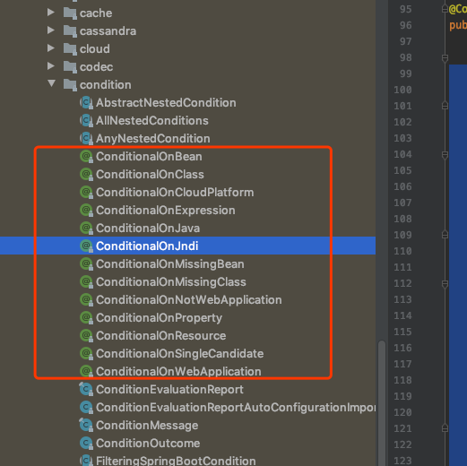

# SpringBoot 如何做到自动化配置的

我们已经知道:

- @SpringBootApplicarion

可以作为以下三个注解的的快捷方式:

- @EnableAutoConfiguration
- @ComponentScan
- @Configuration

## @EnableAutoConfiguration

```java
package org.springframework.boot.autoconfigure;

@Target(ElementType.TYPE)
@Retention(RetentionPolicy.RUNTIME)
@Documented
@Inherited
@AutoConfigurationPackage
@Import(EnableAutoConfigurationImportSelector.class)
public @interface EnableAutoConfiguration {

   Class<?>[] exclude() default {};
   String[] excludeName() default {};
}
```

可以看到两个注解

- @AutoConfigurationPackage

- @Import(EnableAutoConfigurationImportSelector.class)

#### @AutoConfigurationPackage

```java
package org.springframework.boot.autoconfigure;

import ....

@Target(ElementType.TYPE)
@Retention(RetentionPolicy.RUNTIME)
@Documented
@Inherited
@Import(AutoConfigurationPackages.Registrar.class)
public @interface AutoConfigurationPackage {

}
```

可以看到这个注解还标注了注解

- @Import(AutoConfigurationPackages.Registrar.class)

 [import笔记](../../../02-spring-framework-documentation/02-core/00-tutorials/01-bean-config-dependency-wiring/04-using-import.md) 

我们可以知道@Import 注解可以接收以下 class

- 标注有@Configuration 的类
-  [59-configuration-selection-by-using-importSelector.md](../../../02-spring-framework-documentation/02-core/00-tutorials/10-advance-configuration/59-configuration-selection-by-using-importSelector.md) ,ImportSelector 实现类,用来编写 选择 @Configuration 的类
-  [60-using-deferredimportSelector.md](../../../02-spring-framework-documentation/02-core/00-tutorials/10-advance-configuration/60-using-deferredimportSelector.md) , 选择延期配置类
-  [61-using-importBean-Definition-Registrar.md](../../../02-spring-framework-documentation/02-core/00-tutorials/10-advance-configuration/61-using-importBean-Definition-Registrar.md) ,在处理@Cofiguration 类时注册额外的bean

`AutoConfigurationPackages.Registrar` 注册一个bean，该bean存储客户端配置包列表，供以后参考。Spring boot在内部使用这个列表，例如数据访问配置类,

这个列表可以使用静态方法`AutoConfigurationPackages.get(BeanFactory)获取

```java
/**
 * 使用 {@link AutoConfigurationPackages} 来获取所有扫描的包
 *
 * @author EricChen 2019/12/06 12:19
 */
@SpringBootApplication
public class AutoConfigurationPackagesExample {

    public static void main(String[] args) {
        SpringApplicationBuilder springApplicationBuilder = new SpringApplicationBuilder(AutoConfigurationPackagesExample.class)
                .bannerMode(Banner.Mode.OFF)
                .logStartupInfo(false);
        SpringApplication build = springApplicationBuilder.build(args);
        ConfigurableApplicationContext run = build.run(args);
        List<String> strings = AutoConfigurationPackages.get(run);
        strings.forEach(System.out::println);
    }
}


```

#### @Import(EnableAutoConfigurationImportSelector.class)

这个注解负责 springBoot 的自动配置机制

`EnableAutoConfigurationImportSelector`实现了`DeferredImportSelector`,这个 selector 实现使用 Spring core 中的`SpringFactoriesLoader.loadFactoryNames()`方法,这个方法从 META_INF/spring.factories 文件中加载配置类

引导配置类会从 配置文件中读取一个 key 为`org.springframework.boot.autoconfigure.EnableAutoConfiguration`的值

下面的代码是`JmxAutoConfiguration`的实现方式

```java
 package org.springframework.boot.autoconfigure.jmx;

   .......
 import org.springframework.boot.autoconfigure.condition.ConditionalOnClass;
 import org.springframework.boot.autoconfigure.condition.ConditionalOnMissingBean;
 import org.springframework.boot.autoconfigure.condition.ConditionalOnProperty;
 import org.springframework.boot.autoconfigure.condition.SearchStrategy;
  .....

 @Configuration
 @ConditionalOnClass({ MBeanExporter.class })
 @ConditionalOnProperty(prefix = "spring.jmx", name = "enabled", havingValue = "true", matchIfMissing = true)
 public class JmxAutoConfiguration implements
                                    EnvironmentAware, BeanFactoryAware {
    .....
 }
```

#### 什么是@ConditionalOnClass?

首先看一下`@ConditionalOnClass`

```java
@Target({ ElementType.TYPE, ElementType.METHOD })
@Retention(RetentionPolicy.RUNTIME)
@Documented
@Conditional(OnClassCondition.class)
public @interface ConditionalOnClass {

	Class<?>[] value() default {};

	String[] name() default {};

}
```

它实际上是标注了`@Conditional(OnClassCondition.class)`,我们知道,配置类或者方法如果标注了这个注解,那么就会根据`OnClassCondition`的返回是否为 ture 判断是否进行这个 bean的装载

这时我们再看刚刚的 JmxAutoConfiguration 这个类,当`MBeanExporter.class`在 classPath 下存在时,就会装载

#### 什么是@ConditionalOnProperty?

我们注意到注解` @ConditionalOnProperty`也是一个`@Conditional`变种,它是标注了`@Conditional(OnpropertyCondition.class)`

```java
  @ConditionalOnProperty(prefix = "spring.jmx", name = "enabled",
                         havingValue = "true", matchIfMissing = true)
  
```

这么设置,只有

- 在 spring.jmx.enabled=true 的情况下才会进行装载

- `matchIfMissing=true` 意味着如果找不到这个属性的话默认按照 true 装载

#### 其他 Conditional 注解

- 其他的 Condtional 注解可以在包 [org.springframework.boot.autoconfigure.condition](http://docs.spring.io/spring-boot/docs/current/api/org/springframework/boot/autoconfigure/condition/package-summary.html)下找到



对于那些想要创建自己的 starter 的开发者,这些注解需要去了解

## 使用  --debug

为了能够了解自动配置应用情况,我们可以使用`--debug` 参数或者在 JVM 里配置`-Ddebug`参数,我们看一个例子,引入了`spring-boot-starter`依赖

```java
@EnableAutoConfiguration
public class DebugModeExample {

  public static void main (String[] args) {
      //just doing this programmatically for demo
      String[] appArgs = {"--debug"};

      SpringApplication app = new SpringApplication(DebugModeExample.class);
      app.setBannerMode(Banner.Mode.OFF);
      app.setLogStartupInfo(false);
      app.run(appArgs);
    }
}	
```

输出

```

=========================
AUTO-CONFIGURATION REPORT
=========================


Positive matches:
-----------------

   GenericCacheConfiguration matched:
      - Cache org.springframework.boot.autoconfigure.cache.GenericCacheConfiguration automatic cache type (CacheCondition)

   JmxAutoConfiguration matched:
      - @ConditionalOnClass found required class 'org.springframework.jmx.export.MBeanExporter' (OnClassCondition)
      - @ConditionalOnProperty (spring.jmx.enabled=true) matched (OnPropertyCondition)

   JmxAutoConfiguration#mbeanExporter matched:
      - @ConditionalOnMissingBean (types: org.springframework.jmx.export.MBeanExporter; SearchStrategy: current) did not find any beans (OnBeanCondition)

   JmxAutoConfiguration#mbeanServer matched:
      - @ConditionalOnMissingBean (types: javax.management.MBeanServer; SearchStrategy: all) did not find any beans (OnBeanCondition)

   JmxAutoConfiguration#objectNamingStrategy matched:
      - @ConditionalOnMissingBean (types: org.springframework.jmx.export.naming.ObjectNamingStrategy; SearchStrategy: current) did not find any beans (OnBeanCondition)

   NoOpCacheConfiguration matched:
      - Cache org.springframework.boot.autoconfigure.cache.NoOpCacheConfiguration automatic cache type (CacheCondition)

   PropertyPlaceholderAutoConfiguration#propertySourcesPlaceholderConfigurer matched:
      - @ConditionalOnMissingBean (types: org.springframework.context.support.PropertySourcesPlaceholderConfigurer; SearchStrategy: current) did not find any beans (OnBeanCondition)

   RedisCacheConfiguration matched:
      - Cache org.springframework.boot.autoconfigure.cache.RedisCacheConfiguration automatic cache type (CacheCondition)

   SimpleCacheConfiguration matched:
      - Cache org.springframework.boot.autoconfigure.cache.SimpleCacheConfiguration automatic cache type (CacheCondition)


Negative matches:
-----------------

   ActiveMQAutoConfiguration:
      Did not match:
         - @ConditionalOnClass did not find required classes 'javax.jms.ConnectionFactory', 'org.apache.activemq.ActiveMQConnectionFactory' (OnClassCondition)

   AopAutoConfiguration:
      Did not match:
         - @ConditionalOnClass did not find required classes 'org.aspectj.lang.annotation.Aspect', 'org.aspectj.lang.reflect.Advice' (OnClassCondition)

   ArtemisAutoConfiguration:
      Did not match:
         - @ConditionalOnClass did not find required classes 'javax.jms.ConnectionFactory', 'org.apache.activemq.artemis.jms.client

 ...............................
 ....................


Exclusions:
-----------

    None


Unconditional classes:
----------------------

    org.springframework.boot.autoconfigure.PropertyPlaceholderAutoConfiguration

    org.springframework.boot.autoconfigure.web.WebClientAutoConfiguration

    org.springframework.boot.autoconfigure.context.ConfigurationPropertiesAutoConfiguration

    org.springframework.boot.autoconfigure.info.ProjectInfoAutoConfiguration

```

关于 Auto-configuration 的报告

- **Positvive match**: @Conditional 设置为 true 且配置类被引入
- **Negative match:** @Conditional 设置为 false且配置没有被引入
- **Exclusions**:在应用程序端显式排除的配置类。我们将在下一节中看到它是什么。
- **Unconditional classes:**自动配置类没有任何类级别的条件，即类总是应用程序配置的一部分