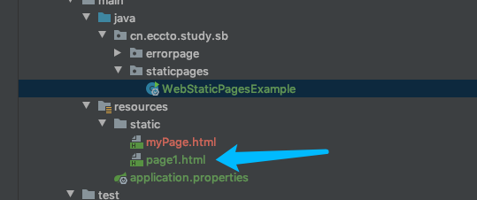
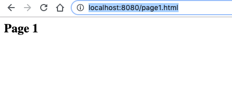
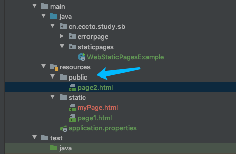
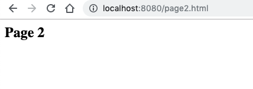
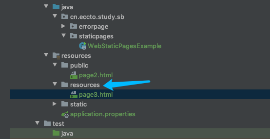
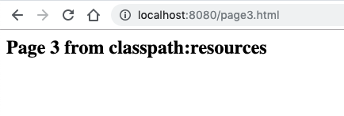
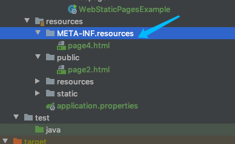
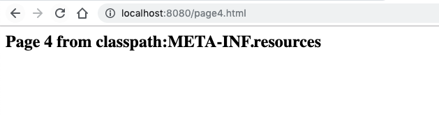

# 使用静态内容

By default Spring boot serves static content from one of the following locations in the classpath:

- /static

- /public

- /resources

- /META-INF/resources

## 四个默认的页面

#### static

```java
http://localhost:8080/page1.html
```



访问



#### public



访问



#### resources



访问



#### /META-INF/resources



访问



## 自定义静态资源路径

## 