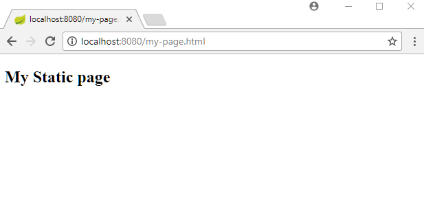
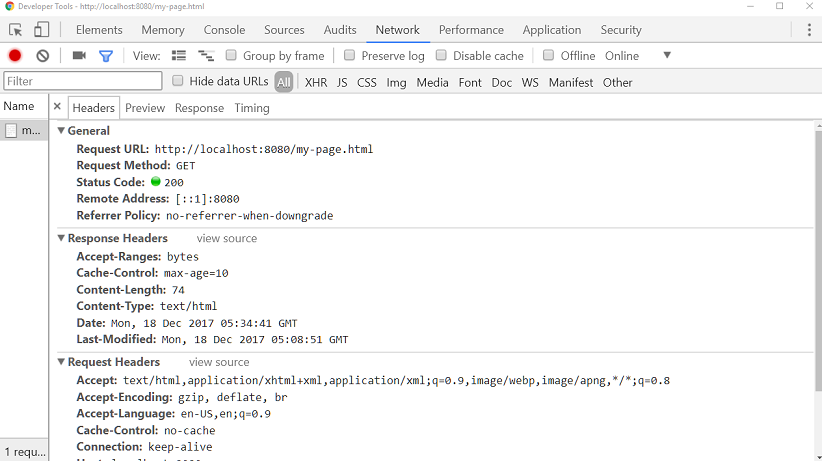

# Setting Cache Period for Static Resource

设置静态资源的缓存周期

- `spring.resources.cache-period` 指定静态资源的缓存周期

- 设置这个属性后,我们的response 的 header 会加上 `Cache-Control:max-age=n`发送给浏览器

## 配置文件

```properties
spring.main.banner-mode=off 
spring.main.logStartupInfo=false
spring.resources.cache-period=10
```


## 展示






See also 'Last-Modified', 'If-Modified-Since' and 'Cache-Control' headers info [here](https://www.logicbig.com/quick-info/web/last-modified-and-if-modified-since.html) and Spring MVC support for Cache-Control [here](https://www.logicbig.com/tutorials/spring-framework/spring-web-mvc/cache-control.html).