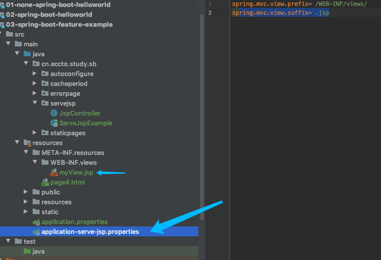

# Serving JSP pages

直接把动态资源,例如 JSP 文件放在  [static 文件夹](10-serving-static-web-contents.md) 文件夹下是不能正常工作的

- 在 war 包中,JSP 存放的文件夹是 `src/main/webapp/WEB-INF/`
- 在 jar 包中,因为  [limitation stated in boot ref docs](http://docs.spring.io/spring-boot/docs/current/reference/html/boot-features-developing-web-applications.html#boot-features-jsp-limitations)的原因,无法放倒上述文件夹

- ` src/main/webapp/WEB-INF`我们也应该避免使用,根据文章

>  Do not use the src/main/webapp directory if your application will be packaged as a jar. Although this directory is a common standard, it will only work with war packaging and it will be silently ignored by most build tools if you generate a jar.

但是幸运的是,Servlet3.0规范允许我们使用这个目录加载动态文件:

- ```
  src/main/resources/META-INF/resources/
  
  ```


## 代码实例

```java
/**
 * jsp 动态文件的 jar 包打包方式下的加载
 *
 * @author EricChen 2019/12/06 18:48
 */
@SpringBootApplication
public class ServeJspExample {
    public static void main(String[] args) {
        SpringApplicationBuilder builder = new SpringApplicationBuilder(ServeJspExample.class);
        builder.profiles("serve-jsp");
        builder.run(args);
    }

}

```

```java
/**
 * 这里返回 myView 会去 src/main/resources/META-INF/resources/WEB-INF/views/myView.jsp 的文件
 *
 * @author EricChen 2019/12/06 18:56
 */
@Controller
public class JspController {

    @RequestMapping("/")
    public String handler(Model model) {
        model.addAttribute("msg", "a jar packaging example");
        return "myView";
    }
}

```


application-serve-jsp.properties

