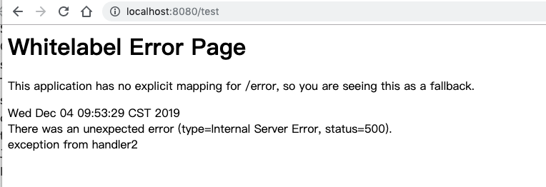
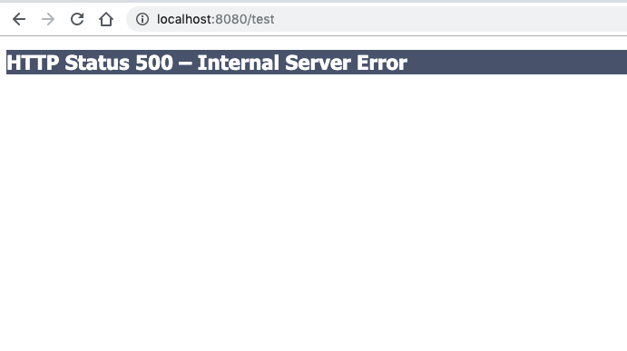

# 关闭默认的错误页面

Spring boot 如果发生异常,会使用一个默认的`whitelabel`错误页面,我们要学习

- `whitelabel`的行为模式
- 如何关闭默认关闭

默认的错误页面如下



## 关闭默认的错误页面

```properties
server.error.whitelabel.enabled=false
```

#### 效果



## 代码示例

```java
/**
 * 错误界面示例,默认情况 application.properties 设置 `server.error.whitelabel.enabled` 可以关闭默认情况
 *
 * @author EricChen 2019/12/04 19:42
 */
@Controller
public class DefaultErrorPageExampleController {
    @RequestMapping("/")
    public String handler(Model model) {
        model.addAttribute("msg", "a spring-boot example");
        return "myPage";
    }

    @RequestMapping("/test")
    public void handler2() {
        throw new RuntimeException("exception from handler2");
    }
}

```

