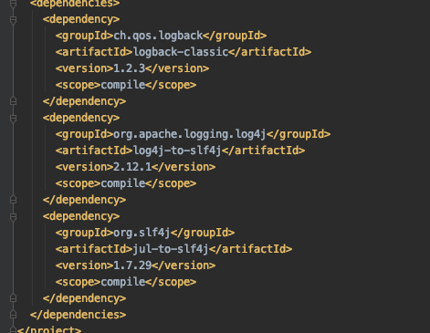

# Spring Boot default logging Configuration

springBoot 默认使用

- 转发所有
  - Apache Commons Logging (JCL), 
  - Log4J 
  - Java Util Logging (JUL) APIs 

三个日志门面的数据到

- SLF4J

使用 Logback 作为 SLF4J 的实现

## 依赖

### spring-boot-starter-logging

```
<dependency>
    <groupId>org.springframework.boot</groupId>
    <artifactId>spring-boot-starter-logging</artifactId>
</dependency>
```

可以看到它有三个依赖



#### logback-classic

Logback classic implements SLF4J,SpringBoot 默认使用

#### log4j-over-slf4j

使用这个依赖将 Log4J 桥接到slf4j

#### jul-to-slf4j

使用这个依赖将 Java Util Logging (JUL) APIs 桥接到slf4j

#### 