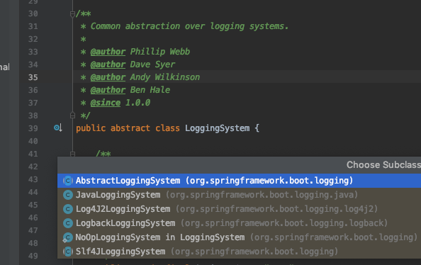

#  LoggingSystem abstraction and logging configuration properties

日志抽象和日志配置文件


SpringBoot使用`LoggingSystem`抽象所有日志,其实现类



- `LogbackLoggingSystem` 支持 LogBack
- `Log4J2LoggingSystem` 支持 Log4j
- `JavaLoggingSystem` 支持 Java Util Logging

SpringBoot 使用`LoggingApplicationListener`(ApplicationListener)一个实现类,来引导日志系统

## 日志配置文件相关属性

- **logging.config**This property specifies the location of the logging configuration file. For instance 'classpath:logging-config/logback.xml' (where logging-config is a folder on the classpath)
  This property overrides the default configuration file location (underlying logging framework specific e.g. logback.xml or log4j2.xml).
  If this property is not specified and the default configuration file is also not present then Spring initializes the logging system with its own default configuration (the default format is specified [here](http://docs.spring.io/spring-boot/docs/current/reference/html/boot-features-logging.html#boot-features-logging-format)).
  This logic is implemented in `LoggingApplicationListener#initializeSystem()` (Spring Boot 1.5.7).
  For Logback, the Spring Boot specific default configuration is performed in `DefaultLogbackConfiguration` class.
  For Log4j2, it is loaded from `spring-boot/src/main/resources/org/springframework/boot/logging/log4j2/` location; `log4j2.xml` for console output and `log4j2-file.xml` for file output.

  

- logging.exception-conversion-word

  This property specifies a 'conversion word' pattern for logging exceptions. This conversion word maps to a converter which converts an exception in more readable form. The default is

   

  ```
  %wEx
  ```

   

  which maps to

   

  ```
  ExtendedWhitespaceThrowableProxyConverter
  ```

  . This is logback specific way of binding a log pattern to a converter.

  The default conversion word '%wEx' is specified in the pattern declared with constants CONSOLE_LOG_PATTERN and FILE_LOG_PATTERN in DefaultLogbackConfiguration class.

  The binding of the conversion can be found in the same class as:

  ```
  private void base(LogbackConfigurator config) {
      .....
      config.conversionRule("wEx", ExtendedWhitespaceThrowableProxyConverter.class);
      ...
   }
  ```

  Log4j2 also configure similar converter (default %wEx) in the default log4j2.xml or log4j2-file.xml file (see above).

- **logging.file**This property is used to set the location of a file to log to (in addition to the console). By default the logs are not saved in any file. The location can be absolute or relative (to where application is running).

  

- **logging.path**Location of the log file. If the logging.file property is not specified then the file "spring.log" will be written in the logging.path directory. If the logging.file property is also specified then this property (logging.path) will be ignored.

  

- **logging.level.xyz**Specifies Log levels. The value can be one of TRACE, DEBUG, INFO, WARN, ERROR, FATAL, OFF. The root logger can be configured using logging.level.root. The wildcards are not supported for the property key.

  Examples:
  logging.level.root=FATAL
  logging.level.org.springframework.web=INFO
  logging.level.com.example=DEBUG

  Note that, regardless of logging configuration loaded via 'logging.config' property or by the default file (logging framework specific e.g. logback.xml) or via LoggingSystem defaults , logging levels will always be applied as specified by this property.

  

- **logging.pattern.console**This property specifies the pattern for console output. By default, `DefaultLogbackConfiguration#CONSOLE_LOG_PATTERN` value is used. This property can only be specified for Logback. Log4j2's default console pattern is in the log4j.xml (the default config file as mentioned in logging.config property above)

  

- **logging.pattern.file**Th pattern for file output. By default, `DefaultLogbackConfiguration#FILE_LOG_PATTERN` value is used. This property can only be specified for Logback. Log4j2's default file pattern is in the log4j-file.xml (the default config file as mentioned in logging.config property above)

  

- **logging.pattern.level**This is the pattern for log Level portion usually in "%np" format (for space padding) where n is an integer. If n is positive then spaces are padded to the left otherwise to the right. The default is %5p . This property can only be specified with logback system.

  

- **logging.register-shutdown-hook**If true, Runtime.getRuntime().addShutdownHook() is used to register a shutdown handler for the logging system . The handler forwards call to the corresponding logger context to clean up, remove listeners and stop logging. The default value of this property is false.