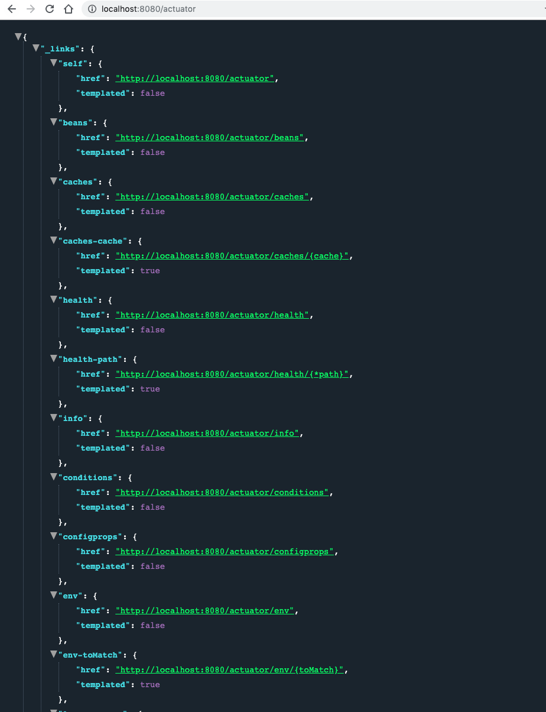
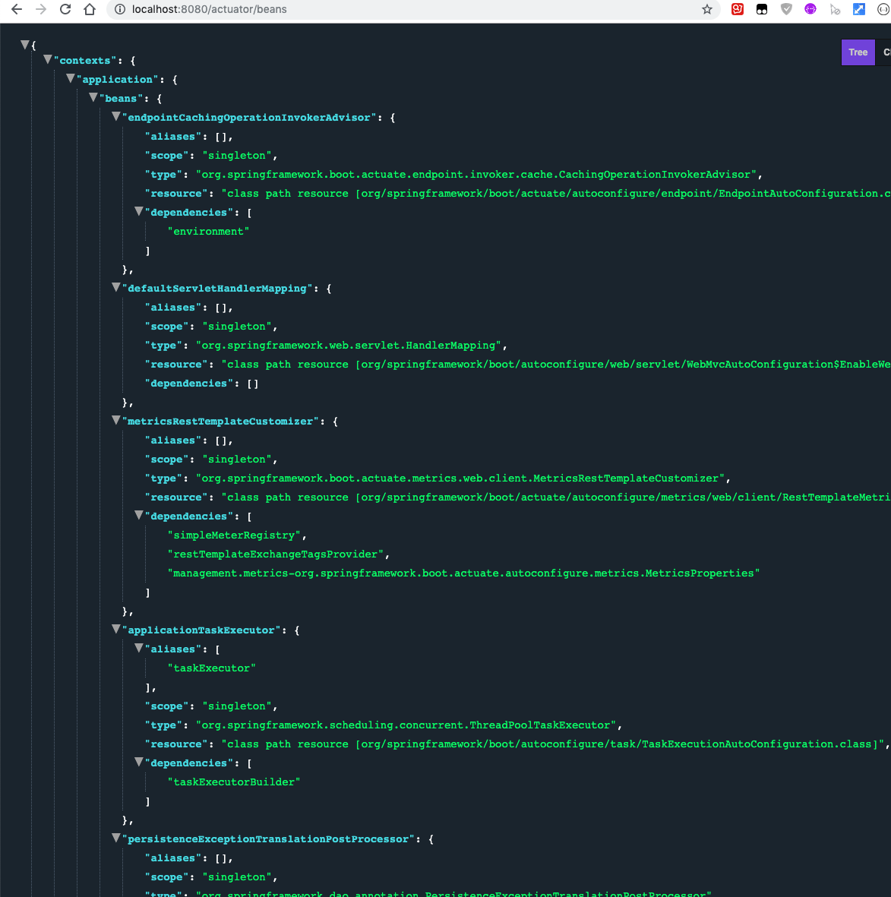

# Quick Intro to Spring Boot Actuator Endpoints and How to enable them?

Spring启动执行器包含许多与应用程序的运行时监视和管理相关的功能。我们可以通过HTTP端点或JMX使用这些特性。在本教程中，我们将了解如何启用执行器HTTP端点。

## Actuator dependency

```xml
    <dependencies>
        <dependency>
            <groupId>org.springframework.boot</groupId>
            <artifactId>spring-boot-starter-actuator</artifactId>
        </dependency>
        <dependency>
            <groupId>org.springframework.boot</groupId>
            <artifactId>spring-boot-starter-web</artifactId>
        </dependency>
    </dependencies>
```

## Enabling endpoints

```
management.endpoints.web.exposure.include=*
```



