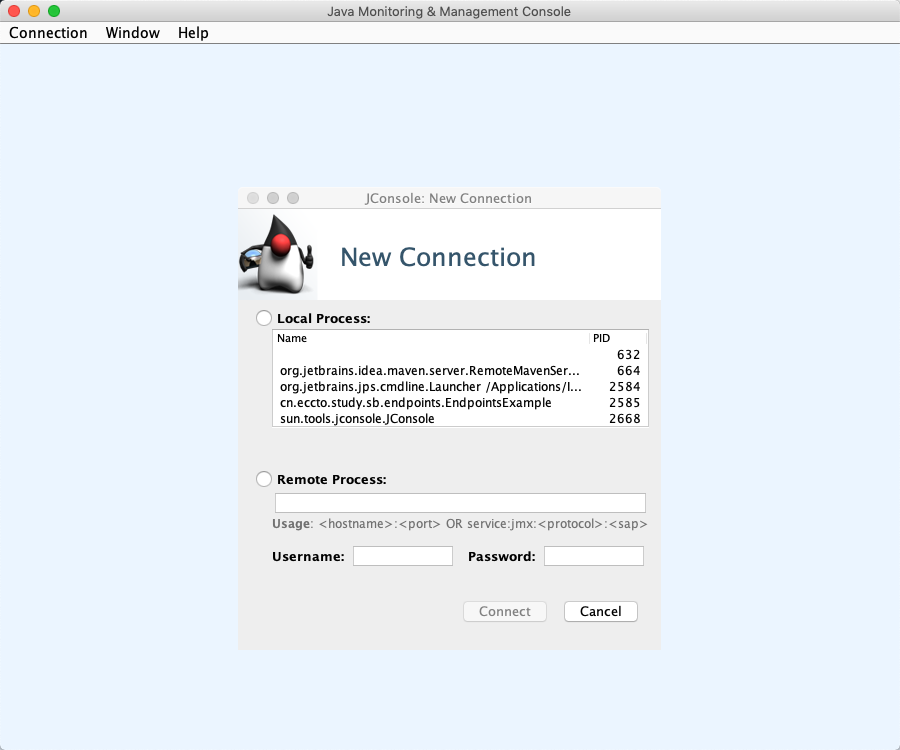
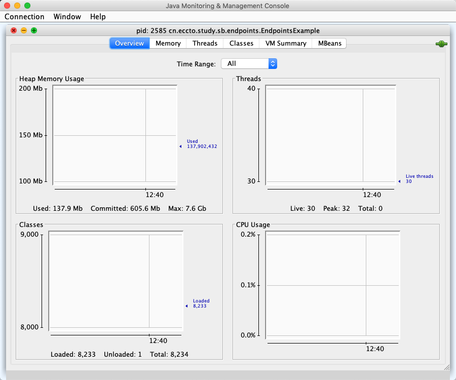
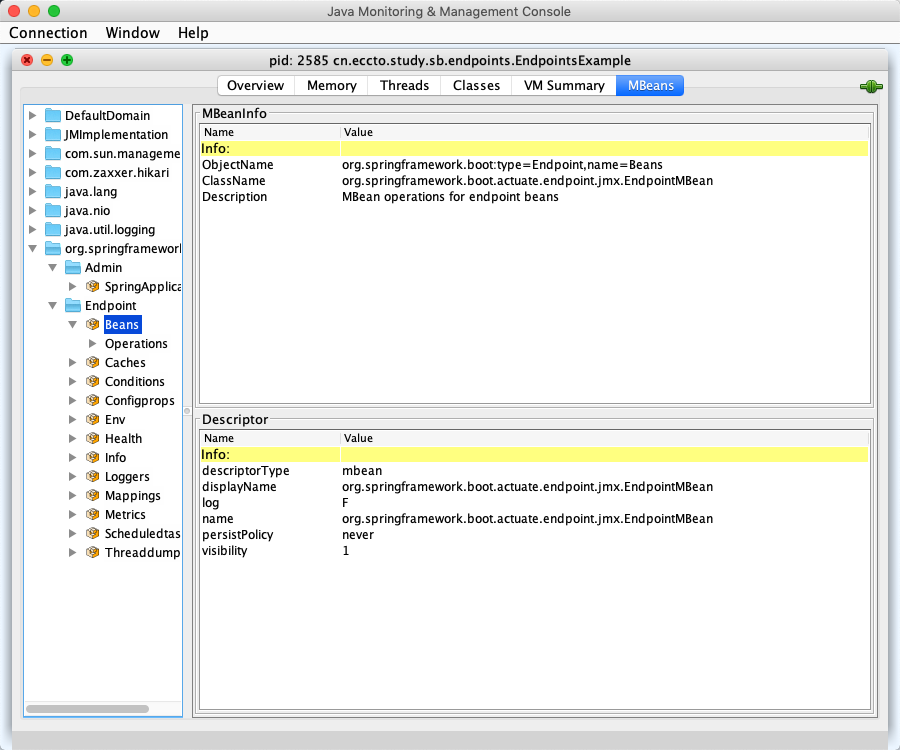

# Accessing Actuator JMX MBean Endpoints

SpringBoot 会暴露管理端口作为 JMX 的 MBeans ,在org.springframework.boot domain包下,使用 JConsole 可以查看

## Actuator dependency

```xml
    <dependencies>
        <dependency>
            <groupId>org.springframework.boot</groupId>
            <artifactId>spring-boot-starter-actuator</artifactId>
        </dependency>
        <dependency>
            <groupId>org.springframework.boot</groupId>
            <artifactId>spring-boot-starter-web</artifactId>
        </dependency>
  </dependencies>
```





