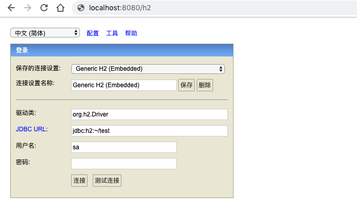

# H2 Web Console

```
# 进行该配置后，h2 web consloe就可以在远程访问了。否则只能在本机访问。
spring.h2.console.settings.web-allow-others=true
#进行该配置，你就可以通过YOUR_URL/h2访问h2 web consloe。YOUR_URL是你程序的访问URl。
spring.h2.console.path=/h2
#进行该配置，程序开启时就会启动h2 web consloe。当然这是默认的，如果你不想在启动程序时启动h2 web consloe，那么就设置为false。
spring.h2.console.enabled=true
```

