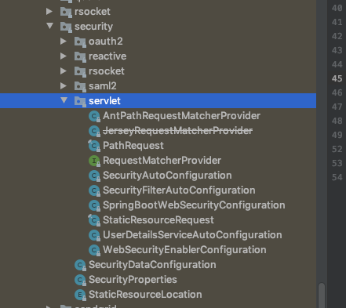

# Security getting started

## 实例

添加依赖

```
<dependency>
   <groupId>org.springframework.boot</groupId>
   <artifactId>spring-boot-starter-web</artifactId>
</dependency>
<dependency>
   <groupId>org.springframework.boot</groupId>
   <artifactId>spring-boot-starter-security</artifactId>
</dependency>
```

## Spring Boot default Security Configuration

默认的配置都在包` org.springframework.boot.autoconfigure.security`下



- 自动配置类 `SpringBootWebSecurityConfiguration `会注册一个默认的`WebSecurityConfigurerAdapter`