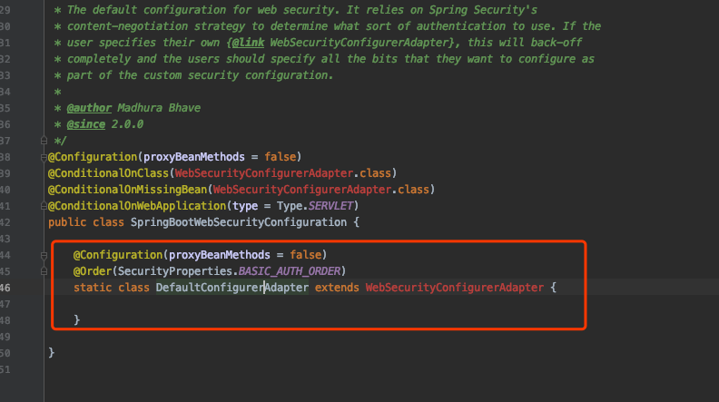

# Security Custom Configuration

我们通过查看自动配置类`org.springframework.boot.autoconfigure.security.servlet.SpringBootWebSecurityConfiguration`

可以知道

- SpringBoot 默认注册了一个 WebSecurityConfigurerAdapter类
- 我们可以通过自定义一个`WebSecurityConfigurerAdapter`类来自定义配置



# Example

```java
@SpringBootApplication
public class SpringBootSecurityExampleMain {

  @Bean
  public WebSecurityConfigurerAdapter webSecurityConfig() {
      return new WebSecurityConfigurerAdapter() {
          @Override
          protected void configure(HttpSecurity http) throws Exception {
              http.authorizeRequests()
                  .anyRequest().authenticated()
                  .and()
                  .formLogin();
          }

          @Override
          protected void configure(AuthenticationManagerBuilder builder) throws Exception {
              BCryptPasswordEncoder passwordEncoder = new BCryptPasswordEncoder();
              builder.inMemoryAuthentication().passwordEncoder(passwordEncoder)
                     .withUser("joe").password(passwordEncoder.encode("123")).roles("USER")
                     .and()
                     .withUser("sara").password(passwordEncoder.encode("234")).roles("ADMIN")
              ;
          }
      };
  }

  public static void main(String[] args) {
      SpringApplication.run(SpringBootSecurityExampleMain.class);
  }
}
```

## Using configuration class with @EnableWebSecurity

```java
package com.logicbig.example;

import org.springframework.context.annotation.Configuration;
import org.springframework.security.config.annotation.authentication.builders.AuthenticationManagerBuilder;
import org.springframework.security.config.annotation.web.builders.HttpSecurity;
import org.springframework.security.config.annotation.web.configuration.EnableWebSecurity;
import org.springframework.security.config.annotation.web.configuration.WebSecurityConfigurerAdapter;
import org.springframework.security.crypto.bcrypt.BCryptPasswordEncoder;

@Configuration
@EnableWebSecurity
public class SecurityConfig extends WebSecurityConfigurerAdapter {
    @Override
    protected void configure(HttpSecurity http) throws Exception {
        http.authorizeRequests()
            .anyRequest().authenticated()
            .and()
            .formLogin();
    }

    @Override
    protected void configure(AuthenticationManagerBuilder builder) throws Exception {
        BCryptPasswordEncoder passwordEncoder = new BCryptPasswordEncoder();
        builder.inMemoryAuthentication().passwordEncoder(passwordEncoder)
               .withUser("joe").password(passwordEncoder.encode("123")).roles("USER")
               .and()
               .withUser("sara").password(passwordEncoder.encode("234")).roles("ADMIN")
        ;
    }
}
```