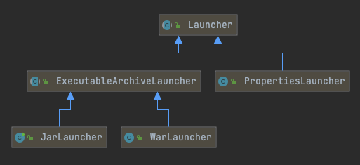

# 031-SpringBoot可执行jar运行原理

[TOC]

## 一言蔽之

Java的可执行jar打包后,MANIFEST.MF 里的Start-Class引导指向的类为

- Jar包 执行的时候, Main-Class:  org.springframework.boot.loader.JarLauncher 
- War包执行的时候, Main-Class: org.springframework.boot.loader.WarLauncher

maven 打包完成后, spring-boot-loader-2.0.2.RELEASE.jar 会被加入到系统

## UML



## META-INF/MANIFEST.MF 声明的启动类

META-INF/MANIFEST.MF 里面规定的启动类

```java
$ cat META-INF/MANIFEST.MF 
Manifest-Version: 1.0
Implementation-Title: first-spring-boot-application
Implementation-Version: 0.0.1-SNAPSHOT
Build-Jdk-Spec: 1.8
Start-Class: vip.ericchen.study.firstspringbootapplication.FirstSpringBootApplication
Created-By: Maven Archiver 3.4.0
//springBoot定制的字段
Spring-Boot-Classes: BOOT-INF/classes/
Spring-Boot-Lib: BOOT-INF/lib/
Spring-Boot-Version: 2.2.6.RELEASE
Main-Class: org.springframework.boot.loader.JarLauncher
```

可以看到其实就是 jar 包启动的机制,入口类是

```java
org.springframework.boot.loader.JarLauncher
```

如果是 war 包, 那么对应的是

```java
org.springframework.boot.loader.WarLauncher
```

## 源码分析

```java
public class JarLauncher extends ExecutableArchiveLauncher {

	static final String BOOT_INF_CLASSES = "BOOT-INF/classes/";

	static final String BOOT_INF_LIB = "BOOT-INF/lib/";

	public JarLauncher() {
	}

	protected JarLauncher(Archive archive) {
		super(archive);
	}

	@Override
	protected boolean isNestedArchive(Archive.Entry entry) {
		if (entry.isDirectory()) {
			return entry.getName().equals(BOOT_INF_CLASSES);
		}
		return entry.getName().startsWith(BOOT_INF_LIB);
	}

	public static void main(String[] args) throws Exception {
    //启动主类 //调用顶层父类的launch方法
		new JarLauncher().launch(args);
	}

}

```

### 调用顶层父类的launch方法

```java
protected void launch(String[] args) throws Exception {
  //注册registerUrlProtocolHandler ,这里涉及到URL 协议处理器的拓展机制
  JarFile.registerUrlProtocolHandler();
  ClassLoader classLoader = createClassLoader(getClassPathArchives());
  launch(args, getMainClass(), classLoader);
}
```


实际上launch 方法都执行了三步

- 注册registerUrlProtocolHandler ,这里涉及到URL 协议处理器的拓展机制
- 创建 classLoader 
- 执行子类的 launch方法(模板方法模式)

### registerUrlProtocolHandler:注册URL解析协议

JarFile.registerUrlProtocolHandler() 方法利用了java.net.URLStreamHandler拓展机制,实现由URL#getURLSTreamHandler(String) 提供

为什么要注册URL解析协议呢,因为 SpringBoot 对jar包的打包方式是自定义的, 所以它需要一套符合自己启动方式的解析方式

```java
protected void launch(String[] args) throws Exception {
  //注册URL解析协议
  JarFile.registerUrlProtocolHandler();
  //创建 classLoader 
  ClassLoader classLoader = createClassLoader(getClassPathArchives());
  //执行子类的 launch方法(模板方法模式)
  launch(args, getMainClass(), classLoader);
}
```

如果 "java.protocol.handler.pkgs" 属性在启动参数中存在, 则拼接在后方, 如果不存在, 则直接使用

```
org.springframework.boot.loader
```

这部分参考[010-URLStreamHandler拓展机制.md](../../04-java/99-拓展机制/010-URLStreamHandler拓展机制.md) 

```java
/**
	 * Register a {@literal 'java.protocol.handler.pkgs'} property so that a
	 * {@link URLStreamHandler} will be located to deal with jar URLs.
	 */
public static void registerUrlProtocolHandler() {
  String handlers = System.getProperty(PROTOCOL_HANDLER, "");
  System.setProperty("java.protocol.handler.pkgs", ("".equals(handlers) ? "org.springframework.boot.loader"
                                        : handlers + "|" + "org.springframework.boot.loader"));
  resetCachedUrlHandlers();
}

private static void resetCachedUrlHandlers() {
  try {
    URL.setURLStreamHandlerFactory(null);
  }
  catch (Error ex) {
    // Ignore
  }
}

```

#### launch:执行子类的 launch方法(模板方法模式)

```java
protected void launch(String[] args, String mainClass, ClassLoader classLoader)
      throws Exception {
   Thread.currentThread().setContextClassLoader(classLoader);
   createMainMethodRunner(mainClass, args, classLoader).run();
}
```

获取 `META-INF/MANIFEST.MF` 中的 `Start-Class`

```java
@Override
protected String getMainClass() throws Exception {
  Manifest manifest = this.archive.getManifest();
  String mainClass = null;
  if (manifest != null) {
    mainClass = manifest.getMainAttributes().getValue("Start-Class");
  }
  if (mainClass == null) {
    throw new IllegalStateException(
      "No 'Start-Class' manifest entry specified in " + this);
  }
  return mainClass;
}

```


```java
protected MainMethodRunner createMainMethodRunner(String mainClass, String[] args,
                                                  ClassLoader classLoader) {
  return new MainMethodRunner(mainClass, args);
}
```

