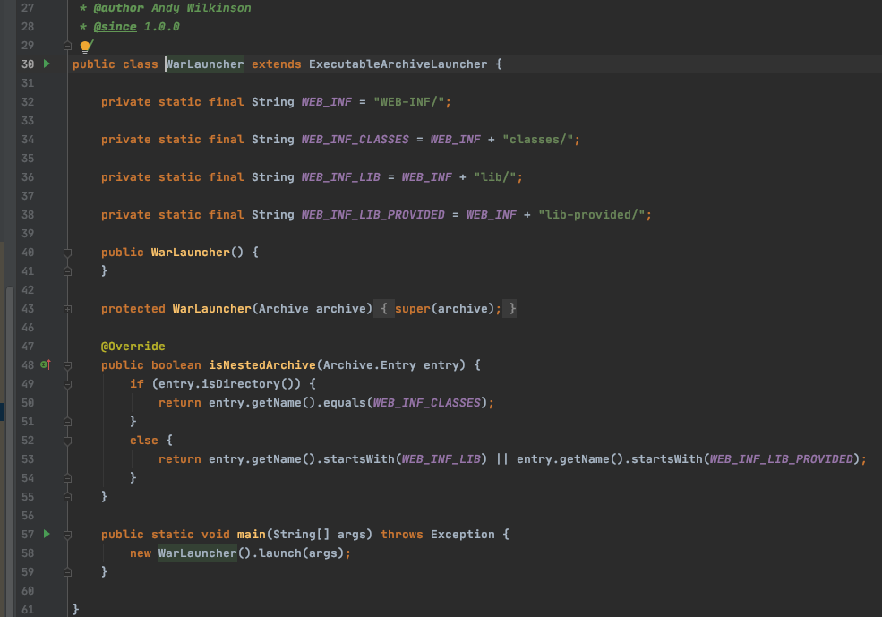
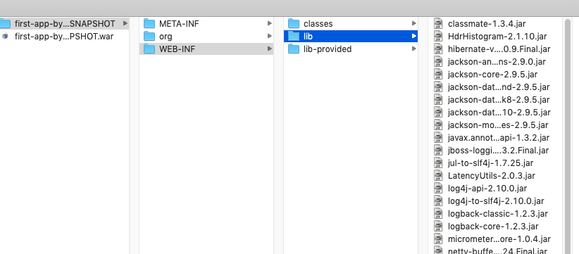

# j040-SpringBoot打包-War方式

[TOC]

## 一言蔽之

SpringBoot可以用jar直接运行,当然也可以使用传统的war包部署的形式, 

打包War文件是一种兼容措施,

- 既能被 WarLauncher 启动, 
- 又能兼容Servlet容器环境

WarLauncher  和 JarLauncher  并没有本质差距 都可以用java -jar 运行, 但是 WarLanucher 的打包方式可以兼容容器内部署,因为打包的文件格式都是按照容器要求来的, 没有 BOOT-INF 这样的目录 

## WarLauncher

```
org.springframework.boot.loader.WarLauncher
```

WarLauncher 与 JarLauncher的差异很小.两者都继承于 **ExecutableArchiveLauncher**.并使用

- JarFileArchive 

- ExplodedArchive 

分别管理归档文件和解压目录两种资源.主要区别是项目类文件和 JAR class path 路径不同



`lib-provided/`包就存放的是 scope = provided 的 jar 包

#### 为什么要提供一个 lib-provided 目录存放 scope = provided 的 JAR 文件

传统的 Servlet 应用的 ClassPath 仅仅关注

- WEB-INF/classes
- WEB-INF/lib

因此,WEB-INF/lib-provided 中的 jar 包会被 Servlet 容器忽略,如`Servlet-API` 

这样设计的好处在于,打包后的 WAR 包能在 Serlvet 容器中兼容运行

## War包的MANIFEST.MF

```
Manifest-Version: 1.0
Implementation-Title: first-spring-boot-application
Implementation-Version: 0.0.1-SNAPSHOT
Start-Class: vip.ericchen.study.firstspringbootapplication.FirstSpringBootApplication
Spring-Boot-Classes: WEB-INF/classes/
Spring-Boot-Lib: WEB-INF/lib/
Build-Jdk-Spec: 1.8
Spring-Boot-Version: 2.2.6.RELEASE
Created-By: Maven Archiver 3.4.0
Main-Class: org.springframework.boot.loader.WarLauncher

```

## 图示



## 