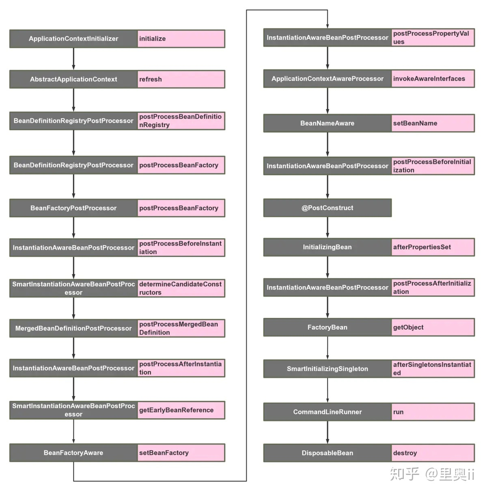

# SpringBoot拓展点

[TOC]

## SpringBoot拓展点简介

SpringBoot基于Spring搭建, 所以SpringBoot的拓展点和Spring的拓展点实际上是有一定的重合的

## SpringBoot拓展点图示

## SpringBoot拓展点详解

1.  [010-SpringBoot拓展点-容器刷新前回调.md](010-SpringBoot拓展点-容器刷新前回调.md) 
2.  [020-SpringBoot拓展点-容器刷新阶段.md](020-SpringBoot拓展点-容器刷新阶段.md) 