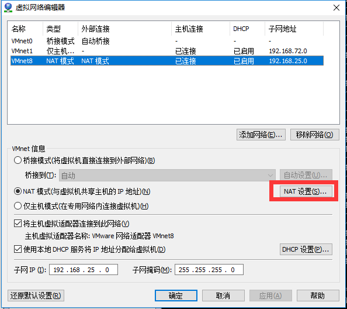
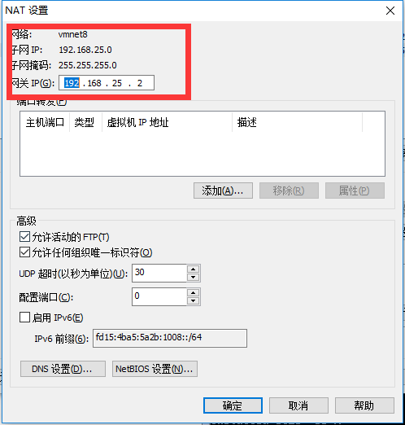
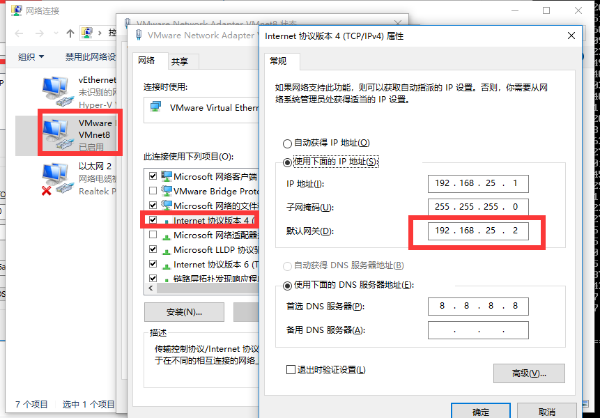

[返回目录](/README.md)

# vm配置NAT联网

* 打开vm&gt;编辑&gt;虚拟网络编辑器
* 查看NAT设置



* 查看NAT配置，记住网关和子网



* 设置windows



* 设置Linux  /etc/sysconfig/network-scripts  中的ifcfg-eno.XXX文件，每个人的可能不一样

```
vi /etc/sysconfig/network-scripts/ifcfg-eno
```

```
TYPE=Ethernet
BOOTPROTO=dhcp
DEFROUTE=yes
PEERDNS=yes
PEERROUTES=yes
IPV4_FAILURE_FATAL=no
IPV6INIT=yes
IPV6_AUTOCONF=yes
IPV6_DEFROUTE=yes
IPV6_PEERDNS=yes
IPV6_PEERROUTES=yes
IPV6_FAILURE_FATAL=no
NAME=eno16777736
UUID=ae05ccde-6a29-4332-b486-f3042da73ac0
DEVICE=eno16777736
ONBOOT=no
这里说一下需要修改的位置:

#修改
BOOTPROTO=static #这里讲dhcp换成ststic
ONBOOT=yes #将no换成yes
#新增
IPADDR=192.168.25.100 #静态IP
GATEWAY=192.168.25.2 #默认网关
NETMASK=255.255.255.0 #子网掩码
DNS1=8.8.8.8
```

* 重启network

```
service network restart
```

* 查看

```
ip addr
```


