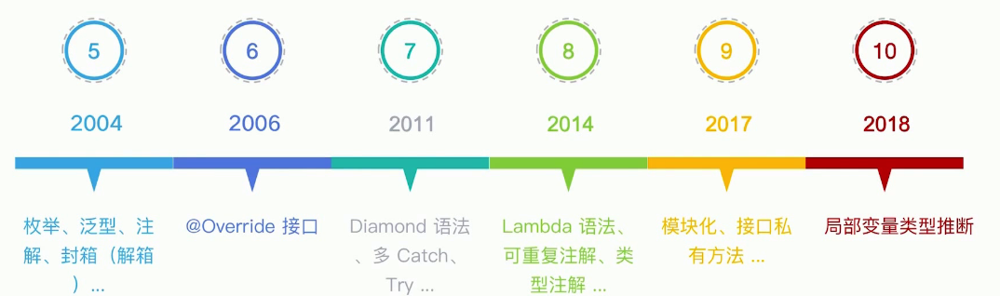
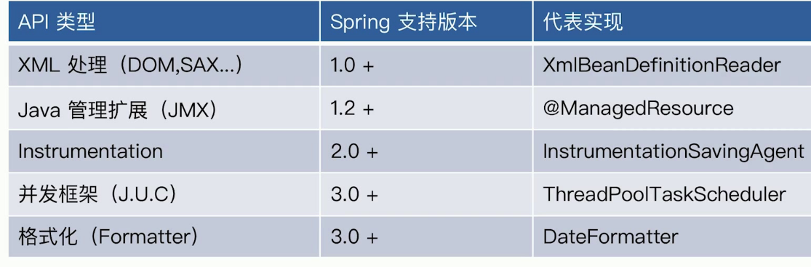
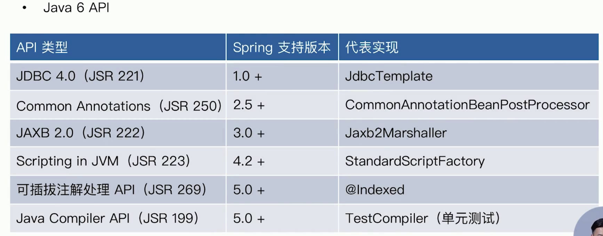
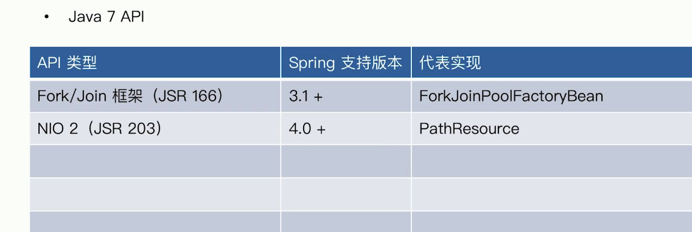
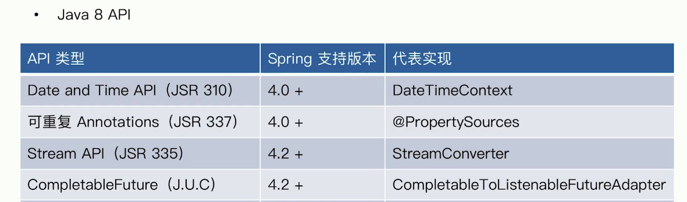
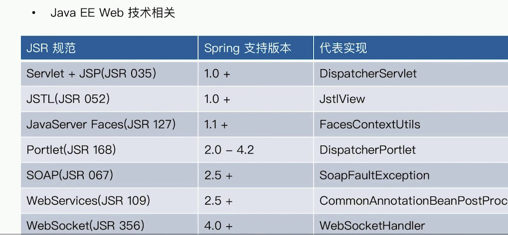
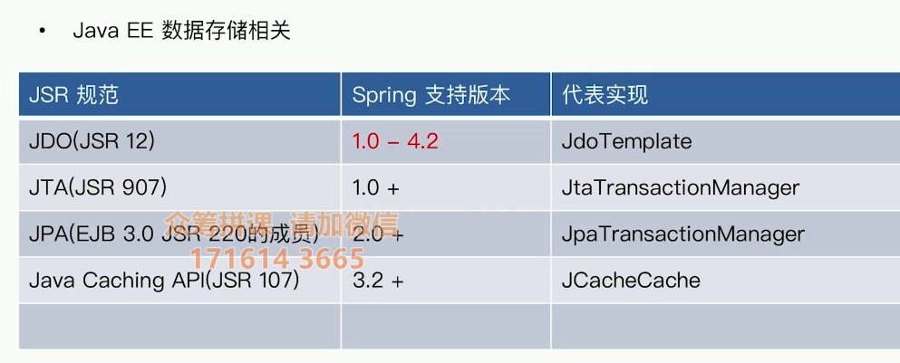
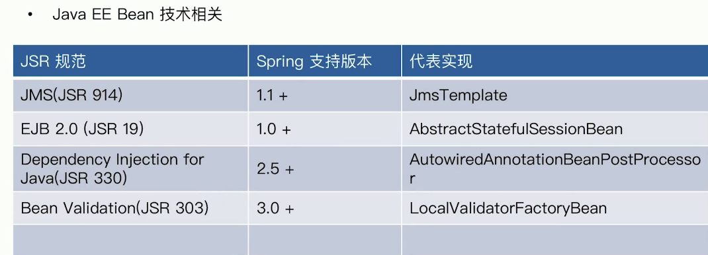

# Java语法变化

java8可重复注解,类型注解

## < Java

- 反射

Spring里的 MethodMatcher ,匹配方法是否匹配

- JavaBeans

Spring里的 CachedIntrospectionResults

- 动态代理

Spring里的 JdkDynamicAopProxy

## Java5

- JUC
- 格式化(Formatter)

DateFormatter , 显示年月日,显示金额的 

- Java管理扩展(JMX)

@ManagedResource 

- Instrumentation

把Instrumentation的API存储到本地

- XML处理(DOM,SAX,Xpath,XSTL)

Spring里的  XmlBeanDefinitionReader . 用来读取XML到 BeanDefinition

## Java6

- JDBC 4.0 (JSR 221)

JdbcTemplate

- JAXB 2.0 (JSR 222)

- 可插拔注解处理 API( JSR 269)

- Common Annotations(JSR 250)

CommonAnnotationBeanProcessor

- Java Compiler API (JSR 199)

- Scripting in JVM (JSR 223)

- 可插拔,Indexed

## java7

- NIO 2 (JSR 203)
- Fork/Join (JSR 166)
- invokedynamic字节码(JSR 292)

## Java8

- Stream API(JSR335)
- ComplableFuture (J.U.C)
- Annotion on java types( JSR 308)
- Date and Time API(JSR 310)
- 可重复 Anotations (JSR337)
- JavaScript(JSR 223)

## java9

- reactive Stream flow API(JUC)

- Process API Updates (JEP 102)

- Variable Handler (JEP 193)

- Method Handler (JEP 227)

- SpinWait Hints 自旋锁 (JEP 285)

- Stack-Walking API (JEP 259) 替换 StackTraceElement 内存消耗大所以要优化

  

