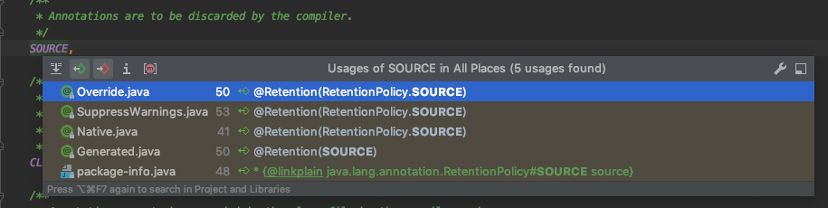

# Predefined Annotation Types

A set of annotation types are predefined in the Java SE API. Some annotation types are used by the Java compiler, and some apply to other annotations.

- **@Deprecated**

- **@Override**
- **@SuppressWarnings**
- **@SafeVarargs**
- **@FunctionalInterface**

- **@Retention**
- **@Documented**
- **@Target**
- **@Inherited**
- **@Repeatable**

## Annotation Types Used by the Java Language

The predefined annotation types defined in `java.lang` are `@Deprecated`, `@Override`, and `@SuppressWarnings`.

**@Deprecated** [`@Deprecated`](https://docs.oracle.com/javase/8/docs/api/java/lang/Deprecated.html) annotation indicates that the marked element is *deprecated* and should no longer be used. The compiler generates a warning whenever a program uses a method, class, or field with the `@Deprecated` annotation. When an element is deprecated, it should also be documented using the Javadoc `@deprecated` tag, as shown in the following example. The use of the at sign (`@`) in both Javadoc comments and in annotations is not coincidental: they are related conceptually. Also, note that the Javadoc tag starts with a lowercase *d* and the annotation starts with an uppercase *D*.

> 标识方法,属性,类已经过时,不推荐继续使用

```
   // Javadoc comment follows 注释解释为什么会失效
    /**
     * @deprecated
     * explanation of why it was deprecated
     */
    @Deprecated
    static void deprecatedMethod() { }
}
```

**@Override** [`@Override`](https://docs.oracle.com/javase/8/docs/api/java/lang/Override.html) annotation informs the compiler that the element is meant to override an element declared in a superclass. Overriding methods will be discussed in [Interfaces and Inheritance](https://docs.oracle.com/javase/tutorial/java/IandI/index.html).

```
   // mark method as a superclass method
   // that has been overridden
   @Override 
   int overriddenMethod() { }
```

While it is not required to use this annotation when overriding a method, it helps to prevent errors. If a method marked with `@Override` fails to correctly override a method in one of its superclasses, the compiler generates an error.

**@SuppressWarnings** [`@SuppressWarnings`](https://docs.oracle.com/javase/8/docs/api/java/lang/SuppressWarnings.html) annotation tells the compiler to suppress specific warnings that it would otherwise generate. In the following example, a deprecated method is used, and the compiler usually generates a warning. In this case, however, the annotation causes the warning to be suppressed.

> 告诉编译器忽略警告

```
   // use a deprecated method and tell 
   // compiler not to generate a warning
   @SuppressWarnings("deprecation")
    void useDeprecatedMethod() {
        // deprecation warning
        // - suppressed
        objectOne.deprecatedMethod();
    }
```

Every compiler warning belongs to a category. The Java Language Specification lists two categories: `deprecation` and `unchecked`. The `unchecked` warning can occur when interfacing with legacy code written before the advent of [generics](https://docs.oracle.com/javase/tutorial/java/generics/index.html). To suppress multiple categories of warnings, use the following syntax:

```
@SuppressWarnings({"unchecked", "deprecation"})
```

**@SafeVarargs** [`@SafeVarargs`](https://docs.oracle.com/javase/8/docs/api/java/lang/SafeVarargs.html) annotation, when applied to a method or constructor, asserts that the code does not perform potentially unsafe operations on its `varargs` parameter. When this annotation type is used, unchecked warnings relating to `varargs` usage are suppressed.

**@FunctionalInterface** [`@FunctionalInterface`](https://docs.oracle.com/javase/8/docs/api/java/lang/FunctionalInterface.html) annotation, introduced in Java SE 8, indicates that the type declaration is intended to be a functional interface, as defined by the Java Language Specification.

## Annotations That Apply to Other Annotations

Annotations that apply to other annotations are called *meta-annotations*. There are several meta-annotation types defined in `java.lang.annotation`.

> 标注在注解上的注解,叫做元注解

**@Retention** [`@Retention`](https://docs.oracle.com/javase/8/docs/api/java/lang/annotation/Retention.html) annotation specifies how the marked annotation is stored:

- `RetentionPolicy.SOURCE` – The marked annotation is retained only in the source level and is ignored by the compiler.

> 标记的注释只保留在源代码级，编译器会忽略它。



包含 Spring 包:


- `RetentionPolicy.CLASS` – The marked annotation is retained by the compiler at compile time, but is ignored by the Java Virtual Machine (JVM).

> 标记的注释在编译时由编译器保留，但被Java虚拟机(JVM)忽略。

包含 Spring 包:


- `RetentionPolicy.RUNTIME` – The marked annotation is retained by the JVM so it can be used by the runtime environment.

> 标记的注释由JVM保留，因此运行时环境可以使用它。

**@Documented** [`@Documented`](https://docs.oracle.com/javase/8/docs/api/java/lang/annotation/Documented.html) annotation indicates that whenever the specified annotation is used those elements should be documented using the Javadoc tool. (By default, annotations are not included in Javadoc.) For more information, see the [Javadoc tools page](https://docs.oracle.com/javase/8/docs/technotes/guides/javadoc/index.html).

> 无论何时使用指定的注释，都应该使用Javadoc工具记录这些元素。(默认情况下，Javadoc中不包含注释。)的更多信息


**@Target** [`@Target`](https://docs.oracle.com/javase/8/docs/api/java/lang/annotation/Target.html) annotation marks another annotation to restrict what kind of Java elements the annotation can be applied to. A target annotation specifies one of the following element types as its value:

- `ElementType.ANNOTATION_TYPE` can be applied to an annotation type.
- `ElementType.CONSTRUCTOR` can be applied to a constructor.
- `ElementType.FIELD` can be applied to a field or property.
- `ElementType.LOCAL_VARIABLE` can be applied to a local variable.
- `ElementType.METHOD` can be applied to a method-level annotation.
- `ElementType.PACKAGE` can be applied to a package declaration.
- `ElementType.PARAMETER` can be applied to the parameters of a method.
- `ElementType.TYPE` can be applied to any element of a class.

**@Inherited** [`@Inherited`](https://docs.oracle.com/javase/8/docs/api/java/lang/annotation/Inherited.html) annotation indicates that the annotation type can be inherited from the super class. (This is not true by default.) When the user queries the annotation type and the class has no annotation for this type, the class' superclass is queried for the annotation type. This annotation applies only to class declarations.

> annotation表示可以从父类继承注释类型。(默认情况下不是这样的。)

**@Repeatable** [`@Repeatable`](https://docs.oracle.com/javase/8/docs/api/java/lang/annotation/Repeatable.html) annotation, introduced in Java SE 8, indicates that the marked annotation can be applied more than once to the same declaration or type use. For more information, see [Repeating Annotations](https://docs.oracle.com/javase/tutorial/java/annotations/repeating.html).

> 在Java SE 8中引入，表示标记的注释可以多次应用于相同的声明或类型使用