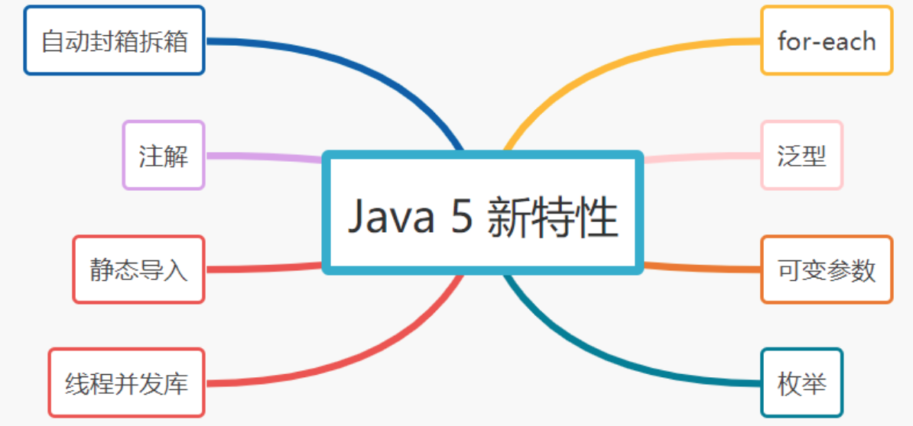

# 050-Java 5 新特性

[TOC]



## 1. 泛型

泛型本质是参数化类型，解决不确定具体对象类型的问题。

```java
 List<String> strList=new ArrayList<String>();
```

## 2. 增强循环（for-each）

for-each循环简化了集合的遍历。

```
String [] str = {"关注","公众号","捡田螺的小男孩"};
for (String temp:str) {
     System.out.println(temp);
}
```

## 3. 自动封箱拆箱

- 自动装箱: 就是将基本数据类型自动转换成对应的包装类。
- 自动拆箱：就是将包装类自动转换成对应的基本数据类型。

包装类型有：Integer,Double,Float,Long,Short,Character和Boolean

```
Integer i =666;  //自动装箱
int a= i;     //自动拆箱
```

## 4. 枚举

关键字enum可以将一组具名的值的有限集合创建为一种新的类型，而这些具名的值可以作为常规的程序组件使用，这就是枚举类型。

```
enum SeasonEnum {
    SPRING,SUMMER,FALL,WINTER;
}
```

## 5. 可变参数

我们在定义方法参数的时候不确定定义多少个，就可以定义为**「可变参数」**，它本质上是一个**「数组」**。

```java
public static void main(String[] args) throws Exception {
    String [] str = {"关注","公众号","捡田螺的小男孩"};
    testVarargs(str);
    String str1 = "关注公众号，捡田螺的小男孩";
    testVarargs(str1);
}
//可变参数String... args
private static void testVarargs(String... args) {
    for (String arg : args) {
        System.out.println(arg);
    }
}
```

## 6. 注解

可以把注解理解为代码里的特殊标记，这些标记可以在编译，类加载，运行时被读取，并执行相应的处理。

```java
@Target(ElementType.METHOD)
@Retention(RetentionPolicy.SOURCE)
public @interface Override {
}
```

## 7.静态导入

通过import static类，就可以使用类里的静态变量或方法。看一下例子哈~

```java
import static java.lang.System.out; //静态导入System类的静态变量out
public class Test {
    public static void main(String[] args) throws Exception {
        String str1 = "关注公众号，捡田螺的小男孩";
        System.out.println(str1); //常规写法
        out.println(str1);  //静态导入，可以直接使用out输出
    }
}
```

## 8. 线程并发库（JUC）

JDK5 丰富了线程处理功能，java.util.concurrent包提供了以下的类、接口：

- 线程池：ExecutorService接口
- 线程护斥：Lock 类
- 线程通信：Condition接口
- 同步队列：ArrayBlockingQueue类
- 同步集合：ConcurrentHashMap类