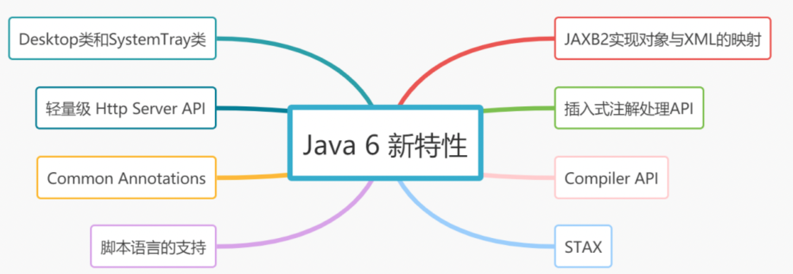

# 060-Java 6 新特性

[TOC]



## 1.Desktop类和SystemTray类

JDK 6在java.awt包下，新增了两个类：Desktop类和SystemTray类

- **「Desktop类」**: 用来打开系统默认浏览器浏览指定的URL,打开系统默认邮件客户端发邮件等
- **「SystemTray类」**:用来在系统托盘区创建一个托盘程序,如果在微软的Windows上，它被称为“任务栏”状态区域。

```java
//获取Desktop实例
Desktop desktop = Desktop.getDesktop();
desktop.browse(URI.create("https://www.baidu.com"));
```

## 2. 使用JAXB2来实现对象与XML之间的映射

JAXB,即Java Architecture for XML Binding,可以实现对象与XML之间的映射，常用注解如下:

> - @XmlRootElement：注解在类上面，对应xml的跟元素，使用name属性定义根节点的名称。
> - @XmlElement：指定一个字段或get/set方法映射到xml的节点，使用name属性定义这个根节点的名称。
> - @XmlAttribute：将JavaBean对象的属性映射为xml的属性,使用name属性为生成的xml属性指定别名。
> - @XmlAccessorType:定义映射这个类中的何种类型都需要映射到xml。
> - @XmlSchema: 将包映射到XML名称空间

**「看个例子吧~」**

```java
public class JAXB2XmlTest {

    public static void main(String[] args) throws JAXBException, IOException {
        
        List<Singer> list = new ArrayList<>();
        list.add(new Singer("jay", 8));
        list.add(new Singer("eason", 10));

        SingerList singerList = new SingerList();
        singerList.setSingers(list);

        String str = JAXB2XmlTest.beanToXml(singerList, SingerList.class);
        String path = "C:\\jay.txt";
        BufferedWriter bfw = new BufferedWriter(new FileWriter(new File(path)));
        bfw.write(str);
        bfw.close();

    }

    private static String beanToXml(Object obj, Class<?> load) throws JAXBException {
        JAXBContext context = JAXBContext.newInstance(load);
        Marshaller marshaller = context.createMarshaller();
        marshaller.setProperty(Marshaller.JAXB_FORMATTED_OUTPUT, true);
        marshaller.setProperty(Marshaller.JAXB_ENCODING, "GBK");
        StringWriter writer = new StringWriter();
        marshaller.marshal(obj,writer);
        return writer.toString();
    }
}
public class Singer {

    private String name;
    private int age;
    public Singer(String name, int age) {
        this.name = name;
        this.age = age;
    }
    @XmlAttribute(name="name")
    public String getName() {
        return name;
    }
    public void setName(String name) {
        this.name = name;
    }
    @XmlAttribute(name="age")
    public int getAge() {
        return age;
    }
    public void setAge(int age) {
        this.age = age;
    }
}
@XmlRootElement(name="list")
public class SingerList {

    private List<Singer> singers;
    
    @XmlElement(name="singer")
    public List<Singer> getSingers() {
        return singers;
    }

    public void setSingers(List<Singer> singers) {
        this.singers = singers;
    }
}
```

**「运行效果：」**

```java
<?xml version="1.0" encoding="GBK" standalone="yes"?>
<list>
    <singer age="8" name="jay"/>
    <singer age="10" name="eason"/>
</list>
```

## 3.轻量级 Http Server API

JDK 6中提供了简单的Http Server API，可以构建嵌入式Http服务器,同时支持Http和Https协议。HttpServer会调用HttpHandler实现类的回调方法来处理客户端请求,这里用户只需实现HttpHandler接口就可以了。

```java
/**
 * 根据Java提供的API实现Http服务器
 */
public class MyHttpServer {

    /**
     * @param args
     * @throws IOException
     */
    public static void main(String[] args) throws IOException {
        //创建HttpServer服务器
        HttpServer httpServer = HttpServer.create(new InetSocketAddress(8080), 10);
        //将 /jay请求交给MyHandler处理器处理
        httpServer.createContext("/", new MyHandler());
        httpServer.start();
    }
}

public class MyHandler implements HttpHandler {

    public void handle(HttpExchange httpExchange) throws IOException {
        //请求头
        Headers headers = httpExchange.getRequestHeaders();
        Set<Map.Entry<String, List<String>>> entries = headers.entrySet();

        StringBuffer response = new StringBuffer();
        for (Map.Entry<String, List<String>> entry : entries){
            response.append(entry.toString() + "\n");
        }
        //设置响应头属性及响应信息的长度
        httpExchange.sendResponseHeaders(200, response.length());
        //获得输出流
        OutputStream os = httpExchange.getResponseBody();
        os.write(response.toString().getBytes());
        os.close();
    }
}
```

## 4. 插入式注解处理API

> JDK 6提供了插入式注解处理API，可以让我们定义的注解在编译期而不是运行期生效，从而可以在编译期修改字节码。lombok框架就是使用该特性来实现的，Lombok通过注解的方式，在编译时自动为属性生成构造器、getter/setter、equals、hashcode、toString等方法，大大简化了代码的开发。

## 5. STAX

STAX，是JDK6中一种处理XML文档的API。

```java
public class STAXTest {

    public static void main(String[] args) throws Exception {

        XMLInputFactory xmlInputFactory = XMLInputFactory.newInstance();
        XMLEventReader xmlEventReader = xmlInputFactory.createXMLEventReader(new FileInputStream("C:\\jay.xml"));
        XMLEvent event = null;
        StringBuffer stringBuffer = new StringBuffer();
        while (xmlEventReader.hasNext()) {
            event = xmlEventReader.nextEvent();
            stringBuffer.append(event.toString());
        }
        System.out.println("xml文档解析结果：");
        System.out.println(stringBuffer);
    }
}
```

**「运行结果:」**

```xml
xml文档解析结果：
<?xml version="1.0" encoding='GBK' standalone='yes'?><list>
    <singer name='jay' age='8'></singer>
    <singer name='eason' age='10'></singer>
</list>ENDDOCUMENT
```

## 6. Common Annotations

> ❝
>
> Common annotations原本是Java EE 5.0(JSR 244)规范的一部分，现在SUN把它的一部分放到了Java SE 6.0中。随着Annotation元数据功能加入到Java SE 5.0里面，很多Java 技术都会用Annotation部分代替XML文件来配置运行参数。
>
> ❞

以下列举Common Annotations 1.0里面的几个Annotations:

- @Generated：用于标注生成的源代码
- @Resource： 用于标注所依赖的资源，容器据此注入外部资源依赖，有基于字段的注入和基于setter方法的注入两种方式 。
- @Resources：同时标注多个外部依赖，容器会把所有这些外部依赖注入
- @PostConstruct：标注当容器注入所有依赖之后运行的方法，用来进行依赖注入后的初始化工作，只有一个方法可以标注为PostConstruct 。
- @PreDestroy：当对象实例将要被从容器当中删掉之前，要执行的回调方法要标注为PreDestroy

## 7. Compiler API

javac编译器可以把.java的源文件编译为.class文件，JDK 6的新特性Compiler API(JSR 199)也可以动态编译Java源文件。

```
public class CompilerApiTest {
    public static void main(String[] args) throws Exception {
        JavaCompiler javaCompiler = ToolProvider.getSystemJavaCompiler();
        StandardJavaFileManager standardJavaFileManager = javaCompiler.getStandardFileManager(null,null,null);
        Iterable<? extends JavaFileObject> javaFileObjects = standardJavaFileManager.getJavaFileObjects("C:\\Singer.java");
        javaCompiler.getTask(null, standardJavaFileManager, null, null, null, javaFileObjects).call();
        standardJavaFileManager.close();
    }
}
```

运行结果：会在C目录生成Singer.class文件

## 8. 对脚本语言的支持（如: ruby, groovy, javascript）

JDK6增加了对脚本语言的支持(JSR 223)，原理是将脚本语言编译成字节码，这样脚本语言也能享用Java平台的诸多优势，包括可移植性，安全等。JDK6实现包含了一个基于Mozilla Rhino的 脚本语言引擎,因此可以支持javascript，当然JDK也支持ruby等其他语言

```
public class JavaScriptTest {

    public static void main(String[] args) throws Exception {
        ScriptEngineManager factory = new ScriptEngineManager();
        ScriptEngine engine = factory.getEngineByName("JavaScript");
        String script;
        try {
            script = "print('Hello')";
            engine.eval(script);// 执行脚本
        }catch (Exception e) {
            e.printStackTrace();
        }
    }
}
//output
Hello
```