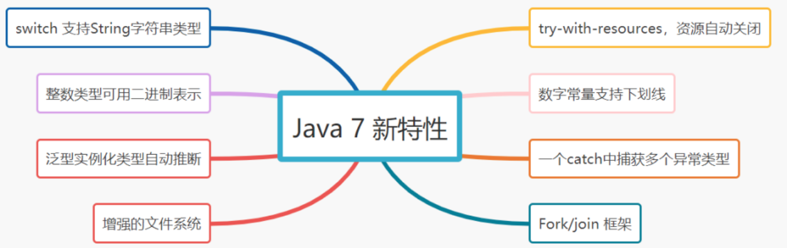
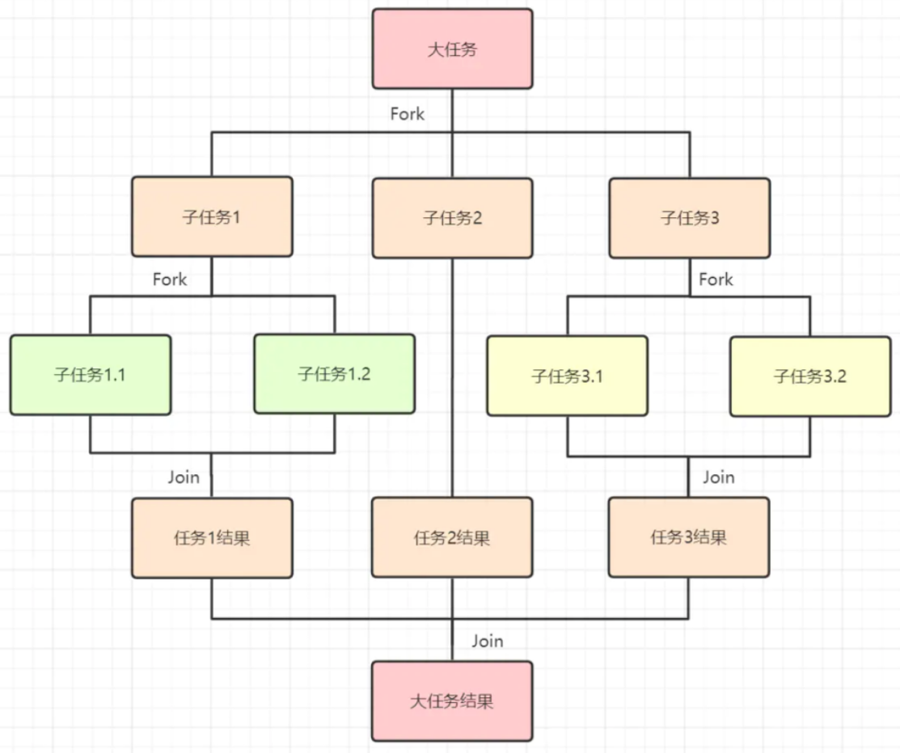

# 070-Java 7 新特性

[TOC]



## 1.switch 支持String字符串类型。

```java
String singer = "jay";
switch (singer) {
       case "jay" :
            System.out.println("周杰伦");
             break;
       case "eason" :
            System.out.println("陈奕迅");
            break ;
       default :
            System.out.println("其他");
            break ;
   }
```

## 2.try-with-resources，资源自动关闭

JDK 7 之前:

```java
BufferedReader br = new BufferedReader(new FileReader("d:七里香.txt"));
try {
   return br.readLine();
} finally {
   br.close();
}
```

JDK 7 之后：

```
/*
 * 声明在try括号中的对象称为资源，在方法执行完毕后会被自动关闭
 */
try (BufferedReader br = new BufferedReader(new FileReader("d:七里香.txt")) {
   return br.readLine();
}
```

## 3. 整数类型如（byte，short，int，long）能够用二进制来表示

```java
//0b或者0B表示二进制
int a = 0b010;
int b = 0B010;
```

## 4. 数字常量支持下划线

```java
int a = 11_11;//a的值为1111，下划线不影响实际值，提升可读性
```

## 5. 泛型实例化类型自动推断,即”<>”

JDK 7 之前：

```java
Map<String, List<String>> map = new HashMap<String, List<String>>();
```

JDK 7之后：

```java
//不须声明类型,自动根据前面<>推断其类型
Map<String, List<String>> map = new HashMap<>();
```

## 6.一个catch中捕获多个异常类型，用（|）分隔开

JDK 7之前

```java
try{
   //do something
} catch (FirstException e) {
     logger.error(e);
} catch (SecondException e) {
     logger.error(ex);
}
```

JDk 7之后

```java
try{
   //do something
} catch (FirstException | SecondException e) {
     logger.error(e);
}
```

## 7. 增强的文件系统

Java7 提供了全新的NIO2.0 API，方便文件管理的编码。如，可以在java.nio.file包下使用Path、Paths、Files、WatchService等常用类型。

```java
Path path = Paths.get("C:\\jay\\七里香.txt"); //创建Path对象
byte[] bytes= Files.readAllBytes(path);  //读取文件
System.out.println(path.getFileName()); //获取当前文件名称
System.out.println(path.toAbsolutePath()); // 获取文件绝对路径
System.out.println(new String(bytes, "utf-8"));
```

## 8. Fork/join 框架

Java7提供的一个用于并行执行任务的框架，是一个把大任务分割成若干个小任务，最终汇总每个小任务结果后得到大任务结果的框架。



Fork/join计算1-1000累加值：

```java
public class ForkJoinPoolTest {

    private static final Integer DURATION_VALUE = 100;

    static class ForkJoinSubTask extends RecursiveTask<Integer>{

        // 子任务开始计算的值
        private Integer startValue;
        // 子任务结束计算的值
        private Integer endValue;

        private ForkJoinSubTask(Integer startValue , Integer endValue) {
            this.startValue = startValue;
            this.endValue = endValue;
        }

        @Override
        protected Integer compute() {
            //小于一定值DURATION,才开始计算
            if(endValue - startValue < DURATION_VALUE) {
                System.out.println("执行子任务计算：开始值 = " + startValue + ";结束值 = " + endValue);
                Integer totalValue = 0;
                for (int index = this.startValue; index <= this.endValue; index++) {
                    totalValue += index;
                }
                return totalValue;
            } else {
                // 将任务拆分，拆分成两个任务
                ForkJoinSubTask subTask1 = new ForkJoinSubTask(startValue, (startValue + endValue) / 2);
                subTask1.fork();
                ForkJoinSubTask subTask2 = new ForkJoinSubTask((startValue + endValue) / 2 + 1 , endValue);
                subTask2.fork();
                return subTask1.join() + subTask2.join();
            }
        }
    }

    public static void main(String[] args) throws ExecutionException, InterruptedException {
        // Fork/Join框架的线程池
        ForkJoinPool pool = new ForkJoinPool();
        ForkJoinTask<Integer> taskFuture =  pool.submit(new ForkJoinSubTask(1,1000));

        Integer result = taskFuture.get();
        System.out.println("累加结果是:" + result);

    }
}
```

运行结果：

```
...
执行子任务计算：开始值 = 189;结束值 = 250
执行子任务计算：开始值 = 251;结束值 = 313
执行子任务计算：开始值 = 314;结束值 = 375
执行子任务计算：开始值 = 376;结束值 = 438
执行子任务计算：开始值 = 439;结束值 = 500
执行子任务计算：开始值 = 501;结束值 = 563
执行子任务计算：开始值 = 564;结束值 = 625
执行子任务计算：开始值 = 626;结束值 = 688
执行子任务计算：开始值 = 689;结束值 = 750
执行子任务计算：开始值 = 751;结束值 = 813
执行子任务计算：开始值 = 814;结束值 = 875
执行子任务计算：开始值 = 876;结束值 = 938
执行子任务计算：开始值 = 939;结束值 = 1000
累加结果是:500500
```

###  