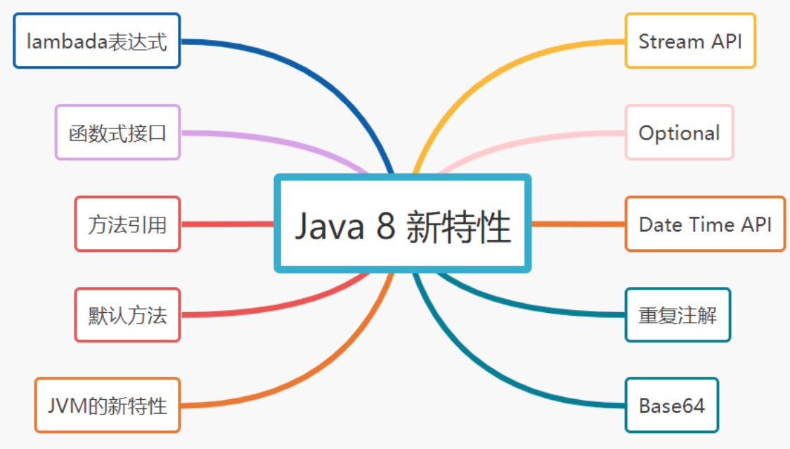

# 080-Java 8 新特性

[TOC]



## 1.lambada表达式

Lambda 允许把函数作为一个方法的参数，传递到方法中

语法格式：

```java
(parameters) -> expression 或 (parameters) ->{ statements; }
```

代码示例：

```java
Arrays.asList("jay", "Eason", "SHE").forEach(
       ( String singer ) -> System.out.print( singer + ",") );
```

## 2. 函数式接口

Lambda的设计者为了让现有的功能与Lambda表达式很好兼容，设计出函数式接口。

- 函数式接口是指只有一个函数的接口，可以隐式转换为lambada表达式。
- Java 8 提供了注解@FunctionalInterface，显示声明一个函数式接口。
- java.lang.Runnable和java.util.concurrent.Callable是函数式接口的例子~

```java
@FunctionalInterface
public interface Runnable {
    public abstract void run();
}
```

## 3. 方法引用

方法引用提供了非常有用的语法，可以直接引用已有Java类或对象（实例）的方法或构造器。它与Lambda表达式配合使用，可以减少冗余代码，使代码更加简洁。

```java
//利用函数式接口Consumer的accept方法实现打印，Lambda表达式如下
Consumer<String> consumer = x -> System.out.println(x);
consumer.accept("jay");
//引用PrintStream类（也就是System.out的类型）的println方法，这就是方法引用
consumer = System.out::println;
consumer.accept("关注公众号捡田螺的小男孩");
```

## 4. 默认方法

默认方法就是一个在接口里面有了一个实现的方法。它允许将新方法添加到接口，但不强制实现了该接口的类必须实现新的方法。

```java
public interface ISingerService {
    // 默认方法
    default void sing(){
        System.out.println("唱歌");
    }
    void writeSong();
}

//JaySingerServiceImpl 不用强制实现ISingerService的默认sing()方法
public class JaySingerServiceImpl implements ISingerService {
    @Override
    public void writeSong() {
        System.out.println("写了一首七里香");
    }
}
```

## 5.Stream API

Stream API，支持对元素流进行函数式操作，它集成在Collections API 中，可以对集合进行批量操作。常用API：

- filter 筛选
- map流映射
- reduce 将流中的元素组合起来
- collect 返回集合
- sorted 排序
- flatMap 流转换
- limit返回指定流个数
- distinct去除重复元素

```java
public class Singer {

    private String name;
    private Integer songNum;
    private Integer age;
    ...
}

List<Singer> singerList = new ArrayList<Singer>();
singerList.add(new Singer("jay", 11, 36));
singerList.add(new Singer("eason", 8, 31));
singerList.add(new Singer("JJ", 6, 29));

List<String> singerNameList = singerList.stream()
                .filter(singer -> singer.getAge() > 30)  //筛选年龄大于30
                .sorted(Comparator.comparing(Singer::getSongNum))  //根据歌曲数量排序
                .map(Singer::getName)  //提取歌手名字
                .collect(Collectors.toList()); //转换为List
```

## 6. Optional

Java 8引入Optional类，用来解决NullPointerException。Optional代替if...else解决空指针问题，使代码更加简洁。

if...else 判空

```java
Singer singer = getSingerById("666");
if (singer != null) {
    String name  = singer.getName();
    System.out.println(name);
}
```

Optional的判空

```java
Optional<Singer> singer = Optional.ofNullable(getSingerById("666"));
singer.ifPresent(s -> System.out.println(s.getName()));
```

## 7. Date Time API

JDK 8之前的日期API处理存在非线程安全、时区处理麻烦等问题。Java 8 在 java.time包下提供了新的日期API，简化了日期的处理~

```java
LocalDate today = LocalDate.now();
int year = today.getYear();
System.out.println("今年是" + year);
//是否闰年
System.out.println("今年是不是闰年:" + today.isLeapYear());

LocalDateTime todayTime = LocalDateTime.now();
System.out.println("当前时间" + todayTime);
//时区指定
System.out.println("美国时间:" + ZonedDateTime.of(todayTime,ZoneId.of("America/Los_Angeles")));
        
LocalDate specailDate = LocalDate.of(2020, 6, 20);
LocalDate expectDate = specailDate.plus(100, ChronoUnit.DAYS);
System.out.println("比较特别的一天" + specailDate);
System.out.println("特殊日期的100天" + expectDate);
```

## 8. 重复注解

重复注解，即一个注解可以在一个类、属性或者方法上同时使用多次；用@Repeatable定义重复注解

```java
@Repeatable(ScheduleTimes.class)
public @interface ScheduleTime {
    String value();
}

public @interface ScheduleTimes {
    ScheduleTime[] value();
}

public class ScheduleTimeTask {
    @ScheduleTime("10")
    @ScheduleTime("12")
    public void doSomething() { }
}
```

## 9. Base64

Java 8把Base64编码的支持加入到官方库中~

```java
String str = "公众号:捡田螺的小男孩";
String encoded = Base64.getEncoder().encodeToString(str.getBytes( StandardCharsets.UTF_8));
String decoded = new String(Base64.getDecoder().decode(encoded), StandardCharsets.UTF_8);
```

## 10. JVM的新特性

使用元空间Metaspace代替持久代（PermGen space），JVM参数使用-XX:MetaSpaceSize和-XX:MaxMetaspaceSize设置大小。

###  