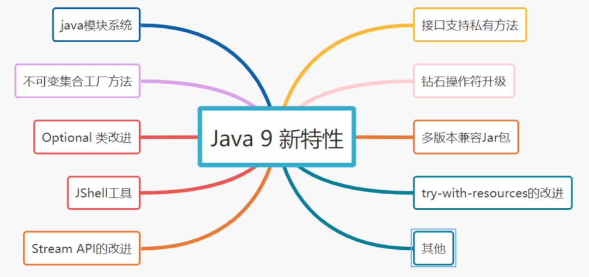

# 090-Java 9 新特性

[TOC]

## 



## 1. java模块系统

什么是模块化？

> 一个大型系统，比如一个商城网站，它会包含很多模块的，如：订单模块，用户信息模块，商品信息模块，广告位模块等等。各个模块之间会相互调用。如果每个模块单独运行都会带动其他所有模块，性能非常低效。但是，如果某一模块运行时，只会启动它所依赖的模块，性能大大提升。这就是JDK 9模块化的思想。

什么是JDK 9模块化？

> Java 平台模块系统，即Project Jigsaw，把模块化开发实践引入到了Java平台中。在引入了模块系统之后，JDK 被重新组织成94个模块。Java 应用可以通过新增的jlink 工具，创建出只包含所依赖的JDK模块的自定义运行时镜像。这样可以极大的减少Java运行时环境的大小。

Java 9 模块的重要特征：

> - 在其工件（artifact）的根目录中包含了一个描述模块的 module-info.class 文 件。
>
> - 工件的格式可以是传统的 JAR 文件或是 Java 9 新增的 JMOD 文件。
> - 这个文件由根目录中的源代码文件 module-info.java 编译而来。
> - 该模块声明文件可以描述模块的不同特征。

在 module-info.java 文件中，我们可以用新的关键词module来声明一个模块，如下所示。下面给出了一个模块com.mycompany.mymodule的最基本的模块声明

```
module com.jay.sample {   //关键词module来声明一个模块
    exports com.jay.sample; //使用 exports可以声明模块对其他模块所导出的包。
    requires com.jay.common; //使用requires可以声明模块对其他模块的依赖关系。
}
```

## 2. 不可变集合工厂方法

为了创建不可变集合，JDK9之前酱紫的：

```java
List<String> stringList = new ArrayList<>();
stringList.add("关注公众号:");
stringList.add("捡田螺的小男孩");
List<String> unmodifiableList = Collections.unmodifiableList(stringList);
```

JDK 9 提供了List.of()、Set.of()、Map.of()和Map.ofEntries()等工厂方法来创建不可变集合：

```java
List<String> unmodifiableList = List.of("关注公众号:","捡田螺的小男孩");
```

## 3. 接口支持私有方法

JDK 8支持在接口实现默认方法和静态方法，但是不能在接口中创建私有方法，为了避免了代码冗余和提高阅读性，JDK 9在接口中支持私有方法。

```java
public interface IPrivateInterfaceTest {

    //JDK 7 之前
    String a = "jay";
    void method7();

    //JDK 8
    default void methodDefault8(){
        System.out.println("JDK 8新特性默认方法");
    }
    static void methodStatic8() {
        System.out.println("JDk 8新特性静态方法");
    }
    
    //Java 9 接口支持私有方法
    private void method9(){}
}
```

## 4.  钻石操作符升级

- 钻石操作符是在 java 7 中引入的，可以让代码更易读，但它不能用于匿名的内部类。
- 在 java 9 中， 它可以与匿名的内部类一起使用，从而提高代码的可读性。

```java
//JDK 5,6
Map<String, String> map56 = new HashMap<String,String>();
//JDk 7,8
Map<String, String> map78 = new HashMap<>();
//JDK 9 结合匿名内部类的实现
Map<String, String> map9 = new HashMap<>(){};
```

## 5. Optional 类改进

java 9 中，java.util.Optional 添加了很多新的有用方法，如：

- stream()
- ifPresentOrElse()
- or()

ifPresentOrElse 方法的改进就是有了 else，接受两个参数 Consumer 和 Runnable。

```java
import java.util.Optional;
 
public class OptionalTest {
   public static void main(String[] args) {
      Optional<Integer> optional = Optional.of(1);
 
      optional.ifPresentOrElse( x -> System.out.println("Value: " + x),() -> 
         System.out.println("Not Present."));
 
      optional = Optional.empty();
 
      optional.ifPresentOrElse( x -> System.out.println("Value: " + x),() -> 
         System.out.println("Not Present."));
   }  
}
```

## 6. 多版本兼容Jar包

> 很多公司使用的JDK都是老版本的，JDK6、JDk5 ，甚至JDk4的，不是他们不想升级JDk版本，而是担心兼容性问题。JDK 9的一个新特性，多版本兼容Jar包解决了这个问题。举个例子：假设你一直用的是小米8，已经非常习惯它的运行流程了，突然出来小米9，即使小米9很多新功能引人入胜，但是有些人不会轻易买小米9，因为已经已经习惯小米8的流程。同理，为什么很多公司不升级JDK，就是在此。但是呢，JDK 9的这个功能很强大，它可以让你的版本升级到JDK 9，但是还是老版本的运行流程，即在老的运行流程继承新的功能~

## 7. JShell工具

jShell工具相当于cmd工具，然后呢，你可以像在cmd工具操作一样，直接在上面运行Java方法，Java语句等~

```java
jshell> System.out.println("关注公众号：捡田螺的小男孩");
关注公众号：捡田螺的小男孩
```

## 8. try-with-resources的改进

JDK 9对try-with-resources异常处理机制进行了升级~

```java
//JDK 7,8
try (BufferedReader br = new BufferedReader(new FileReader("d:七里香.txt")) {
   br.readLine();
}catch(IOException e){
  log.error("IO 异常，e:{}",e);
}
//JDk 9
BufferedReader br = new BufferedReader(new FileReader("d:七里香.txt")
try(br){
  br.readLine();
}catch(IOException e){
  log.error("IO 异常，e:{}",e);
}
```

## 9. Stream API的改进

JDK 9 为Stream API引入以下这些方法，丰富了流处理操作：

- takeWhile（）
- dropWhile（）
- iterate
- ofNullable

**「takeWhile」**

使用一个断言（Predicate 接口）作为参数，返回给定Stream的子集直到断言语句第一次返回 false

```java
// 语法格式
default Stream<T> takeWhile(Predicate<? super T> predicate)
//代码示例
Stream.of(1,2,3).takeWhile(s-> x<2)
         .forEach(System.out::println); 
 //输出
 1
```

**「dropWhile」**

与 takeWhile（）作用相反，使用一个断言（Predicate 接口）作为参数，直到断言语句第一次返回true，返回给定Stream的子集

```java
//语法
default Stream<T> dropWhile(Predicate<? super T> predicate)
//代码示例
Stream.of(1,2,3).dropWhile(s-> x<2)
         .forEach(System.out::println);
//输出
2
3
```

**「iterate」**

iterate() 方法能够返回以seed（第一个参数）开头，匹配 Predicate（第二个参数）直到返回false，并使用第三个参数生成下一个元素的元素流。

```java
//语法
static <T> Stream<T> iterate(T seed, Predicate<? super T> hasNext, UnaryOperator<T> next)
//代码示例
IntStream.iterate(2, x -> x < 10, x -> x*x).forEach(System.out::println);
//输出
2
4
```

**「ofNullable」**

如果指定元素为非null，则获取一个元素并生成单个元素流，元素为null则返回一个空Stream。

```java
//语法
static <T> Stream<T> ofNullable(T t)
//代码示例
Stream<Integer> s1= Stream.ofNullable(100);
s1.forEach(System.out::println)
Stream<Integer> s2 = Stream.ofNullable(null)；
s2.forEach(System.out::println)
//输出
100
```

## 10.其他

> - HTTP 2客户端 (支持 WebSocket和 HTTP2 流以及服务器推送)
> - 进程API（控制和管理操作系统进程）
> - String底层存储结构更改(char[]替换为byte[])
> - 标识符添加限制( String _ ="hello"不能用)
> - 响应式流 API (支持Java 9中的响应式编程)