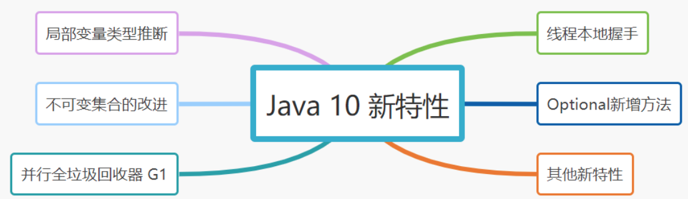

# 100-Java 10 新特性

[TOC]

## 



## 1.局部变量类型推断

JDK 10增加了局部变量类型推断（Local-Variable Type Inference）功能，让 Java 可以像Js里的var一样可以自动推断数据类型。Java中的var是一个保留类型名称，而不是关键字。

JDK 10之前

```java
List<String> list = new ArrayList<String>();
Stream<Integer> stream = Stream.of(1, 2, 3);
```

JDK 10 之后

```
var list = new ArrayList<String>(); // ArrayList<String>
var stream =  Stream.of(1, 2, 3);
```

var 变量类型推断的使用也有局限性，仅**「局限」**于以下场景：

- 具有初始化器的局部变量
- 增强型for循环中的索引变量
- 传统for循环中声明的局部变量

而**「不能用于」**

- 推断方法的参数类型
- 构造函数参数类型推断
- 推断方法返回类型
- 字段类型推断
- 捕获表达式

## 2. 不可变集合的改进

JDK 10中，List，Set，Map 提供了一个新的静态方法copyOf(Collection<? extends E> coll)，它返回Collection集合一个不可修改的副本。

JDK 源码：

```
static <E> List<E> copyOf(Collection<? extends E> coll) {
    return ImmutableCollections.listCopy(coll);
}
```

使用实例：

```
var oldList = new ArrayList<String>();
oldList.add("欢迎关注公众号：");
oldList.add("捡田螺的小男孩");

var copyList = List.copyOf(oldList);
oldList.add("在看、转载、点赞三连"); 
copyList.add("双击666");  //UnsupportedOperationException异常
```

## 3. 并行全垃圾回收器 G1

> JDK 9引入 G1 作为默认垃圾收集器，执行GC 时采用的是基于单线程标记扫描压缩算法（mark-sweep-compact）。为了最大限度地减少 Full GC 造成的应用停顿的影响，Java 10 中将为 G1 引入多线程并行 GC，同时会使用与年轻代回收和混合回收相同的并行工作线程数量，从而减少了 Full GC 的发生，以带来更好的性能提升、更大的吞吐量。

## 4. 线程本地握手

Java 10 中线程管控引入JVM安全点的概念，将允许在不运行全局JVM安全点的情况下实现线程回调，由线程本身或者JVM线程来执行，同时保持线程处于阻塞状态，这将会很方便使得停止单个线程或不停止线程成为可能。

## 5. Optional新增orElseThrow()方法

Optional、OptionalDouble等类新增一个方法orElseThrow()，在没有值时抛出异常

## 6. 其他新特性

- 基于 Java 的 实验性 JIT 编译器
- 类数据共享
- Unicode 语言标签扩展
- 根证书
- 基于时间（Time-Based）的版本控制模型