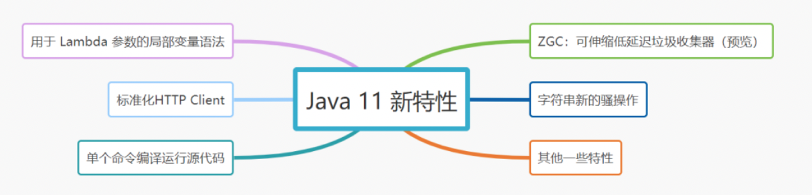

# 110-Java 11 新特性

[TOC]

## Java 11 新特性



## 1.字符串操作

String类是Java最常用的类，JDK 11增加了一系列好用的字符串处理方法

- isBlank() 判空。
- strip() 去除首尾空格
- stripLeading() 去除字符串首部空格
- stripTrailing() 去除字符串尾部空格
- lines() 分割获取字符串流。
- repeat() 复制字符串

```java
// 判断字符串是否为空白
"  ".isBlank();    // true

// 去除首尾空格
" jay ".strip();  // "jay"

// 去除首部空格 
" jay ".stripLeading();   // "jay "

去除字符串尾部空格
" jay ".stripLeading();   // " jay"

// 行数统计
"a\nb\nc".lines().count();    // 3

// 复制字符串
"jay".repeat(3);   // "jayjayjay"
```

## 2.用于 Lambda 参数的局部变量语法

局部变量类型推断是Java 10引入的新特性，但是不能在Lambda 表达式中使用。Java 11再次创新，它允许开发者在 Lambda 表达式中使用 var 进行参数声明。

```java
var map = new HashMap<String, Object>();
map.put("公众号", "捡田螺的小男孩");
map.forEach((var k, var v) -> {
    System.out.println(k + ": " + v);
});
```

## 3.标准化HTTP Client

Java 9 引入Http Client API,Java 10对它更新，Java 11 对它进行标准化。这几个版本后，Http Client几乎被完全重写，支持HTTP/1.1和HTTP/2 ，也支持 websockets。

```java
HttpClient client = HttpClient.newHttpClient();
HttpRequest request = HttpRequest.newBuilder()
            .uri(URI.create("https://github.com/whx123/JavaHome"))
            .GET()
            .build();

// 同步
HttpResponse<String> response = client.send(request, HttpResponse.BodyHandlers.ofString());
System.out.println(response.body());

// 异步
client.sendAsync(request, HttpResponse.BodyHandlers.ofString())
    .thenApply(HttpResponse::body)
    .thenAccept(System.out::println);
```

## 4. 单个命令编译运行源代码

Java 11增强了Java 启动器，使之能够运行单一文件的Java 源代码。

- Java 11之前,要运行一个 Java 源代码必须先编译，再运行

```
// 编译
javac Jay.java
// 运行
java Jay
```

- Java 11之后,只要一个java命令就搞定

```
java Jay.java
```

## 5. ZGC：可伸缩低延迟垃圾收集器

ZGC ，即 Z Garbage Collector（垃圾收集器或垃圾回收器）。它是一个可伸缩的、低延迟的垃圾收集器。 ZGC 主要为了满足如下目标进行设计：

- GC 停顿时间不超过 10ms
- 既能处理几百 MB 的小堆，也能处理几个 TB 的大堆
- 应用吞吐能力不会下降超过 15%（与 G1 回收算法相比）
- 方便在此基础上引入新的 GC 特性和利用 colord
- 针以及 Load barriers 优化奠定基础
- 当前只支持 Linux/x64 位平台

## 6.其他一些特性

- 添加 Epsilon 垃圾收集器。
- 支持 TLS 1.3 协议
- 飞行记录器分析工具
- 动态类文件常量
- 低开销的 Heap Profiling 