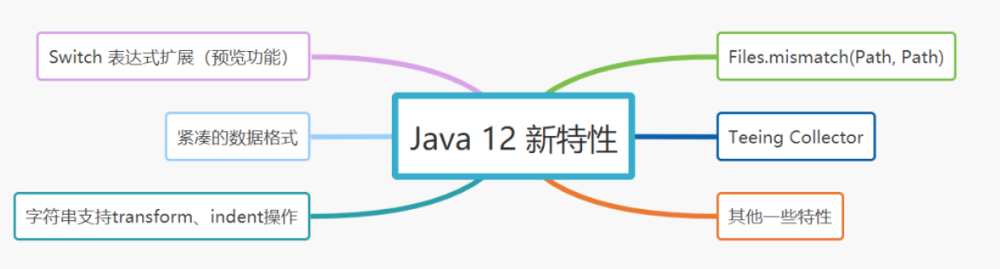

# 120-Java 12 新特性

[TOC]



## 1. Switch 表达式扩展（预览功能）

传统的switch语句，容易漏写break而出错，同时写法并不简洁优雅。

Java 12之前

```java
switch (day) {
    case MONDAY:
    case FRIDAY:
    case SUNDAY:
        System.out.println(6);
        break;
    case TUESDAY:
        System.out.println(7);
        break;
    case THURSDAY:
    case SATURDAY:
        System.out.println(8);
        break;
    case WEDNESDAY:
        System.out.println(9);
        break;
}
```

JDk 12 之后，Switch表达式得到增强，能接受语句和表达式。

```java
switch (day) {
    case MONDAY, FRIDAY, SUNDAY -> System.out.println(6);
    case TUESDAY                -> System.out.println(7);
    case THURSDAY, SATURDAY     -> System.out.println(8);
    case WEDNESDAY              -> System.out.println(9);
}
```

## 2. 紧凑的数据格式

JDK 12 新增了NumberFormat对复杂数字的格式化

```java
NumberFormat numberFormat = NumberFormat.getCompactNumberInstance(Locale.CHINA, NumberFormat.Style.SHORT);
System.out.println(numberFormat.format(100000));
//output
10万
```

## 3. 字符串支持transform、indent操作

- transform 字符串转换，可以配合函数式接口Function一起使用

```java
List<String> list1 = List.of("jay", " 捡田螺的小男孩");
List<String> list2 = new ArrayList<>();
list1.forEach(element ->
            list2.add(element.transform(String::strip)
                    .transform((e) -> "Hello," + e))
    );
list2.forEach(System.out::println);
//输出
Hello,jay
Hello,捡田螺的小男孩
```

- indent 缩进，每行开头增加空格space和移除空格

```java
String result = "Java\n Python\nC".indent(3);
System.out.println(result);
//输出
   Java
    Python
   C
```

## 4. Files.mismatch(Path, Path)

Java 12 新增了mismatch方法，此方法返回第一个不匹配的位置，如果没有不匹配，则返回 -1L。

```java
public static long mismatch(Path path, Path path2) throws IOException;
```

代码示例：

```java
Path file1 = Paths.get("c:\\jay.txt");
Path file2 = Paths.get("c：\\捡田螺的小男孩.txt");

try {
 long fileMismatch = Files.mismatch(file1, file2);
 System.out.println(fileMismatch);
} catch (IOException e) {
 e.printStackTrace();
}
```

## 5. Teeing Collector

Teeing Collector 是 Streams API 中引入的新的收集器实用程序，它的作用是 merge 两个 collector 的结果,API格式如下：

```java
public static <T, R1, R2, R>
    Collector<T, ?, R> teeing(Collector<? super T, ?, R1> downstream1,
    Collector<? super T, ?, R2> downstream2,
    BiFunction<? super R1, ? super R2, R> merger)
```

直接看代码例子吧，如下为求学生的平均分和总分的例子

```java
  List<Student> studentList= Arrays.asList(
                new Student("jay", 90),
                new Student("捡田螺的小男孩", 100),
                new Student("捡表情的小男孩", 80)
        );
        String teeingResult=studentList.stream().collect(
                Collectors.teeing(
                        Collectors.averagingInt(Student::getScore),
                        Collectors.summingInt(Student::getScore),
                        (s1,s2)-> s1+ ":"+ s2
                )
        );
 System.out.println(teeingResult); //90:270
```

## 6.其他特性

- 支持unicode 11（684个新字符、11个新blocks、7个新脚本）
- JVM 常量 API （主要在新的java.lang.invoke.constant包中定义了一系列基于值的符号引用类型，能够描述每种可加载常量。）
- Shenandoah GC（低暂停时间垃圾收集器）
- G1 收集器提升 （可中止的混合收集集合、及时返回未使用的已分配内存）
- 默认CDS档案
- JMH 基准测试