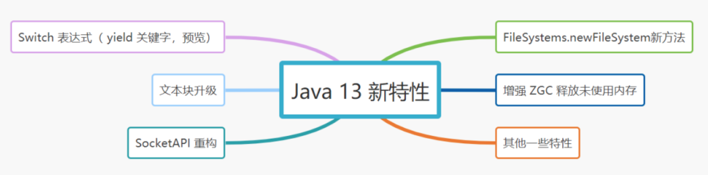

# 130-Java 13 新特性

[TOC]

## Java 13 新特性



## Switch 表达式扩展（引入 yield 关键字）

传统的switch：

```java
private static String getText(int number) {
    String result = "";
    switch (number) {
        case 1, 2:
        result = "one or two";
        break;
        case 3:
        result = "three";
        break;
        case 4, 5, 6:
        result = "four or five or six";
        break;
        default:
        result = "unknown";
        break;
```

Java 13之后，value break 语句不再被编译，而是用 yield 来进行值返回

```java
private static String getText(int number) {
    return switch (number) {
        case 1, 2:
            yield "one or two";
        case 3:
            yield "three";
        case 4, 5, 6:
            yield "four or five or six";
        default:
            yield "unknown";
    };
}
```

## 2.文本块升级

Java 13之前，字符串不能够多行使用，需要通过换行转义或者换行连接符等等，反正就是好麻烦、好难维护。

```java
String html = "<html>\n" +
              "    <body>\n" +
              "        <p>Hello, 捡田螺的小男孩</p>\n" +
              "    </body>\n" +
              "</html>\n";
```

Java 13之后，清爽多了~

```java
String html = """
                <html>
                    <body>
                        <p>Hello,  捡田螺的小男孩</p>
                    </body>
                </html>
                """;
```

## 3. SocketAPI 重构

- 传统的Java Socket API（java.net.ServerSocket 和 java.net.Socket）依赖于SocketImpl 的内部实现
- 在 Java 13之前，通过使用 PlainSocketImpl 作为 SocketImpl 的具体实现。
- Java 13 中的新底层实现，引入 NioSocketImpl 的实现用以替换 SocketImpl 的 PlainSocketImpl 实现，此实现与 NIO（新 I/O）实现共享相同的内部基础结构，并且与现有的缓冲区高速缓存机制集成在一起。

一个Socket简单例子：

```java
import java.io.IOException;
import java.net.ServerSocket;
import java.net.Socket;

public class SocketAPITest {
    public static void main(String[] args) {
        try (ServerSocket serverSocket = new ServerSocket(8080)){
            boolean runFlag = true;
            while(runFlag){
                Socket clientSocket = serverSocket.accept();
                //搞事情
            }
        } catch (IOException e) {
            e.printStackTrace();
        }
    }
}
```

运行以上的实例，看下是否有以下关键词输出~

```
[class,load] sun.nio.ch.NioSocketImpl
```

## 4.FileSystems.newFileSystem新方法

FileSystems 类中添加了以下三种新方法，以便更容易地使用将文件内容视为文件系统的文件系统提供程序：

- 1、newFileSystem(Path)
- 2、newFileSystem(Path, Map<String, ?>)
- 3、newFileSystem(Path, Map<String, ?>, ClassLoader)

## 5. 增强 ZGC 释放未使用内存

- ZGC 是Java 11 中引入的最为瞩目的垃圾回收特性，是一种可伸缩、低延迟的垃圾收集器。但是实际使用中，它不能够主动将未使用的内存释放给操作系统。
- Java 13 中对 ZGC 的改进，包括释放未使用内存给操作系统、支持最大堆大小为 16TB、JVM参数-XX:SoftMaxHeapSize 来软限制堆大小

## 6.其他特性

- 动态 CDS 存档， 扩展了 Java 10 中引入的类数据共享功能， 使用CDS 存档变得更容易。
- 文本块的字符串类新方法，如formatted(Object…args)，stripIndent()等。