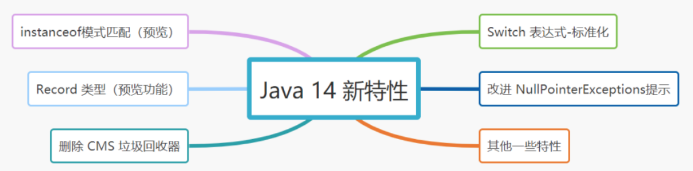

# 140-Java 14 新特性

[TOC]

## 140-Java 14 新特性



## 1. instanceof模式匹配

instanceof 传统使用方式：

```
if (person instanceof Singer) {
    Singer singer = (Singer) person;
    singer.sing();
} else if (person instanceof Writer) {
    Writer writer = (Writer) person;
    writer.write();
}
```

Java 14 对 instanceof 进行模式匹配改进之后

```
if (person instanceof Singer singer) {
    singer.sing();
} else if (person instanceof Writer writer) {
   writer.write();
}
```

## 2.Record 类型（预览功能）

Java 14将Record 类型作为预览特性而引入，有点类似于Lombok 的@Data注解，看个例子吧：

```
public record Person(String name, int age) {
    public static String address;

    public String getName() {
        return name;
    }
}
```

反编译结果：

```
public final class Person extends java.lang.Record {
    private final java.lang.String name;
    private final java.lang.String age;

    public Person(java.lang.String name, java.lang.String age) { /* compiled code */ }

    public java.lang.String getName() { /* compiled code */ }

    public java.lang.String toString() { /* compiled code */ }

    public final int hashCode() { /* compiled code */ }

    public final boolean equals(java.lang.Object o) { /* compiled code */ }

    public java.lang.String name() { /* compiled code */ }

    public java.lang.String age() { /* compiled code */ }
}
```

可以发现，当用 Record 来声明一个类时，该类将自动拥有下面特征：

- 构造方法
- hashCode() 方法
- euqals() 方法
- toString() 方法
- 类对象被final 关键字修饰，不能被继承。

## 3. Switch 表达式-标准化

switch 表达式在之前的 Java 12 和 Java 13 中都是处于预览阶段，终于在 Java 14 标准化，成为稳定版本。

- Java 12 为switch 表达式引入Lambda 语法
- Java 13 使用yield代替 break 关键字来返回表达式的返回值。

```
String result = switch (day) {
    case "M", "W", "F" -> "MWF";
    case "T", "TH", "S" -> "TTS";
    default -> {
        if (day.isEmpty()) {
            yield "Please insert a valid day.";
        } else {
            yield "Looks like a Sunday.";
        }
    }
};
System.out.println(result);
```

## 4. 改进 NullPointerExceptions提示信息

Java 14 之前：

```
String name = song.getSinger().getSingerName()
 
//堆栈信息
Exception in thread "main" java.lang.NullPointerException
    at NullPointerExample.main(NullPointerTest.java:6)
```

Java 14，通过引入JVM 参数-XX:+ShowCodeDetailsInExceptionMessages，可以在空指针异常中获取更为详细的调用信息。

```
Exception in thread "main" java.lang.NullPointerException: Cannot invoke "Singer.getSingerName()" 
because the return value of "rainRow.getSinger()" is null
    at NullPointerExample.main(NullPointerTest.java:6)
```

## 5. 其他特性

- G1 的 NUMA 可识别内存分配
- 删除 CMS 垃圾回收器
- GC 支持 MacOS 和 Windows 系统

###  