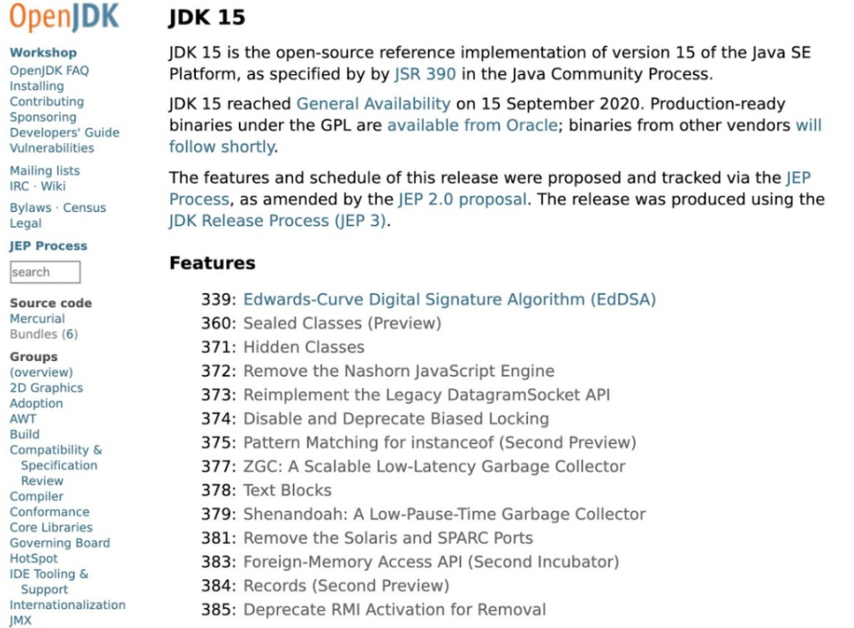
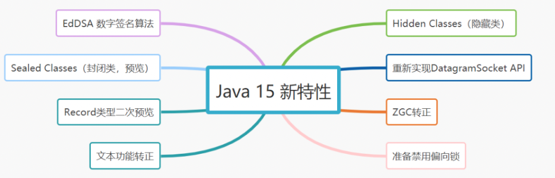

# 150-Java 15 新特性

[TOC]


## Java 15 新特性





## 1.EdDSA 数字签名算法

- 使用 Edwards-Curve 数字签名算法（EdDSA）实现加密签名。
- 与其它签名方案相比，EdDSA 具有更高的安全性和性能。
- 得到许多其它加密库（如 OpenSSL、BoringSSL）的支持。

## 2.Sealed Classes（封闭类，预览）

封闭类，可以是封闭类、封闭接口，防止其他类或接口扩展或实现它们。

```
public abstract sealed class Singer
    permits Jay, Eason{
    ...
}
```

类Singer被sealed 修饰，是封闭类，只能被2个指定子类（Jay, Eason）继承。

## 3. Hidden Classes（隐藏类）

- 隐藏类天生为框架设计的。
- 隐藏类只能通过反射访问，不能直接被其他类的字节码。

## 4. Remove the Nashorn JavaScript Engine

- Nashorn太难维护了，移除 Nashorn JavaScript引擎成为一种必然
- 其实早在JDK 11 中就已经被标记为 deprecated 了。

## 5. Reimplement the Legacy DatagramSocket API（重新实现DatagramSocket API）

- 重新实现老的DatagramSocket API
- 更改java.net.DatagramSocket 和 java.net.MulticastSocket 为更加简单、现代化的底层实现。

## 6. 其他

- Disable and Deprecate Biased Locking（准备禁用偏向锁）
- instanceof 自动匹配模式（预览）
- ZGC，一个可伸缩、低延迟的垃圾回收器。（转正）
- Text Blocks，文本功能转正（JDK 13和14预览，14终于转正）
- Remove the Solaris and SPARC Ports（删除 Solaris 和 SPARC 端口）
- 外部存储器访问 API（允许Java 应用程序安全有效地访问 Java 堆之外的外部内存。）
- Record类型二次预览（在Java 14就预览过啦）