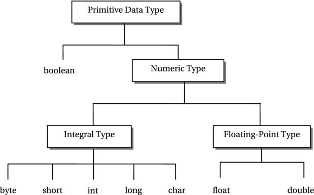

# Primitive Data Types in Java

>  By Lokesh Gupta | Filed Under: [Java Basics](https://howtodoinjava.com/java/basics/)

Learn about all eight **primitive data types** in Java , their memory sizes, default values and maximum and minimum value ranges.

Primitive [data types](https://howtodoinjava.com/java/basics/data-types-in-java/) are **predefined by the language** and named by a **reserved keyword**. Let’s look at each primitive data types in below image.



## 1. Integral Data Types

An integral data type is a numeric data type whose values are **integers**. Java offers **five integral data types**: `byte`, `short`, `int`, `long`, and `char`.

#### 1.1. int data type

- The `int` data type is a **32-bit signed** Java primitive data type. A variable of the `int` data type takes **32 bits of memory**.
- Its valid range is `-2,147,483,648` to `2,147,483,647` (-2^31 to 2^31– 1).
- All whole numbers in this range are known as **integer literals** (or integer constants). For example, 10, -200, 0, 30, 19, etc. are integer literals of int.

An integer literal can be assigned to an `int` variable, say `counter`, like so:

> int counter = 21;

##### 1.1.1. Integer Wrapper Class

Java has a wrapper class named `Integer`, which defines two constants to represent maximum and minimum values for the int data type, `Integer.MAX_VALUE` and `Integer.MIN_VALUE`. It is object representation of an int value.

```
int max = Integer.MAX_VALUE; // Assigns maximum int value to max
int min = Integer.MIN_VALUE; // Assigns minimum int value to min
```

- The **long data type is a \**64-bit signed\** Java primitive data type**.
- It is used when the result of calculations on whole numbers may exceed the range of the int data type.
- Its range is -2^63 to 2^63 – 1.
- All whole numbers in the range of long are called **integer literals of long type**.

An integer literal of type long always ends with ‘L’ (or lowercase ‘l’).

```java
long num1 = 0L;
long num2 = 401L;
long mum3 = -3556L;
```

##### 1.2.1. Type Casting

Even if the value stored in a `long` variable is well within the range of the `int` data type, the **assignment from long to int is not allowed** without explicit **type casting**, as shown in the following example:

```
int num1 = 5;
long num2 = 25L;
  
// A compile-time error. Even if num2's value 25 which is within the range of int.
num1 = num2;
```

**If you want to assign the value of a `long` variable to an `int` variable, you have to explicitly mention this fact in your code**, so that Java makes sure you are aware that there may be data overflow. You do this using “cast” in Java, like so:

```
long num1 = (int) num2; // Now it is fine because of the "(int)" cast
```

By writing `(int)num2`, you are instructing Java to treat the value stored in `num2` as an int. At runtime, Java will use only the 32 least significant bits of `num2`, and assign the value stored in those 32 bits to `num1`. If `num2` has a value that is outside the range of the int data type, you would not get the same value in `num1` and it will result in **data loss**.

##### 1.2.2. Long Wrapper Class

Java has a class `Long` (note the upper case L in Long), which defines two constants to represent maximum and minimum values of long data type, `Long.MAX_VALUE` and `Long.MIN_VALUE`.

```
long max = Long.MAX_VALUE;
long min = Long.MIN_VALUE;
```

#### 1.3. byte data type

- The **byte data type is an \**8-bit signed\** Java primitive integer data type**.
- Its range is -128 to 127 (-27 to 27 – 1). This is the **smallest integer data type** available in Java.
- Unlike `int` and `long` literals, there are no byte literals.
- However, you can assign any int literal that falls in the range of byte to a byte variable.

```
byte b1 = 125;
byte b2 = -11;
```

##### 1.3.1. Type Casting

If you assign an `int` literal to a `byte` variable and the value is outside the range of the byte data type, Java generates a compiler error. The following piece of code will produce a compiler error:

```
// An error. 150 is an int literal outside -128 to 127
byte b3 = 150;
```

Java does not allow you to assign the value of a variable of a higher range data type to the variable of a lower range data type because there is a **possible loss of precision** in making such an assignment. To make such an assignment from int to byte, you must use a cast, as you did in the case of the long–to-int assignment.

```
b1 = (byte)num1; // Ok
```

##### 1.3.2. Byte Wrapper Class

Java has a class `Byte` (note the upper case B in Byte), which defines two constants to represent maximum and minimum values of the byte data type, `Byte.MAX_VALUE` and` Byte.MIN_VALUE`.

```
byte max = Byte.MAX_VALUE;
byte min = Byte.MIN_VALUE;
```

#### 1.4. short data type


The `short` data type is a **16-bit signed** Java primitive integer data type. Its range is -32768 to 32767 (or -215 to 215 – 1).

Unlike int and long literals, there is no short literal.

However, you can assign any int literal that falls in the range of short (-32768 to 32767) to a short variable.

```
short s1 = 12905;   // ok
short s2 = -11890;  // ok
```

The value of a byte variable can always be assigned to a short variable because the range of the byte data type falls within the range of the short data type. All other rules for assignment of a value from an int or long variable to a short variable are same as that for the byte variable.

##### 1.4.1. Short Wrapper Class

Java has a class called `Short` (note the upper case S in Short), which defines two constants to represent maximum and minimum values of short data type, `Short.MAX_VALUE` and `Short.MIN_VALUE`.

```
short max = Short.MAX_VALUE;
short min = Short.MIN_VALUE;
```

#### 1.5. char data type

- The char data type is a **16-bit unsigned** Java primitive data type.
- It represents a **Unicode character**.
- Note that char is an unsigned data type. Therefore, a char variable cannot have a negative value.
- The range of the char data type is 0 to 65535, which is the same as the range of the Unicode set.
- A character literal represents a value of the char data type.

```
char c1 = 'A';
char c2 = 'L';
char c3 = '5';
char c4 = '/';
```

##### 1.5.1. Character escape sequences

A character literal can also be expressed as a **character escape sequence**. A character escape sequence starts with a backslash immediately followed by a character, and both are enclosed in single quotes.

**There are eight predefined character escape sequences** as listed below:

| CHARACTER ESCAPE SEQUENCE | DESCRIPTION       |
| ------------------------- | ----------------- |
| ‘\n’                      | A linefeed        |
| ‘\r’                      | A carriage return |
| ‘\f’                      | A form feed       |
| ‘\b’                      | A backspace       |
| ‘\t’                      | A tab             |
| ‘\\’                      | A backslash       |
| ‘\”‘                      | A double quote    |
| ‘\”                       | A single quote    |

These are only eight character escape sequences in Java. You cannot define your own character escape sequences.

##### 1.5.2. Unicode escape sequence

A character literal can also be expressed as a Unicode escape sequence in the form `'\uxxxx'`, Here, **\u** (a backslash immediately followed by a lowercase u) denotes the start of the Unicode escape sequence, and **xxxx** represents exactly four hexadecimal digits.

```
char c1 = 'A';
char c2 = '\u0041';  // Same as c2 = 'A'
```

## 2. Floating-Point Data Types

A floating point number that contains a **fractional part** is known as a **real number**, for example, 3.25, 0.49, -9.19, etc.

#### How numbers are stored in memory

When a real number is converted to its binary representation, the computer must also store the position of the decimal point within the number. There are two strategies to store a real number in computer memory.

1. **Fixed-point number format** – Store only the binary representation of the number and assume that there are always a fixed number of digits before and after the point. A point is called a **decimal point** in the decimal representation of a number and a binary point in the binary representation. The type of representation in which the position of the point is always fixed in a number is known as “fixed-point” number format.
2. **Floating-point number format** – Store the binary representation of the real number and the position of the point in the real number. Since the number of digits before and after the point can vary in this kind of representation of the real number, we say that the point can float. This kind of representation is called a “floating-point” format.

Floating-point representations are **slower and less accurate** compared to fixed-point representations. However, floating-point representations can handle a larger range of numbers with the same computer memory as compared to that of fixed-point representations.

> Java supports the ‘floating-point’ number format.

IEEE-754 32-bit Single-Precision Floating-Point Numbers

Java has two floating-point Numeric data types: **float** and **double**.

#### 2.1. float data type

The float data type uses **32 bits** to store a floating-point number in the [IEEE 754 standard format](https://en.wikipedia.org/wiki/IEEE_754) (*single-precision floating-point number*). It can represent a real number as small as 1.4 x 10-45 and as big as 3.4 x 1038 (approx.) in magnitude. The range includes only the magnitude. It could be positive or negative.

All real numbers that end with ‘f’ or ‘F’ are called **float literals**.

```
float f1 = 8F;
float f2 = 8.F;
float f3 = 8.0F;
```

##### 2.1.1. Positive and negative infinity

The float data type defines two infinities: positive infinity and negative infinity. For example, the result of the dividing `2.5F` by `0.0F` is a float positive infinity whereas the result of dividing `2.5F` by `-0.0F` is a float negative infinity.

##### 2.1.2. NaN (Not-a-Number)

Results of some of the operations on float are not defined. These results are represented by a special value of the float data type called NaN (Not-a-Number).

`Float` class defines three constants that represent positive infinity, negative infinity, and NaN of the float data type. There are two more constants, which represent the maximum and minimum (greater than zero) float values that can be stored in a float variable.

```
Float.POSITIVE_INFINITY - Positive infinity of type float.
Float.NEGATIVE_INFINITY - Negative infinity of type float.
Float.NaN - Not a Number of type float.
Float.MAX_VALUE - The largest positive value that can be represented in a float variable.
Float.MIN_VALUE - The smallest positive value greater than zero that can be represented in a float variable. 
```

Please note that the value of all integral types (int, long, byte, short, and char) can be assigned to a variable of the float data type without using an explicit cast, BUT a float value must be cast before it is assigned to a variable of any integral data type int, long, byte, short, or char.

#### 2.2. double data type

The double data type uses **64 bits** to store a floating-point number in the ‘IEEE 754 standard format’. A floating-point number represented in 64 bits according to IEEE 754 standard is also known as a **double-precision floating-point number**.

All real numbers are called **double literals**. A double literal may optionally end with ‘d’ or ‘D’, for example, 19.27d. However, the suffix d or D is optional in double literals. That is, both 19.27 and 19.27d represent the same double literal.

```
double d1 = 8D
double d2 = 8.;
double d3 = 8.0;
double d4 = 8.D;
```

Like the float data type, the double data type defines maximum, minimum, two infinities, and a NaN values.

```
Double.POSITIVE_INFINITY - Positive infinity of type double.
Double.NEGATIVE_INFINITY - Negative infinity of type double.
Double.NaN - Not a Number of type double.
Double.MAX_VALUE - The largest positive value that can be represented in a double variable.
Double.MIN_VALUE - The smallest positive value greater than zero that can be represented in a double variable. 
```

## 3. Boolean

#### 3.1. boolean data type

The boolean data type has only two valid values: **true** and **false**. These two values are called **boolean literals**. You can use boolean literals as

```
boolean done; // Declares a boolean variable named done
done = true;  // Assigns true to done
```

One important point to note is that a *boolean variable cannot be cast to any other data type and vice versa*. Java does not specify the size of the boolean data type. Its size is left up to the JVM implementation. Typically, a value of a boolean data type is stored internally in a byte.