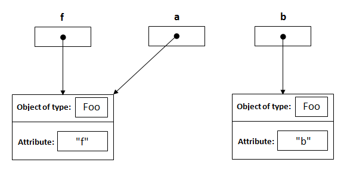
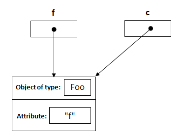

# Java Pass by Value vs. Pass by Reference

> By Lokesh Gupta | Filed Under: [Java Basics](https://howtodoinjava.com/java/basics/)

> 值传递（pass by value）是指在调用函数时将实际参数复制一份传递到函数中，这样在函数中如果对参数进行修改，将不会影响到实际参数。
> 引用传递（pass by reference）是指在调用函数时将实际参数的地址直接传递到函数中，那么在函数中对参数所进行的修改，将影响到实际参数。

There has been a good amount of debate on whether “*java is pass by value or pass by reference*?”. Well, lets conclude it last time, **Java is pass by value and not pass by reference**. If it had been pass by reference, we should have been able to C like swapping of objects, but we can’t do that in java. We know it already, right?

> Java 是值传递,不是引用传递,传递的参数如果是普通类型，那就是值传递，如果是对象，那就是值传递对象地址

When you pass an instance to a method, its memory address are copied bit by bit to new reference variable, thus both pointing to same instance. But if you change the reference inside method, original reference will not get change. If it was pass by reference, then it would have got changed also.

> 当你传递一个实例到一个方法参数时,实际上是拷贝了一份引用变量的内存地址,他们两个指向的是同一个实例,但是如果你在方法内部修改了引用,原引用不会被修改,如果它是引用传递,它的值也会被修改

```java
public class Foo
{
    private String attribute;
 
    public Foo (String a){
        this.attribute = a;
    }
    public String getAttribute() {
        return attribute;
    }
    public void setAttribute(String attribute) {
        this.attribute = attribute;
    }
}
 
public class Main
{
     public static void main(String[] args){
          Foo f = new Foo("f");
          changeReference(f); // It won't change the reference!
          modifyReference(f); // It will change the object that the reference variable "f" refers to!
     }
     public static void changeReference(Foo a) {
          Foo b = new Foo("b");
          a = b;
     }
     public static void modifyReference(Foo c) {
          c.setAttribute("c");
     }
}
```

**1) Foo f = new Foo(“f”);**

This statement will create an instance of class Foo, with ‘attribute’ initialized to ‘f’. The reference to this created instance is assigned to variable f;


**2) public static void changeReference(Foo a)**

When this executes then a reference of type Foo with a name a is declared and it’s initially assigned to null.


**3) changeReference(f);**

As you call the method changeReference, the reference a will be assigned to the object which is passed as an argument.


**4) Foo b = new Foo(“b”);** inside first method

This will do exactly the same as in first step, and will create a new instance of Foo, and assign it to b;



**5) a = b;**

This is the important point. Here, we have three reference variables and when statement executes, a and b will point to same instance created inside the method. Note: f is unchanged and it is continually pointing to instance, it was pointing originally. NO CHANGE !!


**6) modifyReference(Foo c);**

Now when this statement executed a reference, c is created and assigned to the object with attribute “f”.



**7) c.setAttribute(“c”);**

This will change the attribute of the object that reference c points to it, and its same object that reference f points to it.

