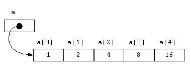

# Array in Java

An **array** is a container object that holds a **fixed number of values** of a **single type** in a **contiguous memory location**. It is a data structure which is used to store finite number of elements and all elements must be of similar data type.

> 固定元素数量,相同类型

Arrays are index based data structure so they allow random access to elements, they store. Indices start with `'0'`.

## 1. Array representation in memory

In this example, we have create an array of 5 elements. Indexes will range from `'0'` to `'4'`.

```java
int[] a = new int[5];
 
a[0] = 1;
a[1] = 2;
a[2] = 4;
a[3] = 8;
a[4] = 16;
```

A pictorial representation of above example can be as below.



## 2. Array Features

- Arrays are also a subtype of `Object` in Java.
- Arrays are objects so we can find the length of the array using attribute `'length'`.
- Java array are types. we can declare the [variables](https://howtodoinjava.com/java/basics/java-variables/) of array type.
- Arrays are ordered and each have an index beginning from `'0'` for the first element.
- Arrays can store primitives as well as objects. But all must be of a single type in one array instance.

> 存储的内容可以是基础类型或者是对象类型,但是一个 Array 里存储的类型必须一致

- Just like other variables, arrays can also be `static`, `final` or used as method arguments.
- The size of an array must be specified by an `int` value.
- Java arrays are `Cloneable` and `Serializable`.

## 3. Types of Array in Java

An array can be one of two types.

#### 3.1. Single Dimensional Array 

> 一维数组

An array which store only primitives or objects is called single dimensional array. The general form of a one-dimensional array declaration is:

```java
type var-name[];
OR
type[] var-name;
 
//Examples
 
int[] numbers;
 
String names[];
```

#### 3.2. Multi-dimensional Array

> 多维数组

A multi-dimensional array stores other arrays. It is **array of arrays**. In multi-dimensional array, each element of the array holding the reference of other array. A multidimensional array is created by appending one set of square brackets (`[ ]`) per dimension.

```java
type var-name[][];
OR
type[][] var-name;
 
//Examples
 
int[][] cordinates;
 
String nameSets[][];
```

## Example 

```java
/**
 * Example of Array in Java
 *
 * @author EricChen 2020/01/20 10:33
 */
public class ArrayExample {

    public static void main(String[] args) {
        contains();
        streamContains();
    }


    private static void contains() {
        String[] fruits = new String[]{"banana", "guava", "apple", "cheeku"};
        Arrays.asList(fruits).contains("apple"); // true
        Arrays.asList(fruits).indexOf("apple"); // 2

        Arrays.asList(fruits).contains("lion"); // false
        Arrays.asList(fruits).indexOf("lion"); // -1
    }

    /**
     * Since Java 8 , Stream also hold elements and you might want to test if stream contains elements or not 
     */
    private static void streamContains() {
        String[] fruits = new String[]{"banana", "guava", "apple", "cheeku"};
        boolean apple = Arrays.asList(fruits)
                .stream()
                .anyMatch(x -> x.equalsIgnoreCase("apple")); //true
        System.out.println(apple);
        boolean result = Arrays.asList(fruits)
                .stream()
                .anyMatch(x -> x.equalsIgnoreCase("lion"));  //false
        System.out.println(result);
    }

}
```

## Java Array Clone - Deep Copy vs Shallow Copy

- Deep Copy
- Shallow Copy

```java
   /**
     * Shallow Copy ,Cloning always creates shallow copy of  Array ,Any change in origin array will be
     * </p>
     * reflected in clone array as well
     */
    private static void shallowCopy() {
        System.out.println("----- shallow copy ------");
        Employee[] employees = new Employee[]{new Employee("eric", 123), new Employee("jack", 18)};
        Employee[] clone = employees.clone();
        // so if I change array "clone", array "fruits" is changed as well
        System.out.println(employees[0]);
        clone[0].setAge(11);
        System.out.println(employees[0]);
        System.out.println("----- shallow copy ------");

    }

    /**
     * If you want to create  deep copy of a array in Java, then use apache 's   SerializationUtils.clone(array);
     *
     * @see SerializationUtils
     */
    private static void deepCopy() {
        System.out.println("----- deep copy ------");
        Employee[] employees = new Employee[]{new Employee("eric", 123), new Employee("jack", 18)};
        Employee[] clone = SerializationUtils.clone(employees);
        // so if I change array "clone", array "fruits" is changed as well
        System.out.println(employees[0]);
        clone[0].setAge(11);
        System.out.println(employees[0]);
        System.out.println("----- deep copy ------");

    }

    static class Employee implements Serializable {
        public Employee(String name, Integer age) {
            this.name = name;
            this.age = age;
        }

        String name;
        Integer age;

        public String getName() {
            return name;
        }

        public void setName(String name) {
            this.name = name;
        }

        public Integer getAge() {
            return age;
        }

        public void setAge(Integer age) {
            this.age = age;
        }

        @Override
        public String toString() {
            return "Employee{" +
                    "name='" + name + '\'' +
                    ", age=" + age +
                    '}';
        }
    }
```

### Remove Duplicate elements in Array 

If there is no pre=condiction to not to use collections API , Then LinkedHashSet is the best approach for removing duplicate elements in an array 

LinkedHashSet does two things internally:

- remove the duplicate elements 
- maintain the order of elements added to it 

```java
/**
 * If there is no pre-condition to not to use collections API
 * then LinkedHashSet is the best approach for removing duplicate elements in an array
 * LinkedHashSet does two things internally:
 *
 * <ul>
 *     <li>1.remove duplicate elements</li>
 *     <li>2. maintain the order of elements added to it</li>
 * </ul>
 *
 * @see java.util.LinkedHashSet
 */
private static void removeDuplicates() {
    //Array with duplicate elements
    Integer[] numbers = new Integer[]{1, 2, 3, 4, 5, 1, 3, 5};
    //This array has duplicate elements
    System.out.println(Arrays.toString(numbers));
    //Create set from array elements
    LinkedHashSet<Integer> linkedHashSet = new LinkedHashSet<>(Arrays.asList(numbers));
    //Get back the array without duplicates
    Integer[] numbersWithoutDuplicates = linkedHashSet.toArray(new Integer[]{});
    //Verify the array content
    System.out.println(Arrays.toString(numbersWithoutDuplicates));
}
```