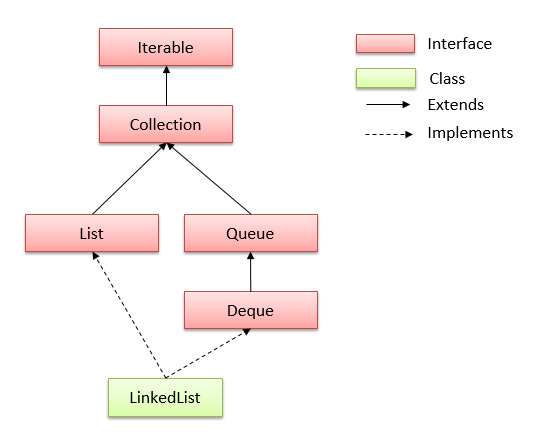

# LinkedList Class In Java

## 1. LinkedList Hierarchy

The LinkedList class **extends AbstractSequentialList** class and **implements List and Deque** interfaces. Here `'E'` is the type of values linkedlist stores.

```java
public class LinkedList<E>
    extends AbstractSequentialList<E>
    implements List<E>, Deque<E>, Cloneable, java.io.Serializable
{
    //implementation
}
```



## 2. LinkedList Features

- **Doubly linked list** implementation which implements List and Deque interfaces. Therefore, It can also be used as a Queue, Deque or Stack.

> 双向链表的实现类实现了`List`接口和`Deque`接口

- Permits all elements including duplicates and NULL.

> 允许元素重复,允许 null 

- LinkedList maintains the **insertion order** of the elements.

> LinkedList 保留插入顺序

- It is **not synchronized**. If multiple threads access a linked list concurrently, and at least one of the threads modifies the list structurally, it *must* be synchronized externally.

> 线程非同步的,如果多个线程并发访问了一个链表 list,需要外部同步

- Use Collections.synchronizedList(new LinkedList()) to get synchronized linkedlist.

> 可以通过`Collections.synchronizedList(new LinkedList())`方法获取一个同步的 LinkedList

- The iterators returned by this class are fail-fast and may throw `ConcurrentModificationException`.

> 迭代器迭代时是快速失败的,直接抛出异常`ConcurrentModificationException`

- It does not implement [RandomAccess](https://docs.oracle.com/javase/7/docs/api/java/util/RandomAccess.html) interface. So we can access elements in sequential order only. It does not support accessing elements randomly.

> 它没有实现`RadomAccess`接口,所以我们只能按顺序访问元素。它不支持随机访问元素。

- We can use [ListIterator](https://docs.oracle.com/javase/7/docs/api/java/util/ListIterator.html) to iterate LinkedList elements.

> 我们可以使用 ListIterator 去迭代一个 LinkedList 元素

## 3. LinkedList Constructors

1. **LinkedList()** : initializes an empty LinkedList implementation.
2. **LinkedListExample(Collection c)** : initializes a LinkedList containing the elements of the specified collection, in the order they are returned by the collection’s iterator.


## 4. LinkedList Methods

1. **boolean add(Object o)** : appends the specified element to the end of a list.
2. **void add(int index, Object element)** : inserts the specified element at the specified position index in a list.
3. **void addFirst(Object o)** : inserts the given element at the beginning of a list.
4. **void addLast(Object o)** : appends the given element to the end of a list.
5. **int size()** : returns the number of elements in a list
6. **boolean contains(Object o)** : return `true` if the list contains a specified element, else `false`.
7. **boolean remove(Object o)** : removes the first occurence of the specified element in a list.
8. **Object getFirst()** : returns the first element in a list.
9. **Object getLast()** : returns the last element in a list.
10. **int indexOf(Object o)** : returns the index in a list of the first occurrence of the specified element, or -1 if the list does not contain specified element.
11. **lastIndexOf(Object o)** : returns the index in a list of the last occurrence of the specified element, or -1 if the list does not contain specified element.
12. **Iterator iterator()** : returns an iterator over the elements in this list in proper sequence.
13. **Object[] toArray()** : returns an array containing all of the elements in this list in proper sequence.
14. **List subList(int fromIndex, int toIndex)** : returns a view of the portion of this list between the specified fromIndex (inclusive) and toIndex (exclusive).

## 5. Java LinkedList Example

#### 5.1. Add, remove, iterate

Java program to demo the usage of basic methods in linkedlist class.

```java
import java.util.LinkedList;
import java.util.ListIterator;
 
public class LinkedListExample 
{
    public static void main(String[] args) 
    {
        //Create linked list
        LinkedList<String> linkedList = new LinkedList<>();
         
        //Add elements
        linkedList.add("A");
        linkedList.add("B");
        linkedList.add("C");
        linkedList.add("D");
         
        System.out.println(linkedList);
         
        //Add elements at specified position
        linkedList.add(4, "A");
        linkedList.add(5, "A");
         
        System.out.println(linkedList);
         
        //Remove element
        linkedList.remove("A");     //removes A
        linkedList.remove(0);       //removes B
         
        System.out.println(linkedList);
         
        //Iterate
        ListIterator<String> itrator = linkedList.listIterator();
 
        while (itrator.hasNext()) {
            System.out.println(itrator.next());
        }
    }
}
```

```
[A, B, C, D]
[A, B, C, D, A, A]
[C, D, A, A]
C
D
A
A
```

#### 5.2. Convert between Array and LinkedList

Java program to **convert LinkedList to array** and **convert array to linkedlist**.

```java
LinkedList<String> linkedList = new LinkedList<>();
         
linkedList.add("A");
linkedList.add("B");
linkedList.add("C");
linkedList.add("D");
 
//1. LinkedList to Array
String array[] = new String[linkedList.size()];
linkedList.toArray(array);
 
System.out.println(Arrays.toString(array));
 
//2. Array to LinkedList
LinkedList<String> linkedListNew = new LinkedList<>(Arrays.asList(array));
 
System.out.println(linkedListNew);
```

Program Output.

```
[A, B, C, D]
[A, B, C, D]
```

#### 5.3. How to sort LinkedList

Java example to sort a LinkedList using **Collections.sort()** method. Please note that for custom sorting of objects, we can use **Collections.sort(linkedList, comparator)** method.

```java
LinkedList<String> linkedList = new LinkedList<>();
 
linkedList.add("A");
linkedList.add("C");
linkedList.add("B");
linkedList.add("D");
 
//Unsorted
System.out.println(linkedList);
 
//1. Sort the list
Collections.sort(linkedList);
 
//Sorted
System.out.println(linkedList);
 
//2. Custom sorting
Collections.sort(linkedList, Collections.reverseOrder());
 
//Custom sorted
System.out.println(linkedList);
```

Program Output.

```
[A, C, B, D]
[A, B, C, D]
[D, C, B, A]
```

## 6. LinkedList Usecases

In any desktop application, actions can be recorded in linked list and implement Undo and Redo function iterating from last.

Browser’s Next and Previous buttons can be programmed using linkedlist.

Linked Lists (paired with a hashtable) are really useful for LRU Caches.

## 7. LinkedList Performance

In Java LinkedList class, manipulation is fast because no shifting needs to be occurred. So essentially, all add and remove method provide very good performance **O(1)**.

- add(E element) method is of O(1).
- get(int index) and add(int index, E element) methods are of O(n).
- remove(int index) method is of O(n).
- Iterator.remove() is O(1).
- ListIterator.add(E element) is O(1).

LinkedList should be preferred there are no large number of random access of element while there are a large number of add/remove operations.

## 8. ArrayList vs LinkedList

Let’s list down few notiable **differences between arraylist and linkedlist**.

- ArrayList is implemented with the concept of dynamic resizable array. While LinkedList is a doubly linked list implementation.

> ArrayList是用动态可调整大小的数组来实现的。而LinkedList是一个双链表实现。

- ArrayList allows random access to it’s elements while LinkedList does not.

> ArrayList 允许随机访问,链表不支持

- LinkedList, also implements `Queue` interface which adds more methods than ArrayList, such as offer(), peek(), poll(), etc.

> LinkedList还实现了' Queue '接口，它比ArrayList添加了更多的方法，如offer()、peek()、poll()等。

- While comparing to LinkedList, [ArrayList](https://howtodoinjava.com/java-arraylist/) is slower in add and remove, but faster in get, because there is no need of resizing array and copying content to new array if [array](https://howtodoinjava.com/java-array/) gets full in LinkedList.

- LinkedList has more memory overhead than ArrayList because in ArrayList each index only holds actual object but in case of LinkedList each node holds both data and address of next and previous node.

- ArrayList是实现了基于动态数组的数据结构，LinkedList基于链表的数据结构。 （LinkedList是双向链表，有next也有previous）

- 对于随机访问get和set，ArrayList觉得优于LinkedList，因为LinkedList要移动指针。 
- 对于新增和删除操作add和remove，LinedList比较占优势，因为ArrayList要移动数据。

它使用get方法访问列表中的任意一个元素时(random access)，它的速度要比LinkedList快（O1）。LinkedList中的get方法是按照顺序从列表的一端开始检查，直到另外一端（On）。对LinkedList而言，访问列表中的某个指定元素没有更快的方法了

但在某些情况下LinkedList的表现要优于ArrayList，有些算法在LinkedList中实现时效率更高。比方说，利用Collections.reverse方法对列表进行反转时，其性能就要好些。当要对list进行大量的插入和删除操作时，LinkedList也是一个较好的选择。

## 总结 

ArrayList和LinkedList在性能上各有优缺点，都有各自所适用的地方，总的说来可以描述如下： 

- 对ArrayList和LinkedList而言，在列表末尾增加一个元素所花的开销都是固定的。对ArrayList而言，主要是在内部数组中增加一项，指向所添加的元素，偶尔可能会导致对数组重新进行分配；而对LinkedList而言，这个开销是统一的，分配一个内部Entry对象。

- 在ArrayList的中间插入或删除一个元素意味着这个列表中剩余的元素都会被移动；而在LinkedList的中间插入或删除一个元素的开销是固定的。

- LinkedList不支持高效的随机元素访问。

- ArrayList的空间浪费主要体现在在list列表的结尾预留一定的容量空间，而LinkedList的空间花费则体现在它的每一个元素都需要消耗相当的空间