# HashMap 为什么线程不安全

[TOC]

## 一言蔽之

在多线程情况下,使用 HashMap 进行 put 的操作的时候会引发死循环

是因为 Java8 之前 的 HashMap 在扩容的 Rehash 时,采用的是头插法 ,会导致形成链状结构

 [051-hashMap的底层原理.md](../../../02-collections/03-map/051-hashMap的底层原理.md) 

## JDK1.7中的线程不安全

### `HashMap`的线程不安全主要体现在下面两个方面：

1. 在JDK1.7中，当并发执行扩容操作时会造成环形链和数据丢失的情况。
2. 在JDK1.8中，在并发执行put操作时会发生数据覆盖的情况。

### 分析

-  [扩容造成死循环分析过程](#扩容造成死循环分析过程)
-  [扩容造成数据丢失分析过程](#扩容造成数据丢失分析过程)

###  扩容造成死循环分析过程

```java
public class HashMapDemo {

    public static void main(String[] args) {
        HashMapThread thread0 = new HashMapThread();
        HashMapThread thread1 = new HashMapThread();
        HashMapThread thread2 = new HashMapThread();
        HashMapThread thread3 = new HashMapThread();
        HashMapThread thread4 = new HashMapThread();
        thread0.start();
        thread1.start();
        thread2.start();
        thread3.start();
        thread4.start();
    }

}

class HashMapThread extends Thread {
    private static AtomicInteger ai = new AtomicInteger();
    private static Map<Integer, Integer> map = new HashMap<>();

    @Override
    public void run() {
        while (ai.get() < 1000000) {
            map.put(ai.get(), ai.get());
            ai.incrementAndGet();
        }
    }
}
```

其中有几次还会出现数组越界的情况：

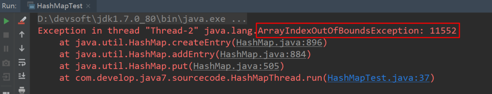

这里我们着重分析为什么会出现死循环的情况，通过jps和jstack命名查看死循环情况，结果如下：

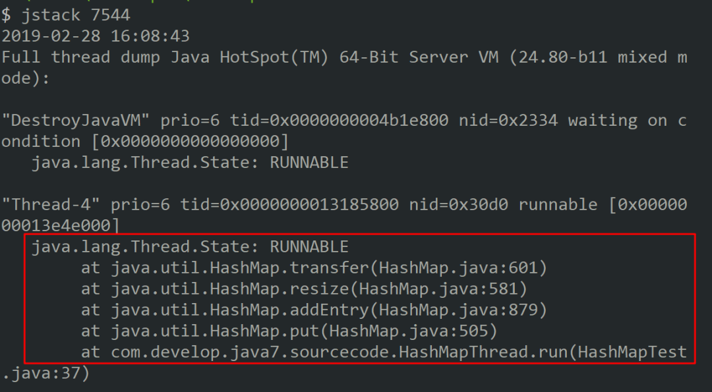

从堆栈信息中可以看到出现死循环的位置，通过该信息可明确知道死循环发生在HashMap的扩容函数中，根源在**transfer函数**中，jdk1.7中HashMap的transfer函数如下：

```java
void transfer(Entry[] newTable, boolean rehash) {
        int newCapacity = newTable.length;
        for (Entry<K,V> e : table) {
            while(null != e) {
              //循环原链表,获取到下一个 entry
                Entry<K,V> next = e.next;  // 7 =3.next
              //进行 rehash
                if (rehash) {
                    e.hash = null == e.key ? 0 : hash(e.key);
                }
              //获取到 rehash 后的索引值
                int i = indexFor(e.hash, newCapacity); //使用 3进行 rehash
              //把目前尾结点的 next 指向新的索引地址  
              e.next = newTable[i];//10   // e.next = null
              //将rehash 后的 element 插入索引地址 
                newTable[i] = e;//11 // 新空间设置为 3
              //将
                e = next;//12  //  e 设置成 7
            }
        }
    }

```

总结下该函数的主要作用：

在对table进行扩容到`newTable`后，需要将原来数据转移到`newTable`中，注意10-12行代码，这里可以看出在转移元素的过程中，**使用的是头插法，也就是链表的顺序会翻转**，这里也是形成死循环的关键点。

下面进行详细分析。

假设

- hash算法为简单的用key mod链表的大小。
- 最开始 hash 表 size=2，key=3,7,5 ，则都在table[1]中。
- 后进行resize，使size变成4。

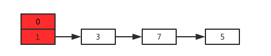

如果是在单线程情况下,结果如下

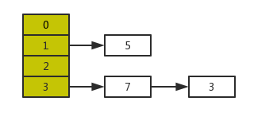

这里的转移过程，不再进行详述，只要理解transfer函数在做什么，其转移过程以及如何对链表进行反转应该不难。

然后在多线程环境下，假设有两个线程A和B都在进行put操作。线程A在执行到transfer函数中第11行代码处挂起，因为该函数在这里分析的地位非常重要，因此再次贴出来。


```java
void transfer(Entry[] newTable, boolean rehash) {
        int newCapacity = newTable.length;
        for (Entry<K,V> e : table) {
            while(null != e) {
              //循环原链表,获取到下一个 entry
                Entry<K,V> next = e.next;  // 7 =3.next
              //进行 rehash
                if (rehash) {
                    e.hash = null == e.key ? 0 : hash(e.key);
                }
              //获取到 rehash 后的索引值
                int i = indexFor(e.hash, newCapacity); //使用 3进行 rehash
              //把目前尾结点的 next 指向新的索引地址  
              e.next = newTable[i];//10   // e.next = null
              //将rehash 后的 element 插入索引地址 
                newTable[i] = e;//11 // 新空间设置为 3
              //将
                e = next;//12  //  e 设置成 7
            }
        }
    }
```


此时线程A中运行结果如下：

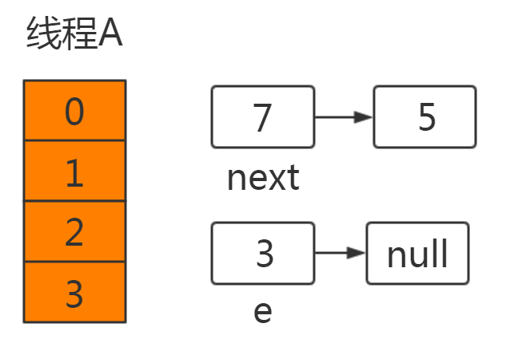

线程A挂起后，此时线程B正常执行，并完成resize操作，结果如下：


**这里需要特别注意的点：由于线程B已经执行完毕，根据Java内存模型，现在newTable和table中的Entry都是主存中最新值：7.next=3，3.next=null。**

此时切换到线程A上，在线程A挂起时内存中值如下：e=3，next=7，newTable[3]=null，代码执行过程如下：

```
newTable[3]=e ----> newTable[3]=3
e=next ----> e=7
```

此时结果如下：

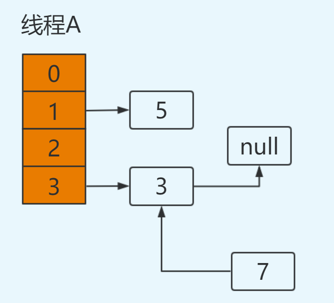

继续循环：

```java
e=7
next=e.next ----> next=3【从主存中取值】
e.next=newTable[3] ----> e.next=3【从主存中取值】
newTable[3]=e ----> newTable[3]=7
e=next ----> e=3
```

结果如下：

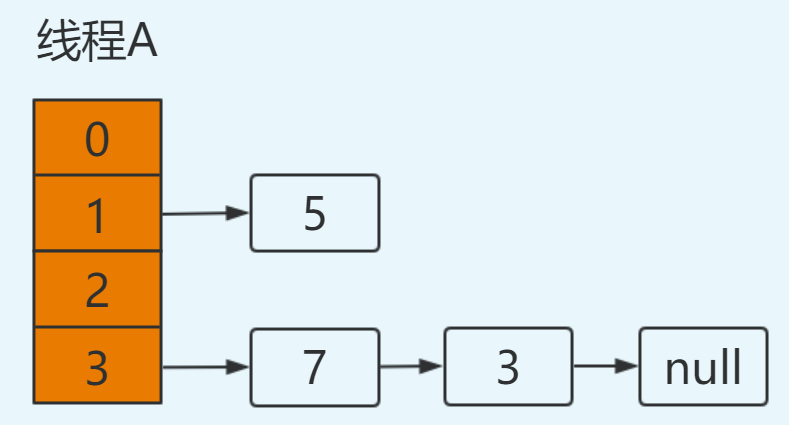

再次进行循环：

```
e=3
next=e.next ----> next=null
e.next=newTable[3] ----> e.next=7 即：3.next=7
newTable[3]=e ----> newTable[3]=3
e=next ----> e=null
```

注意此次循环：e.next=7，而在上次循环中7.next=3，出现环形链表，并且此时e=null循环结束。

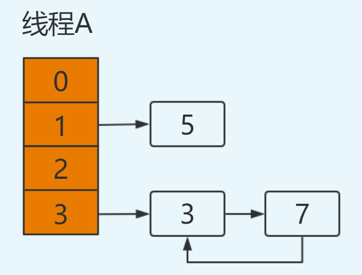

在后续操作中只要涉及轮询hashmap的数据结构，就会在这里发生死循环，造成悲剧。


###  扩容造成数据丢失分析过程

遵照上述分析过程，初始时：

线程A和线程B进行put操作，同样线程A挂起：

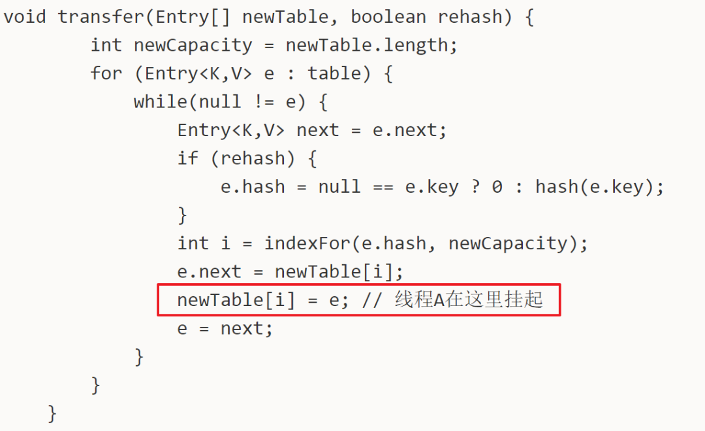

此时线程A的运行结果如下：

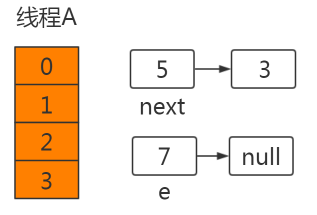

此时线程B已获得CPU时间片，并完成resize操作：

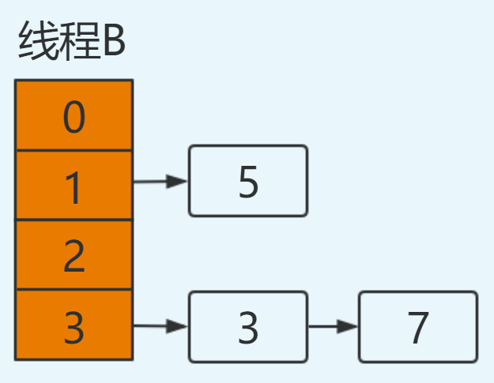

同样注意由于线程B执行完成，newTable和table都为最新值：**5.next=null**。

此时切换到线程A，在线程A挂起时：**e=7，next=5，newTable[3]=null。**

执行newtable[i]=e，就将**7放在了table[3]**的位置，此时next=5。接着进行下一次循环：

```
e=5
next=e.next ----> next=null，从主存中取值
e.next=newTable[1] ----> e.next=5，从主存中取值
newTable[1]=e ----> newTable[1]=5
e=next ----> e=null
```

将5放置在table[1]位置，此时e=null循环结束，**3元素丢失**，并形成**环形链表**。并在后续操作hashmap时造成死循环。

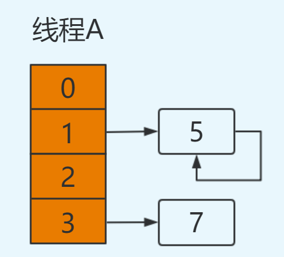

## JDK1.8中的线程不安全

在jdk1.8中对HashMap进行了优化，在发生hash碰撞，不再采用头插法方式，而是直接插入链表尾部，因此不会出现环形链表的情况，但是在多线程的情况下仍然不安全，这里我们看jdk1.8中HashMap的put操作源码：

```java
final V putVal(int hash, K key, V value, boolean onlyIfAbsent,
                   boolean evict) {
        Node<K,V>[] tab; Node<K,V> p; int n, i;
        if ((tab = table) == null || (n = tab.length) == 0)
            n = (tab = resize()).length;
        if ((p = tab[i = (n - 1) & hash]) == null) 
          // 如果没有hash碰撞则直接插入元素
            tab[i] = newNode(hash, key, value, null);
        else {
            Node<K,V> e; K k;
            if (p.hash == hash &&
                ((k = p.key) == key || (key != null && key.equals(k))))
                e = p;
            else if (p instanceof TreeNode)
                e = ((TreeNode<K,V>)p).putTreeVal(this, tab, hash, key, value);
            else {
                for (int binCount = 0; ; ++binCount) {
                    if ((e = p.next) == null) {
                        p.next = newNode(hash, key, value, null);
                        if (binCount >= TREEIFY_THRESHOLD - 1) // -1 for 1st
                            treeifyBin(tab, hash);
                        break;
                    }
                    if (e.hash == hash &&
                        ((k = e.key) == key || (key != null && key.equals(k))))
                        break;
                    p = e;
                }
            }
            if (e != null) { // existing mapping for key
                V oldValue = e.value;
                if (!onlyIfAbsent || oldValue == null)
                    e.value = value;
                afterNodeAccess(e);
                return oldValue;
            }
        }
        ++modCount;
        if (++size > threshold) // 
            resize();
        afterNodeInsertion(evict);
        return null;
    }

```

这是jdk1.8中HashMap中put操作的主函数， 注意第6行代码，

```java
 if ((p = tab[i = (n - 1) & hash]) == null) // 如果没有hash碰撞则直接插入元素
```

如果没有hash碰撞则会直接插入元素。

如果线程A和线程B同时进行put操作，刚好这两条不同的数据hash值一样，并且该位置数据为null，所以这线程A、B都会进入第6行代码中。

假设一种情况，线程A进入后还未进行数据插入时挂起，而线程B正常执行，从而正常插入数据，然后线程A获取CPU时间片，此时线程A不用再进行hash判断了，问题出现：

**线程A会把线程B插入的数据给覆盖，发生线程不安全。**