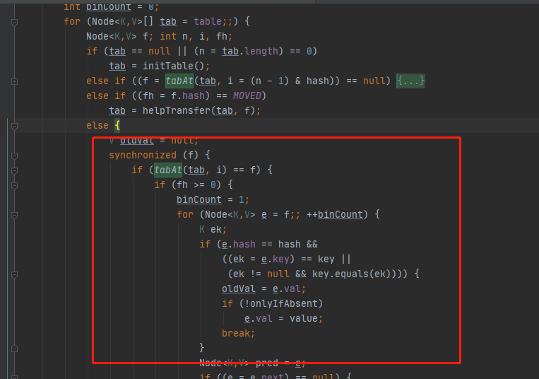

# put方法第三阶段-碰撞插入

- [插入流程](#插入流程)

- [树化流程-treeifyBin](#树化流程-treeifyBin)



## 源码分析


## 插入流程

这个方法的主要作用是

- 如果被添加的节点的位置已经存在节点的时候，需要以链表的方式 ,加入到节点中

- 如果当前节点已经是一颗红黑树，那么就会按照红黑树的规则将当前节点加入到红黑树中

```java
final V putVal(K key, V value, boolean onlyIfAbsent) {
      	....
        for (Node<K,V>[] tab = table;;) {
            Node<K,V> f; int n, i, fh;
            if (tab == null || (n = tab.length) == 0)
               //初始化 tabke
            else if ((f = tabAt(tab, i = (n - 1) & hash)) == null) {
              //当节点为空则设置节点
            }
            else if ((fh = f.hash) == MOVED)
              //协助扩容
            else {
              //链表或者红黑树
                V oldVal = null;
                synchronized (f) {//给对应的头结点加锁
								//再次判断对应下标位置是否为f节点
                    if (tabAt(tab, i) == f) {
                        if (fh >= 0) {  //头结点的hash值大于0，说明是链表

                            binCount = 1;//用来记录链表的长度
                            for (Node<K,V> e = f;; ++binCount) {
                                K ek;
                                if (e.hash == hash && //如果发现相同的 key，则判断是否需要进行值的覆盖
                                    ((ek = e.key) == key ||
                                     (ek != null && key.equals(ek)))) {
                                    oldVal = e.val;
                                    if (!onlyIfAbsent)//默认情况下，直接覆盖旧的值
                                        e.val = value;
                                    break;
                                }
                              //一直遍历到链表的最末端，直接把新的值加入到链表的最后面
                                Node<K,V> pred = e;
                                if ((e = e.next) == null) {
                                    pred.next = new Node<K,V>(hash, key,
                                                              value, null);
                                    break;
                                }
                            }
                        }
                      //如果当前的 f 节点是一颗红黑树
                        else if (f instanceof TreeBin) {
                            Node<K,V> p;
                            binCount = 2;
                          //则调用红黑树的插入方法插入新的值
                            if ((p = ((TreeBin<K,V>)f).putTreeVal(hash, key,
                                                           value)) != null) {
                                oldVal = p.val;//同样，如果值已经存在，则直接替换
                                if (!onlyIfAbsent)
                                    p.val = value;
                            }
                        }
                    }
                }
                if (binCount != 0) {
                    if (binCount >= TREEIFY_THRESHOLD) // 8
                        treeifyBin(tab, i);
                    if (oldVal != null)
                        return oldVal;
                    break;
                }
            }
        }
        addCount(1L, binCount);
        return null;
    }
```

- 判断链表的长度是否已经达到临界值 8. 如果达到了临界值，**这个时候会根据当前数组的长度来决定是扩容还是将链表转化为红黑树**。**也就是说如果当前数组的长度小于 64**，就会先扩容。 否则，会把当前链表转化为红黑树

```java
                if (binCount != 0) {
                    if (binCount >= TREEIFY_THRESHOLD) // 8
                        treeifyBin(tab, i);
                    if (oldVal != null)//如果val是被替换的，则返回替换之前的值
                        return oldVal;
                    break;
                }
```

## 树化流程-treeifyBin

```java
    private final void treeifyBin(Node<K,V>[] tab, int index) {
        Node<K,V> b; int n, sc;
        if (tab != null) {
            if ((n = tab.length) < MIN_TREEIFY_CAPACITY)  //tab 的长度是不是小于 64， 如果是，则执行扩容
                tryPresize(n << 1);
            else if ((b = tabAt(tab, index)) != null && b.hash >= 0) { //否则，将当前链表转化为红黑树结构存储

                synchronized (b) {// 将链表转换成红黑树
                    if (tabAt(tab, index) == b) {
                        TreeNode<K,V> hd = null, tl = null;
                        for (Node<K,V> e = b; e != null; e = e.next) {
                            TreeNode<K,V> p =
                                new TreeNode<K,V>(e.hash, e.key, e.val,
                                                  null, null);
                            if ((p.prev = tl) == null)
                                hd = p;
                            else
                                tl.next = p;
                            tl = p;
                        }
                        setTabAt(tab, index, new TreeBin<K,V>(hd));
                    }
                }
            }
        }
    }
```

## tryPresize

tryPresize 里面部分代码和 addCount 的部分代码类似，看起来会稍微简单一些

```java
    private final void tryPresize(int size) {
      //对 size 进行修复,主要目的是防止传入的值不是一个 2 次幂的整数，然后通过 tableSizeFor 来讲入参转化为离该整数最近的 2 次幂
        int c = (size >= (MAXIMUM_CAPACITY >>> 1)) ? MAXIMUM_CAPACITY :
            tableSizeFor(size + (size >>> 1) + 1);
        int sc;
        while ((sc = sizeCtl) >= 0) {
            Node<K,V>[] tab = table; int n;
          //下面这段代码和 initTable 是一样的，如果 table 没有初始化，则开始初始化
            if (tab == null || (n = tab.length) == 0) {
                n = (sc > c) ? sc : c;
                if (U.compareAndSwapInt(this, SIZECTL, sc, -1)) {
                    try {
                        if (table == tab) {
                          //这段代码和addCount后部分代码是一样的，做辅助扩 容操作
                            @SuppressWarnings("unchecked")
                            Node<K,V>[] nt = (Node<K,V>[])new Node<?,?>[n];
                            table = nt;
                            sc = n - (n >>> 2);
                        }
                    } finally {
                        sizeCtl = sc;
                    }
                }
            }
            else if (c <= sc || n >= MAXIMUM_CAPACITY)
                break;
            else if (tab == table) {
                int rs = resizeStamp(n);
                if (sc < 0) {
                    Node<K,V>[] nt;
                    if ((sc >>> RESIZE_STAMP_SHIFT) != rs || sc == rs + 1 ||
                        sc == rs + MAX_RESIZERS || (nt = nextTable) == null ||
                        transferIndex <= 0)
                        break;
                    if (U.compareAndSwapInt(this, SIZECTL, sc, sc + 1))
                        transfer(tab, nt);
                }
                else if (U.compareAndSwapInt(this, SIZECTL, sc,
                                             (rs << RESIZE_STAMP_SHIFT) + 2))
                    transfer(tab, null);
            }
        }
    }
```


