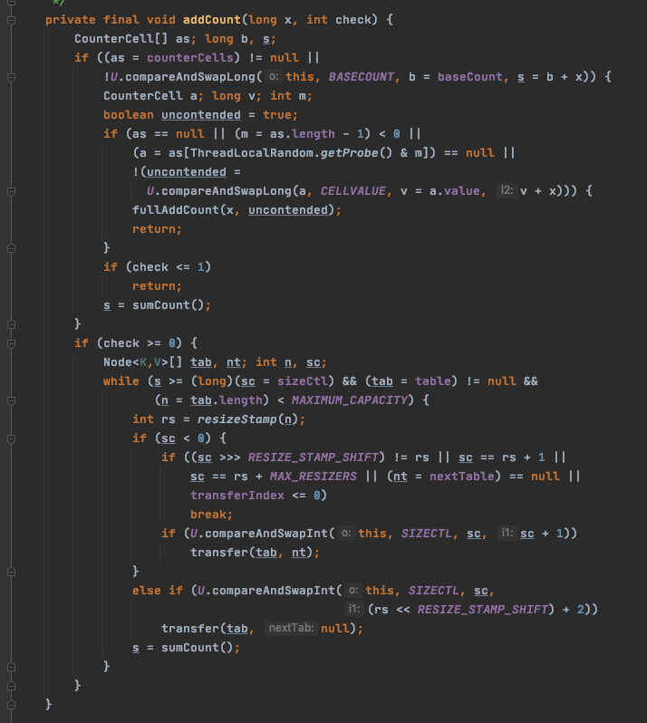
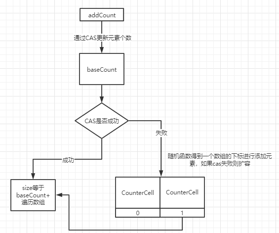
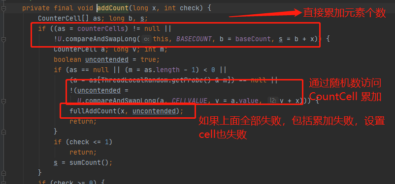

# put方法第四阶段-累加元素计数器

 [010-LongAdder.md](..\..\03-concurrency\09-Java中13个原子类\010-LongAdder.md)  伪共享

- [addCount方法初始化阶段](#addCount方法初始化阶段)
  - 直接cas BaseCount 累加元素的个数
  - 找到CounterCell[] 的某个下标位置， value = v +x() -> 表示记录元素个数
  - 如果前面全部失败，则走fullAndCount
- [addCount方法添加元素个数阶段](#addCount方法添加元素个数阶段)
  - CountCell[]为null
  - 已经初始化了，然后存在竞争，cas进行更新
  - 如果cas失败，触发counterCell扩容

## 图示




## addCount方法初始化阶段

#### 核心两大件




- baseCount - 没有竞争的情况下，通过CAS更新元素个数
- CounterCell[] ：存在线程竞争的情况下，累加元素个数
- 汇总的计算  size() = baseCount + 遍历 counterCells

### 源码

```java
private transient volatile long baseCount; //在没有竞争的情况下,去通过cas操作更新元素 个数
private transient volatile CounterCell[] counterCells;//在存在线程竞争的情况下，存储 元素个数
```

- 直接访问baseCount累加元素个数
- 如果累计失败,找到CountCell[] 随机的某个下标位置, value = v + x() -> 表示记录元素个数
- 如果还是失败则进入到fullAndCount()

## addCount方法添加元素个数阶段



> 在 putVal 方法执行完成以后，会通过 addCount 来增加 ConcurrentHashMap 中的元素个数， 并且还会可能触发扩容操作。这里会有两个非常经典的设计
>
> 1. 高并发下的扩容
>
> 2. 如何保证 addCount 的数据安全性以及性能

在 putVal 最后调用 addCount 的时候，传递了两个参数，分别是 1 和 binCount (链表长度)， 

- x 表示这次需要在表中增加的元素个数，
- check 参数表示是否需要进行扩容检查，大于等于 0 都需要进行检查

#### addCount总体

- ① 判断  counterCells 是否为空
  - 如果为空，就通过 cas 操作尝试修改 baseCount 变量，对这个变量进行原子累加操作(做这个操作的意义是:如果在没有竞争的情况下，仍然采用 baseCount 来记录元素个数
  - 如果 cas 失败说明存在竞争，这个时候不能再采用 baseCount 来累加，而是通过 CounterCell 来记录

```java
    private final void addCount(long x, int check) {
        CounterCell[] as; long b, s;
      //①判断  counterCells 是否为空
      //如果为空，就通过 cas 操作尝试修改 baseCount 变量，对这个变量进行原子累加操 作(做这个操作的意义是:如果在没有竞争的情况下，仍然采用 baseCount 来记录元素个数
      //如果 cas 失败说明存在竞争，这个时候不能再采用 baseCount 来累加，而是通过 CounterCell 来记录
        if ((as = counterCells) != null ||
            !U.compareAndSwapLong(this, BASECOUNT, b = baseCount, s = b + x)) {
            CounterCell a; long v; int m;
            boolean uncontended = true;//是否冲突标识，默认为没有冲突
          //这里有几个判断
          //  1. 计数表为空则直接调用 fullAddCount
          //  2. 从计数表中随机取出一个数组的位置为空，直接调用 fullAddCount
          //  3. 通过 CAS 修改 CounterCell 随机位置的值，如果修改失败说明出现并发情况(这里又用到了一种巧妙的方法)，调用 fullAndCount
          //  Random 在线程并发的时候会有性能问题以及可能会产生相同的随机数,ThreadLocalRandom.getProbe 可以解决这个问题，并且性能要比 Random 高
            if (as == null || (m = as.length - 1) < 0 ||
                (a = as[ThreadLocalRandom.getProbe() & m]) == null ||
                !(uncontended =U.compareAndSwapLong(a, CELLVALUE, v = a.value, v + x))) {
                fullAddCount(x, uncontended);
                return;
            }
            if (check <= 1) //链表长度小于等于1，不需要考虑扩容
                return;
            s = sumCount(); //统计ConcurrentHashMap元素个数
        }
				....
          addCount 后半段,扩容
    }

```

#####  CounterCells

ConcurrentHashMap 是采用 CounterCell 数组来记录元素个数的，像一般的集合记录集合大小，直接定义一个 size 的成员变量即可，当出现改变的时候只要更新这个变量就行。

##### 为什么 ConcurrentHashMap 要用这种形式来处理呢?

> 城北: **ConcurrentHashMap 采用了分片的方法来记录大小**

问题还是处在并发上，ConcurrentHashMap 是并发集合，如果用一个成员变量来统计元素个 数的话，为了保证并发情况下共享变量的线程安全，势必会需要通过加锁或者自旋来实现， 如果竞争比较激烈的情况下，**size 的设置上会出现比较大的冲突反而影响了性能**，所以在 **ConcurrentHashMap 采用了分片的方法来记录大小**

```java
private transient volatile int cellsBusy;// 标识当前 cell 数组是否在初始化或扩容中的CAS 标志位
private transient volatile CounterCell[] counterCells;/ /counterCells数组，总数值的分值分别存在每个 cell 中
  
  /**
   * CounterCell 数组的每个元素，都存储一个元素个数，而实际我们调用 size 方法就是通过这个循环累加来得到的
  */
@sun.misc.Contended // 
 static final class CounterCell {
        volatile long value; // 每个 value 存一部分
        CounterCell(long x) { value = x; }
    }
```

值得注意的是 **@sun.misc.Contended** 注解 是为了解决伪共享问题  


#### fullAddCount源码分析

fullAddCount 主要是用来初始化 CounterCell，来记录元素个数，里面包含扩容，初始化等 操作


#### sumCount

size 实际上调用的额就是 sumCount 进行操作的

```java
    final long sumCount() {
        CounterCell[] as = counterCells; CounterCell a;
        long sum = baseCount;
        if (as != null) {
            for (int i = 0; i < as.length; ++i) {
                if ((a = as[i]) != null)
                    sum += a.value;
            }
        }
        return sum;
    }
```


