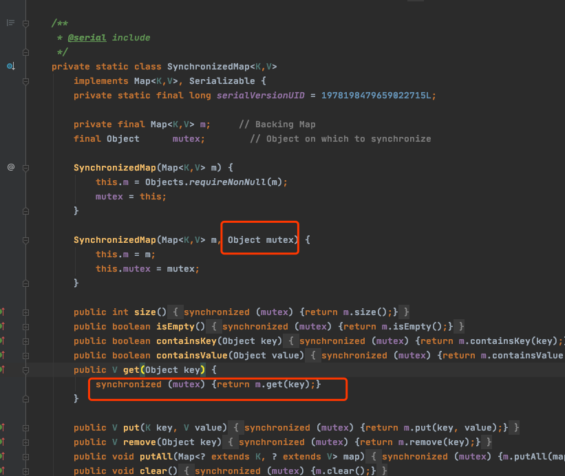
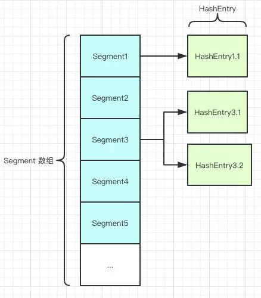

# HashTable vs HashMap vs ConcurrentHashMap

#### 如何让 HashMap 线程安全

## 让 HashMap 线程安全的方式

- [Collections.synchronizedMap(Map)](#Collections.synchronizedMap(Map))
- [`Hashtable `](#Hashtable): 所有方法全部用 `sychrinzied`修饰
- [`ConcurrentHashMap`: 分段锁技术](#`ConcurrentHashMap`: 分段锁技术)

#### Collections.synchronizedMap(Map)

> 内部通过包装 Map 并设置一互斥锁,通过同步块锁住对象,属于重量级锁,可以升级



#### Hashtable

跟HashMap相比Hashtable是线程安全的，适合在多线程的情况下使用，但是效率可不太乐观。

它的所有方法都用`synchronized`进行声明

- Hashtable 是不允许键或值为 null 的

- HashMap 的键值则都可以为 null

> 为啥 Hashtable 是不允许 KEY 和 VALUE 为 null, 而 HashMap 则可以呢？

这是因为Hashtable使用的是**安全失败机制（fail-safe）**，这种机制会使你此次读到的数据不一定是最新的数据。

如果你使用null值，就会使得其无法判断对应的key是不存在还是为空，因为你无法再调用一次`contain(key）`来对key是否存在进行判断，`ConcurrentHashMap`同理。

#### Hashtable 和 hashMap的区别

- **实现方式不同**：Hashtable 继承了 `Dictionary`类，而 HashMap 继承的是 AbstractMap 类。

- **初始化容量不同**：HashMap 的初始容量为：16，Hashtable 初始容量为：11，两者的负载因子默认都是：0.75。

- **扩容机制不同**：当现有容量大于总容量 * 负载因子时，HashMap 扩容规则为当前容量翻倍，Hashtable 扩容规则为当前容量翻倍 + 1。

- **迭代器不同**：HashMap 中的 Iterator 迭代器是 fail-fast 的，而 Hashtable 的 Enumerator 不是 fail-fast 的。

  所以，当其他线程改变了HashMap 的结构，如：增加、删除元素，将会抛出`ConcurrentModificationException` 异常，而 Hashtable 则不会。

#### fail-fast是啥？

是java集合中的一种机制， 在用迭代器遍历一个集合对象时，如果遍历过程中对集合对象的内容进行了修改（增加、删除、修改），则会抛出 `Concurrent Modification Exception`

原理

迭代器在遍历时直接访问集合中的内容，并且在遍历过程中使用一个 modCount 变量。

集合在被遍历期间如果内容发生变化，就会改变modCount的值。

每当迭代器使用hashNext()/next()遍历下一个元素之前，都会检测modCount变量是否为expectedmodCount值，是的话就返回遍历；否则抛出异常，终止遍历。

#### HashMap 和 ConcurrentHashMap 的不同

1.7中的 HashMap



如图所示，是由 Segment 数组、HashEntry 组成，和 HashMap 一样，仍然是**数组加链表**。

`Segment` 是` ConcurrentHashMap` 的一个内部类，主要的组成如下：

```java
static final class Segment<K,V> extends ReentrantLock implements Serializable {

    private static final long serialVersionUID = 2249069246763182397L;

    // 和 HashMap 中的 HashEntry 作用一样，真正存放数据的桶
    transient volatile HashEntry<K,V>[] table;

    transient int count;
        // 记得快速失败（fail—fast）么？
    transient int modCount;
        // 大小
    transient int threshold;
        // 负载因子
    final float loadFactor;

}
```

HashEntry跟HashMap差不多的，但是不同点是，他使用volatile去修饰了他的数据Value还有下一个节点next。

原理上来说，ConcurrentHashMap 采用了**分段锁**技术，其中 Segment 继承于 ReentrantLock。

不会像 HashTable 那样不管是 put 还是 get 操作都需要做同步处理，理论上 ConcurrentHashMap 支持 CurrencyLevel (Segment 数组数量)的线程并发。

每当一个线程占用锁访问一个 Segment 时，不会影响到其他的 Segment。

就是说如果容量大小是16他的并发度就是16，可以同时允许16个线程操作16个Segment而且还是线程安全的。

```java
public V put(K key, V value) {
    Segment<K,V> s;
    if (value == null)
        throw new NullPointerException();//这就是为啥他不可以put null值的原因
    int hash = hash(key);
    int j = (hash >>> segmentShift) & segmentMask;
    if ((s = (Segment<K,V>)UNSAFE.getObject          
         (segments, (j << SSHIFT) + SBASE)) == null) 
        s = ensureSegment(j);
    return s.put(key, hash, value, false);
}
```

他先定位到Segment，然后再进行put操作。

我们看看他的put源代码，你就知道他是怎么做到线程安全的了，关键句子我注释了。

```java
    final V put(K key, int hash, V value, boolean onlyIfAbsent) {
          // 将当前 Segment 中的 table 通过 key 的 hashcode 定位到 HashEntry
            HashEntry<K,V> node = tryLock() ? null :
                scanAndLockForPut(key, hash, value);
            V oldValue;
            try {
                HashEntry<K,V>[] tab = table;
                int index = (tab.length - 1) & hash;
                HashEntry<K,V> first = entryAt(tab, index);
                for (HashEntry<K,V> e = first;;) {
                    if (e != null) {
                        K k;
 // 遍历该 HashEntry，如果不为空则判断传入的 key 和当前遍历的 key 是否相等，相等则覆盖旧的 value。
                        if ((k = e.key) == key ||
                            (e.hash == hash && key.equals(k))) {
                            oldValue = e.value;
                            if (!onlyIfAbsent) {
                                e.value = value;
                                ++modCount;
                            }
                            break;
                        }
                        e = e.next;
                    }
                    else {
                 // 不为空则需要新建一个 HashEntry 并加入到 Segment 中，同时会先判断是否需要扩容。
                        if (node != null)
                            node.setNext(first);
                        else
                            node = new HashEntry<K,V>(hash, key, value, first);
                        int c = count + 1;
                        if (c > threshold && tab.length < MAXIMUM_CAPACITY)
                            rehash(node);
                        else
                            setEntryAt(tab, index, node);
                        ++modCount;
                        count = c;
                        oldValue = null;
                        break;
                    }
                }
            } finally {
               //释放锁
                unlock();
            }
            return oldValue;
        }
```

首先第一步的时候会尝试获取锁，如果获取失败肯定就有其他线程存在竞争，则利用 `scanAndLockForPut()` 自旋获取锁。

1. 尝试自旋获取锁。
2. 如果重试的次数达到了 `MAX_SCAN_RETRIES` 则改为阻塞锁获取，保证能获取成功。

#### get的逻辑呢？

get 逻辑比较简单，只需要将 Key 通过 Hash 之后定位到具体的 Segment ，再通过一次 Hash 定位到具体的元素上。

由于 HashEntry 中的 value 属性是用 volatile 关键词修饰的，保证了内存可见性，所以每次获取时都是最新值。

ConcurrentHashMap 的 get 方法是非常高效的，**因为整个过程都不需要加锁**。

