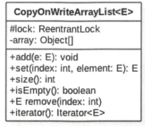
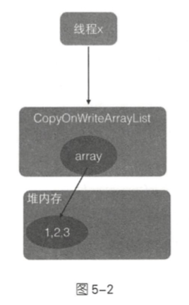
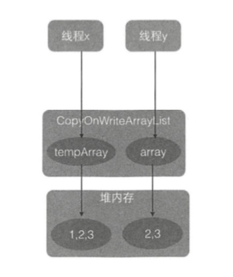

# CopyOnWriteArrayList

> [COW-CopyOnWrite写时复制机制.md](../../../99-unclassified/01-COW-CopyOnWrite写时复制机制.md) 

CopyOnWriteArrayList 使用CopyOnWrite 写时复制的策略来保证 list 的一致性, 而

- 获取

- 修改
- 写入

三步操作不是原子性的,所以在增删改的过程中都是用了独占锁,来保证在某个时间只有一个线程能对 list 数组进行修改

CopyOnWriteArrayList 提供了弱一致性的迭代器,从而保证了获取迭代器后, 其他线程对 list 的修改是不可见的, 迭代器遍历的数组是一个快照

CopyOnWriteArraySet 底层也是用它实现的

## Copy On WriteArrayList 的类图结构



在 CopyOnWriteArrayList 的类图中 , 每个 CopyOnWriteArrayList 对象里面

- array 数组对象用来存放具体的元素
- ReentrantLock 独占锁对象用来保证同时只有一个线程对 array 进行修改

如果让我们自己做一个写时复制的线程安全的 list 我们可以怎么做, 有哪些点需要考虑?

- 何时初始化 list, 初始化的 list 元素个数为多少, list 是有限大小吗 ?
- 如何保证线程安全, 比如多个线程进行读写时如何保证是线程安全的 ?
- 如何保证使用迭代器遍历 list 的数据一致性

## 源码解析

### 初始化

```java
public CopyOnWriteArrayList() {
  setArray(new Object[0]);
}
```

然后看下有参的构造函数

```java
// 入参为集合, 将集合里面的元素复制到  
public CopyOnWriteArrayList(Collection<? extends E> c) {
        Object[] elements;
        if (c.getClass() == CopyOnWriteArrayList.class)
            elements = ((CopyOnWriteArrayList<?>)c).getArray();
        else {
            elements = c.toArray();
            // c.toArray might (incorrectly) not return Object[] (see 6260652)
            if (elements.getClass() != Object[].class)
                elements = Arrays.copyOf(elements, elements.length, Object[].class);
        }
        setArray(elements);
    }
```

### 添加元素

可以添加元素的函数有

- add(E e)
- add(int index , E element)
- addIfAbsent(E e)
- addAllAbsent(Collection<? extends E>)

```java
    public boolean add(E e) {
      //获取独占锁
        final ReentrantLock lock = this.lock;
        lock.lock();
        try {
          //② 获取 array
            Object[] elements = getArray();
          // ③ 获取 array 到新数组.添加元素到新数组
            int len = elements.length;
            Object[] newElements = Arrays.copyOf(elements, len + 1);
        
            newElements[len] = e;
          //④ 使用新数组替换添加前的数组
            setArray(newElements);
            return true;
        } finally {
          //释放独占锁
            lock.unlock();
        }
    }

```

- 代码① 获取独占锁,如果多个线程都去调用 add方法则只有一个线程能够获取到该锁
- 如果多个线程都调用 add 方法, 则只有一个线程会获取到该锁, 其他线程都会被阻塞挂起直到锁被释放
- ② 获取 array ,然后执行代码③ , 复制 array 到一个新的数组, 数组长度是原来长度增加 1 ,所以 copyOnWriteArrayList 是一个无界数组
- 将新增的额元素添加到新数组
- 代码④ , 使用新数组替换原数组, 并在返回前释放锁, 由于加了锁,所以整个 add 过程是个原子性操作

简而言之就是添加元素时,先复制一个快照,然后在快照上添加,而不是直接在原来的数组上进行

## 获取指定位置的元素

使用 E get(int index) 获取下标为 index 的元素, 如果元素不存在则抛出 IndexOutOfBoundsException 异常

```java
    public E get(int index) {
        return get(getArray(), index);
    }
    final Object[] getArray() {
        return array;
    }
    private E get(Object[] a, int index) {
        return (E) a[index];
    }

```


- 首先获取 array 数组, 然后通过下标访问指定位置的元素 
- 然后通过下标访问指定元素

整个过程没有加锁同步



由于没有加锁,可能导致 线程 x 在执行完第一步前,另外一个线程 y 进行了 remove 操作, 假设要删除元素 1 ,remove 操作首先会获取独占锁,然后进行写时复制

而这个时候 array 之前指向的数组的引用计数为 1 ,而不是0 , 因为线程 x 还在使用它, 这时 线程 x 考试执行步骤 B ,步骤 B 操作的数组是线程 y删除之前的数组



虽然 y 已经删除了 index 的元素,但是 x 线程还是会返回 index 处的元素,这就是写时复制产生的弱一致性

## 修改指定元素

使用 E set (int index, E element) 修改 list 中指定元素的值, 如果指定位置的元素不存在则抛出 IndeOutOfBoundsException 异常

```java
    public E set(int index, E element) {
      //获取独占锁
        final ReentrantLock lock = this.lock;
        lock.lock();
        try {
            Object[] elements = getArray();
          //get 方法获取指定位置的元素
            E oldValue = get(elements, index);
						//如果指定位置的元素值与新值不一致,则创建新数组并复制元素
            if (oldValue != element) {
                int len = elements.length;
                Object[] newElements = Arrays.copyOf(elements, len);
              //在新数组上修改制定位置的元素并设置新数组到 array
                newElements[index] = element;
                setArray(newElements);
            } else {
                // Not quite a no-op; ensures volatile write semantics
              // 如果指定位置的元素与新的值一样,为了保证 volatile 语义,还是重新设置 array,虽然 array 内容并没有变化
                setArray(elements);
            }
            return oldValue;
        } finally {
            lock.unlock();
        }
    }
```

- 获取独占锁
- get 方法获取指定位置的元素
  - 如果指定位置的元素值与新值不一致,则创建新数组并复制元素
    - 在新数组上修改制定位置的元素并设置新数组到 array
  - 如果指定位置的元素与新的值一样,为了保证 volatile 语义,还是重新设置 array,虽然 array 内容并没有变化

## 删除指定元素

```java
    public E remove(int index) {
        final ReentrantLock lock = this.lock;
      //获取独占锁
        lock.lock();
        try {
          //获取数组
            Object[] elements = getArray();
            int len = elements.length;
          //获取指定元素
            E oldValue = get(elements, index);
            int numMoved = len - index - 1;
          //如果要删除的是最后一个元素
            if (numMoved == 0)
          //    直接复制一个新的元素,长度为原长度 -1
                setArray(Arrays.copyOf(elements, len - 1));
            else {
              //如果不是最后一个元素,则分两次复制删除后的元素到新数组
                Object[] newElements = new Object[len - 1];
                System.arraycopy(elements, 0, newElements, 0, index);
                System.arraycopy(elements, index + 1, newElements, index,
                                 numMoved);
                setArray(newElements);
            }
            return oldValue;
        } finally {
          //释放锁
            lock.unlock();
        }
    }
```

- 获取独占锁

- 获取数组

- 获取指定元素

- 如果要删除的是最后一个元素

  - 直接复制一个新的元素,长度为原长度 -1

- 如果不是最后一个元素,则分两次复制删除后的元素到新数组

  > 比如要删除的是 index ,那么久复制 0- index-1 , 然后再复制 index+1到结束

## 弱一致性的迭代器

遍历列表元素可以使用迭代器,

弱一致性:

**其他线程对 list 增删改对迭代器是不可见的,**

遍历的不是原来的数组,而是快照 

#### 在创建迭代器的时候分明是把数组引用传进去了,为什么是快照呢?

如果其他线程没有对 list 修改, 那么 snapshot 本身就是快照,因为增删改后 list 里面的数组被新数组替换了, 这个时候,来数组被snapshot 引用

使用迭代器元素时, 其他对该 list 进行增删改不可见, 因为它们操作的是两个不同的数组


```java
    static final class COWIterator<E> implements ListIterator<E> {
        /** Snapshot of the array */
        private final Object[] snapshot;
        /** Index of element to be returned by subsequent call to next.  */
        private int cursor;

        private COWIterator(Object[] elements, int initialCursor) {
            cursor = initialCursor;
            snapshot = elements;
        }

        public boolean hasNext() {
            return cursor < snapshot.length;
        }

        public boolean hasPrevious() {
            return cursor > 0;
        }

        @SuppressWarnings("unchecked")
        public E next() {
            if (! hasNext())
                throw new NoSuchElementException();
            return (E) snapshot[cursor++];
        }

        @SuppressWarnings("unchecked")
        public E previous() {
            if (! hasPrevious())
                throw new NoSuchElementException();
            return (E) snapshot[--cursor];
        }

        public int nextIndex() {
            return cursor;
        }

        public int previousIndex() {
            return cursor-1;
        }

        /**
         * Not supported. Always throws UnsupportedOperationException.
         * @throws UnsupportedOperationException always; {@code remove}
         *         is not supported by this iterator.
         */
        public void remove() {
            throw new UnsupportedOperationException();
        }

        /**
         * Not supported. Always throws UnsupportedOperationException.
         * @throws UnsupportedOperationException always; {@code set}
         *         is not supported by this iterator.
         */
        public void set(E e) {
            throw new UnsupportedOperationException();
        }

        /**
         * Not supported. Always throws UnsupportedOperationException.
         * @throws UnsupportedOperationException always; {@code add}
         *         is not supported by this iterator.
         */
        public void add(E e) {
            throw new UnsupportedOperationException();
        }

        @Override
        public void forEachRemaining(Consumer<? super E> action) {
            Objects.requireNonNull(action);
            Object[] elements = snapshot;
            final int size = elements.length;
            for (int i = cursor; i < size; i++) {
                @SuppressWarnings("unchecked") E e = (E) elements[i];
                action.accept(e);
            }
            cursor = size;
        }
    }
```


## 代码 

Beggar version of CopyOnWriteArrayList

```java
package cn.eccto.study.java.collections.list;

import java.io.Serializable;
import java.util.Arrays;
import java.util.Collection;
import java.util.RandomAccess;
import java.util.concurrent.locks.ReentrantLock;

/**
 * a beggar version of {@link java.util.concurrent.CopyOnWriteArrayList}
 *
 * @author EricChen 2020/01/30 18:23
 */
public class MyCopyOnWriteList<E> implements MyList, RandomAccess, Cloneable, Serializable {

    private transient volatile Object[] array;

    final transient ReentrantLock lock = new ReentrantLock();

    /**
     * Gets the array , No-private so as to also be accessible from CopyOnWriteSet class.
     */
    final Object[] getArray() {
        return array;
    }

    final void setArray(Object[] array) {
        this.array = array;
    }

    public MyCopyOnWriteList() {
        setArray(new Object[0]);
    }

    public MyCopyOnWriteList(Collection<? extends E> collection) {
        setArray(collection.toArray());
    }


    @Override
    public int size() {
        return getArray().length;
    }

    @Override
    public boolean isEmpty() {
        return size() == 0;
    }

    /**
     * 获取 指定 index 的值
     */
    public E get(int index) {
        return get(getArray(), index);
    }

    @SuppressWarnings("unchecked")
    private E get(Object[] a, int index) {
        return (E) a[index];
    }

    /**
     * appends the specified elements to the end of this list
     */
    public boolean add(E e) {
        //加锁
        final ReentrantLock lock = new ReentrantLock();
        lock.lock();
        //追加
        try {
            Object[] array = getArray();
            //复制一份
            int length = array.length;
            Object[] newElements = Arrays.copyOf(array, length + 1);
            newElements[length] = e;
            setArray(array);
            return true;
        } finally {
            //释放锁
            lock.unlock();
        }
    }

    /**
     * Removes the element at the specified position in this list , Shifts any subsequent elements to the
     * left ( subtracts one from their indices)
     *
     * @param index index of the specified position
     * @return the element that was removed from the list
     */
    public E remove(int index) {
        final ReentrantLock lock = this.lock;
        lock.lock();
        try {
            Object[] array = getArray();
            int length = array.length;
            E oldValue = get(index);
            int numMoved = length - index - 1;
            if (numMoved == 0) {
                setArray(Arrays.copyOf(array, length - 1));
            } else {
                Object[] newElements = new Object[length - 1];
                System.arraycopy(array, 0, newElements, 0, index);
                System.arraycopy(array, index + 1, newElements, index, numMoved);
                setArray(newElements);
            }
            return oldValue;
        } finally {
            lock.unlock();
        }

    }

}

```

## 迭代器方法

```java
    static final class COWIterator<E> implements ListIterator<E> {
        /** Snapshot of the array */
 
        private final Object[] snapshot;
        /** Index of element to be returned by subsequent call to next.  */
        private int cursor;

        private COWIterator(Object[] elements, int initialCursor) {
            cursor = initialCursor;
            snapshot = elements;
        }

        public boolean hasNext() {
            return cursor < snapshot.length;
        }

        public boolean hasPrevious() {
            return cursor > 0;
        }

        @SuppressWarnings("unchecked")
        public E next() {
            if (! hasNext())
                throw new NoSuchElementException();
            return (E) snapshot[cursor++];
        }

        @SuppressWarnings("unchecked")
        public E previous() {
            if (! hasPrevious())
                throw new NoSuchElementException();
            return (E) snapshot[--cursor];
        }

        public int nextIndex() {
            return cursor;
        }

        public int previousIndex() {
            return cursor-1;
        }

        /**
         * Not supported. Always throws UnsupportedOperationException.
         * @throws UnsupportedOperationException always; {@code remove}
         *         is not supported by this iterator.
         */
        public void remove() {
            throw new UnsupportedOperationException();
        }

        /**
         * Not supported. Always throws UnsupportedOperationException.
         * @throws UnsupportedOperationException always; {@code set}
         *         is not supported by this iterator.
         */
        public void set(E e) {
            throw new UnsupportedOperationException();
        }

        /**
         * Not supported. Always throws UnsupportedOperationException.
         * @throws UnsupportedOperationException always; {@code add}
         *         is not supported by this iterator.
         */
        public void add(E e) {
            throw new UnsupportedOperationException();
        }

        @Override
        public void forEachRemaining(Consumer<? super E> action) {
            Objects.requireNonNull(action);
            Object[] elements = snapshot;
            final int size = elements.length;
            for (int i = cursor; i < size; i++) {
                @SuppressWarnings("unchecked") E e = (E) elements[i];
                action.accept(e);
            }
            cursor = size;
        }
    }

```

- 可以看出在创建迭代器的时候,创建的是内部类
- 拷贝出来一份作为`snapshot`
- 迭代时不允许更新操作

