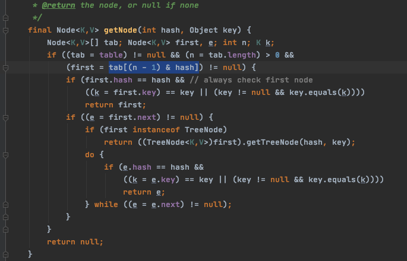

# HashMap 如何计算 index

## 一句话总结

首先

hashMap 通过 (容量 -1 ) & hash 值来算出 bucket 的位置,我们都知道如果位置一样会冲突且变成链表, 要尽量分散

我们第一个想法是 用 hashcode 取余 数组长度 ,实际上 (数组长度 - 1) & hash  的值是一样的 而且是与运算效率高

```
(n - 1) & hash = hash % n
```

容量 - 1 与上 hashCode 实际上会计算的值 不会超过容量 

例如 16 -1 = 15 = 01111

```
0101010010101010
						1111
						----
						1010
						也就是十进制 10
```

还有一个是值得注意的是算 hash 的时候用低 16 位与上高 16 位是为了减少重复的几率


## HashMap：为什么容量总是为2的次幂

HashMap是根据key的hash值决策key放入到哪个桶（bucket）中，通过 tab=[(n - 1) & hash] 公式计算得出。其中tab是一个哈希表



#### **为什么要保证 capacity 是2的次幂呢？**

```java
    public V get(Object key) {
        Node<K,V> e;
        return (e = getNode(hash(key), key)) == null ? null : e.value;
    }
```

在get方法实现中，实际上是匹配链表中的 Node[] tab 中的数据。

```java
(n - 1) & hash
```

实际上是计算出 key 在 tab 中索引位置，当 key 的 hash 没有冲突时，key 在 HashMap 存储的位置就是匹配的 node 中的第一个节点。如果hash有冲突，就会在node 里面节点中查询，直至匹配到相等的key。

**这里的 n 实际上就是容量**, 因为 n 永远是2的次幂，所以 n-1 通过 二进制表示，

例如

```
16 = 10000
15 = 1111  
```

可以看出来都是尾端以连续1的形式表示

## **当(n - 1) 和 hash 做与运算时，会保留hash中 后 x 位的 1**

例如

```
例如 00001111 & 10000011 = 00000011
```

这样做有2个好处

- &运算速度快，至少比%取模运算块
- 能保证 索引值 肯定在 capacity 中，不会超出数组长度  ; (n - 1) & hash，当n为2次幂时，会满足一个公式：**(n - 1) & hash = hash % n**

hash 函数如下

- h  =  对象的 hashcode ,32位
- 低 16 位异或高 16 位 是为了减少重复的几率

```java
static final int hash(Object key) {
  int h;
  return (key == null) ? 0 : (h = key.hashCode()) ^ (h >>> 16);
}
```

## **为什么要通过 (n - 1) & hash 决定桶的索引呢？**

- key具体应该在哪个桶中，肯定要和key挂钩的，HashMap顾名思义就是通过hash算法高效的把存储的数据查询出来，所以HashMap的所有get 和 set 的操作都和hash相关。
- 既然是通过hash的方式，那么不可避免的会出现hash冲突的场景。hash冲突就是指 2个key 通过hash算法得出的哈希值是相等的。hash冲突是不可避免的，所以**如何尽量避免hash冲突，或者在hash冲突时如何高效定位到数据的真实存储位置就是HashMap中最核心的部分**。
- 首先要提的一点是 HashMap 中 capacity 可以在构造函数中指定，如果不指定默认是2 的 (n = 4) 次方，即16。
- HashMap中的hash也做了比较特别的处理，(h = key.hashCode()) ^ (h >>> 16)。
  先获得key的hashCode的值 h，然后 h 和 h右移16位 做异或运算。**实质上是把一个数的低16位与他的高16位做异或运算**，因为在前面 (n - 1) & hash 的计算中，hash变量只有末x位会参与到运算。**使高16位也参与到hash的运算能减少冲突**。

```
例如1000000的二进制是 
00000000 00001111 01000010 01000000
右移16位： 
00000000 00000000 00000000 00001111
异或 
00000000 00001111 01000010 01000000
^
00000000 00000000 00000000 00001111
-----------------------------------
00000000 00001111 01000010 01001111

```

#### **capacity 永远都是 2 次幂，那么如果我们指定 initialCapacity 不为 2次幂时呢，是不是就破坏了这个规则？**

答案是不会的，HashMap 的 tableSizeFor 方法做了处理，能保证 n 永远都是2次幂。

```java
/**
 * Returns a power of two size for the given target capacity.
 */
static final int tableSizeFor(int cap) {
    //cap-1后，n的二进制最右一位肯定和cap的最右一位不同，即一个为0，一个为1，例如cap=17（00010001），n=cap-1=16（00010000）
    int n = cap - 1;
    //n = (00010000 | 00001000) = 00011000
    n |= n >>> 1;
    //n = (00011000 | 00000110) = 00011110
    n |= n >>> 2;
    //n = (00011110 | 00000001) = 00011111
    n |= n >>> 4;
    //n = (00011111 | 00000000) = 00011111
    n |= n >>> 8;
    //n = (00011111 | 00000000) = 00011111
    n |= n >>> 16;
    //n = 00011111 = 31
    //n = 31 + 1 = 32, 即最终的cap = 32 = 2 的 (n=5)次方
    return (n < 0) ? 1 : (n >= MAXIMUM_CAPACITY) ? MAXIMUM_CAPACITY : n + 1;
}

```

