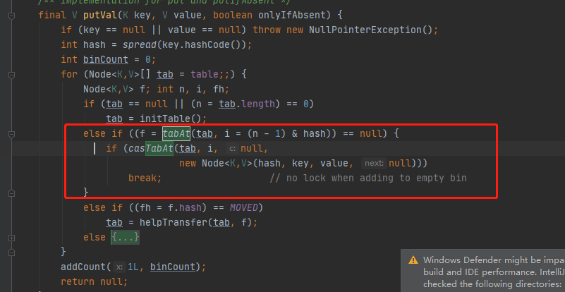

# ConcurrentHashMap - put操作


## 总体步骤

- [put方法准备阶段-spread](062-ConcurrentHashMap-put操作-spread.md) 
- [put方法第一阶段-初始化 ](063-ConcurrentHashMap-put操作-初始化.md) 
- [put方法第二阶段-无碰撞插入](064-ConcurrentHashMap-put操作-无碰撞插入.md) 
- [put方法第三阶段-碰撞插入](#put方法第三阶段-碰撞插入)
-  [put方法第四阶段-累加元素计数器](066-ConcurrentHashMap-put操作-累加计数器.md) 
- [put方法第五阶段-扩容](#put方法第五阶段-扩容)
- put方法第五阶段-插入节点与树化

## 整体流程

```
for (Node<K,V>[] tab = table;;) {
    Node<K,V> f; int n, i, fh;
    if (tab == null || (n = tab.length) == 0)
		//tab为空，走初始化
    else if ((f = tabAt(tab, i = (n - 1) & hash)) == null) {
		//如果一维数组上该索引上是空，走插入
    }
    else if ((fh = f.hash) == MOVED)
        //正在迁移，协助迁移
    else {
   	// 如果不为空，要锁node c插入
   }
```

## [put方法准备阶段-spread](062-ConcurrentHashMap-put操作-spread.md) 

## [put方法第一阶段-初始化 ](063-ConcurrentHashMap-put操作-初始化.md) 

初始化完成后，会进入下次循环

## [put方法第二阶段-无碰撞插入](064-ConcurrentHashMap-put操作-无碰撞插入.md) 



##  [put方法第三阶段-碰撞插入](065-ConcurrentHashMap-操作-碰撞插入.md) 


##  [ConcurrentHashMap-put操作-累加计数器.md](066-ConcurrentHashMap-put操作-累加计数器.md) 

## [ConcurrentHashMap-put操作-扩容](067-ConcurrentHashMap-put操作-扩容) 