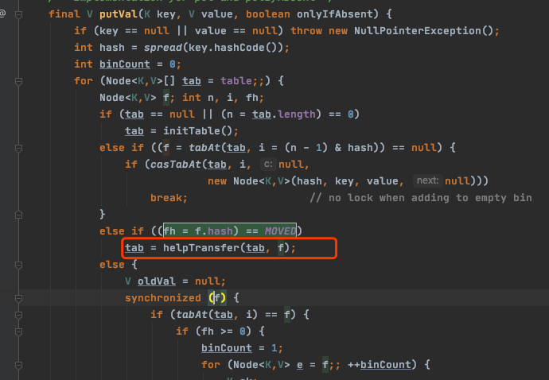

# ConcurrentHashMap - put操作

## 总体步骤

- [put方法第一阶段-初始化](#put方法第一阶段-初始化)
- [put方法第二阶段-累加元素计数器](#put方法第二阶段-累加元素计数器)
- put方法第三阶段-扩容
- put方法第五阶段-插入节点与树化

## 源码

```java
    public V put(K key, V value) {
        return putVal(key, value, false);
    }
```

## put方法第一阶段-初始化

- 判断是否非空, 可以看到 hashMap key 和 value 都不能为空
- ① 根据对象的 hashCode 取模获取在数组中的位置
- ② 自旋
- ③ 如果 列表 table 为空,进入**初始化阶段**
  - [initTable](#initTable) 初始化列表
  - [addCount](#addCount) 将 count的值累加
- [put方法第二阶段-累加元素计数器](#put方法第二阶段-累加元素计数器)

```java
    final V putVal(K key, V value, boolean onlyIfAbsent) {
        if (key == null || value == null) throw new NullPointerException();
      	//① 根据对象的 hashCode 取模获取在数组中的位置
        int hash = spread(key.hashCode());
        int binCount = 0;
      // ②  自旋
        for (Node<K,V>[] tab = table;;) {
            Node<K,V> f; int n, i, fh;
            if (tab == null || (n = tab.length) == 0)
              //③ 如果 列表 table 为空,则初始化列表
                tab = initTable();
          // 通过 hash 值对应的数组下标得到第一个节点; 以 volatile 读的方式来读取 table 数组中的元素，保证每次拿到的数据都是最新的
            else if ((f = tabAt(tab, i = (n - 1) & hash)) == null) {
              //如果该下标返回的节点为空，则直接通过 cas 将新的值封装成 node 插入即可;如果 cas 失败，说明存在竞争，则进入下一次循环
                if (casTabAt(tab, i, null, new Node<K,V>(hash, key, value, null)))
                    break;                   // no lock when adding to empty bin
            }
            else if ((fh = f.hash) == MOVED)
              //如果当前 value 的 hash 值是 -1 (MOVED) 的话,当前线程协助迁移
                tab = helpTransfer(tab, f);
            else {
              //
                V oldVal = null;
                synchronized (f) {
                  	//插入节点到对应的 Table
										// 对链表进行尾插
                    // 转红黑树逻辑 
                }
                if (binCount != 0) {
                    if (binCount >= TREEIFY_THRESHOLD)
                        treeifyBin(tab, i);
                    if (oldVal != null)
                        return oldVal;
                    break;
                }
            }
        }
      //累加计数器
        addCount(1L, binCount);
        return null;
    }

```

#### spread

- (h >>> 16) :  hashcode 无符号右移 16 位, 即高 16 位
- 使用 hashcode 异或低 16 位(不同为 1 ) 自己的高 16 位 ,这样的目的是为了降低重复的可能性

```java
   static final int spread(int h) {
        return (h ^ (h >>> 16)) & HASH_BITS;
    }
```

#### initTable

##### sizeCtl的含义

这个标志是在 Node 数组初始化或者扩容的时候的一个控制位标识，**负数代表正在进行初始化或者扩容操作**

- -1 代表正在初始化
- -N 代表有 N-1 个线程正在进行扩容操作，这里不是简单的理解成 n 个线程，sizeCtl 就是 -N
- 0 标识 Node 数组还没有被初始化
- 正数代表初始化或者下一次扩容的大小

##### 步骤

- ① 通过 CAS 判断 SIZECTL 变量是否为 0 , 0 则改为 -1
- ② 再次判断 列表 table 为空 ,如果 sc 大于 0 则使用 sc 作为初始化容量, 否则使用 16
- ③ 计算下次扩容的大小，实际就是当前容量的 0.75 倍，这里使用了右移来计算
- ④ 将下次扩容的大小赋值给 sizeCTL
- ⑤ 可能在初始化,也可能在扩容 ,则直接出让 CPU 时间片

```java
    private final Node<K,V>[] initTable() {
        Node<K,V>[] tab; int sc;
        while ((tab = table) == null || tab.length == 0) {
            if ((sc = sizeCtl) < 0)
              // ⑤ 可能在初始化,也可能在扩容 ,则直接出让 CPU 时间片
                Thread.yield(); // lost initialization race; just spin
            else if (U.compareAndSwapInt(this, SIZECTL, sc, -1)) {
              // ① 通过 CAS 判断 SIZECTL 变量是否为 0 , 0 则改为 -1
                try {
                    if ((tab = table) == null || tab.length == 0) {
                      //② 再次判断 列表 table 为空 ,如果 sc 大于 0 则使用 sc 作为初始化容量, 否则使用 16
                        int n = (sc > 0) ? sc : DEFAULT_CAPACITY;
                        @SuppressWarnings("unchecked")
                        Node<K,V>[] nt = (Node<K,V>[])new Node<?,?>[n];
                        table = tab = nt;
                      //③ 计算下次扩容的大小，实际就是当前容量的 0.75 倍，这里使用了右移来计算
                        sc = n - (n >>> 2);
                    }
                } finally {
                  //④ 将下次扩容的大小赋值给 sizeCTL , 此时的 sizeCtl 变为正数
                    sizeCtl = sc;
                }
                break;
            }
        }
        return tab;
    }
```

> 城北: 使用 CAS 从而只允许一个线程进行初始化,确保线程安全 ,其他线程

#### tabAt

> **城北:  volatile 的数组只针对数组的引用具有 volatile 的语义，而不是它的元素**

该方法获取对象中 offset 偏移地址对应的对象 field 的值。

实际上这段代码的含义等价于 tab[i], 但是为什么不直接使用 tab[i]来计算呢?

getObjectVolatile 方法 , 一旦看到 volatile 关键字，就表示可见性。因为对 volatile 写操作 happen- before 于 volatile 读操作，因此其他线程对 table 的修改均对 get 读取可见; 虽然 table 数组本身是增加了 volatile 属性，但是“ **volatile 的数组只针对数组的引用具有 volatile 的语义，而不是它的元素**”。 所以如果有其他线程对这个数组的元素进行写操作，那么当前线程来读的时候不一定能读到最新的值。

出于性能考虑，Doug Lea 直接通过 Unsafe 类来对 table 进行操作。

```java
    @SuppressWarnings("unchecked")
    static final <K,V> Node<K,V> tabAt(Node<K,V>[] tab, int i) {
        return (Node<K,V>)U.getObjectVolatile(tab, ((long)i << ASHIFT) + ABASE);
    }
```

## put方法第三阶段-扩容

判断是否需要扩容，也就是当更新后的键值对总数 baseCount >= 阈值 sizeCtl 时，进行 rehash ，这里面会有两个逻辑。

- 如果当前正在处于扩容阶段，则当前线程会加入并且协助扩容
- 如果当前没有在扩容，则直接触发扩容操作

##### addCount 后半段,扩容

```java
if (check >= 0) { //如果 binCount>=0，标识需要检查扩容
  Node<K,V>[] tab, nt; int n, sc;
//标识集合大小，如果集合大小大于或等于扩容阈值(默认值的 0.75) 
//并且 table 不为空并且 table 的长度小于最大容量
  while (s >= (long)(sc = sizeCtl) && (tab = table) != null &&
         (n = tab.length) < MAXIMUM_CAPACITY) {
    int rs = resizeStamp(n);
    if (sc < 0) { //sc<0，也就是sizeCtl<0，说明已经有别的线程正在扩容了
      //这 5 个条件只要有一个条件为 true，说明当前线程不能帮助进行此次的扩容，直接跳出循环
			//sc >>> RESIZE_STAMP_SHIFT!=rs 表示比较高 RESIZE_STAMP_BITS 位 生成戳和 rs 是否相等，相同
			//sc=rs+1 表示扩容结束
			//sc==rs+MAX_RESIZERS 表示帮助线程线程已经达到最大值了
 			//nt=nextTable -> 表示扩容已经结束
			//transferIndex<=0 表示所有的 transfer 任务都被领取完了，没有剩余的 hash 桶来给自己自己好这个线程来做 transfer
      
      if ((sc >>> RESIZE_STAMP_SHIFT) != rs || sc == rs + 1 ||
          sc == rs + MAX_RESIZERS || (nt = nextTable) == null ||
          transferIndex <= 0)
        break;
      if (U.compareAndSwapInt(this, SIZECTL, sc, sc + 1))
        transfer(tab, nt);//当前线程,尝试帮助此次扩容，如果成功，则调用 transfer
    }
    // 如果当前没有在扩容，那么 rs 肯定是一个正数，通过 rs<<RESIZE_STAMP_SHIFT 将 sc 设置 为一个负数，+2 表示有一个线程在执行扩容
    else if (U.compareAndSwapInt(this, SIZECTL, sc,
                                 (rs << RESIZE_STAMP_SHIFT) + 2))
      transfer(tab, null);
    s = sumCount();// 重新计数，判断是否需要开启下一轮扩容
  }
}
```

## put方法第四阶段-其他线程协助扩容

如果对应的节点存在，判断这个节点的 hash 是不是等于 MOVED(-1)，说明当前节点是 ForwardingNode 节点，
意味着有其他线程正在进行扩容，那么当前现在直接帮助它进行扩容，因此调用 helpTransfer 方法



```java
    final Node<K,V>[] helpTransfer(Node<K,V>[] tab, Node<K,V> f) {
        Node<K,V>[] nextTab; int sc;
      // 判断此时是否仍然在执行扩容,nextTab=null 的时候说明扩容已经结束了
        if (tab != null && (f instanceof ForwardingNode) &&
            (nextTab = ((ForwardingNode<K,V>)f).nextTable) != null) {
            int rs = resizeStamp(tab.length);
            while (nextTab == nextTable && table == tab &&
                   //说明扩容还未完成的情况下不断循环来尝试将当前 线程加入到扩容操作中
                   (sc = sizeCtl) < 0) {
//下面部分的整个代码表示扩容结束，直接退出循环
//transferIndex<=0 表示所有的 Node 都已经分配了线程 //sc=rs+MAX_RESIZERS 表示扩容线程数达到最大扩容线程数
//sc >>> RESIZE_STAMP_SHIFT !=rs， 如果在同一轮扩容中，那么 sc 无符号右移比较高位和 rs 的值，那么应该是相等的。如果不相等，说明扩容结束了 
//sc==rs+1 表示扩容结束
                if ((sc >>> RESIZE_STAMP_SHIFT) != rs || sc == rs + 1 ||
                    sc == rs + MAX_RESIZERS || transferIndex <= 0)
                    break;//跳出循环
                if (U.compareAndSwapInt(this, SIZECTL, sc, sc + 1)) {
                 //在低16位 上增加扩容线程数
                    transfer(tab, nextTab); //帮助扩容
                    break;
                }
            }
            return nextTab;
        }
        return table;
    }
```

## put方法第五阶段-插入节点与树化

这个方法的主要作用是

- 如果被添加的节点的位置已经存在节点的时候，需要以链表的方式 ,加入到节点中

- 如果当前节点已经是一颗红黑树，那么就会按照红黑树的规则将当前节点加入到红黑树中

```java
final V putVal(K key, V value, boolean onlyIfAbsent) {
      	....
        for (Node<K,V>[] tab = table;;) {
            Node<K,V> f; int n, i, fh;
            if (tab == null || (n = tab.length) == 0)
               //初始化 tabke
            else if ((f = tabAt(tab, i = (n - 1) & hash)) == null) {
              //当节点为空则设置节点
            }
            else if ((fh = f.hash) == MOVED)
              //协助扩容
            else {
              //链表或者红黑树
                V oldVal = null;
                synchronized (f) {//给对应的头结点加锁
								//再次判断对应下标位置是否为f节点
                    if (tabAt(tab, i) == f) {
                        if (fh >= 0) {  //头结点的hash值大于0，说明是链表

                            binCount = 1;//用来记录链表的长度
                            for (Node<K,V> e = f;; ++binCount) {
                                K ek;
                                if (e.hash == hash && //如果发现相同的 key，则判断是否需要进行值的覆盖
                                    ((ek = e.key) == key ||
                                     (ek != null && key.equals(ek)))) {
                                    oldVal = e.val;
                                    if (!onlyIfAbsent)//默认情况下，直接覆盖旧的值
                                        e.val = value;
                                    break;
                                }
                              //一直遍历到链表的最末端，直接把新的值加入到链表的最后面
                                Node<K,V> pred = e;
                                if ((e = e.next) == null) {
                                    pred.next = new Node<K,V>(hash, key,
                                                              value, null);
                                    break;
                                }
                            }
                        }
                      //如果当前的 f 节点是一颗红黑树
                        else if (f instanceof TreeBin) {
                            Node<K,V> p;
                            binCount = 2;
                          //则调用红黑树的插入方法插入新的值
                            if ((p = ((TreeBin<K,V>)f).putTreeVal(hash, key,
                                                           value)) != null) {
                                oldVal = p.val;//同样，如果值已经存在，则直接替换
                                if (!onlyIfAbsent)
                                    p.val = value;
                            }
                        }
                    }
                }
                if (binCount != 0) {
                    if (binCount >= TREEIFY_THRESHOLD) // 8
                        treeifyBin(tab, i);
                    if (oldVal != null)
                        return oldVal;
                    break;
                }
            }
        }
        addCount(1L, binCount);
        return null;
    }
```

判断链表的长度是否已经达到临界值 8. 如果达到了临界值，**这个时候会根据当前数组的长度来决定是扩容还是将链表转化为红黑树**。**也就是说如果当前数组的长度小于 64**，就会先扩容。 否则，会把当前链表转化为红黑树

```java
                if (binCount != 0) {
                    if (binCount >= TREEIFY_THRESHOLD) // 8
                        treeifyBin(tab, i);
                    if (oldVal != null)//如果val是被替换的，则返回替换之前的值
                        return oldVal;
                    break;
                }
```

树化

```java
    private final void treeifyBin(Node<K,V>[] tab, int index) {
        Node<K,V> b; int n, sc;
        if (tab != null) {
            if ((n = tab.length) < MIN_TREEIFY_CAPACITY)  //tab 的长度是不是小于 64， 如果是，则执行扩容
                tryPresize(n << 1);
            else if ((b = tabAt(tab, index)) != null && b.hash >= 0) { //否则，将当前链表转化为红黑树结构存储

                synchronized (b) {// 将链表转换成红黑树
                    if (tabAt(tab, index) == b) {
                        TreeNode<K,V> hd = null, tl = null;
                        for (Node<K,V> e = b; e != null; e = e.next) {
                            TreeNode<K,V> p =
                                new TreeNode<K,V>(e.hash, e.key, e.val,
                                                  null, null);
                            if ((p.prev = tl) == null)
                                hd = p;
                            else
                                tl.next = p;
                            tl = p;
                        }
                        setTabAt(tab, index, new TreeBin<K,V>(hd));
                    }
                }
            }
        }
    }
```

#### tryPresize

tryPresize 里面部分代码和 addCount 的部分代码类似，看起来会稍微简单一些

```java
    private final void tryPresize(int size) {
      //对 size 进行修复,主要目的是防止传入的值不是一个 2 次幂的整数，然后通过 tableSizeFor 来讲入参转化为离该整数最近的 2 次幂
        int c = (size >= (MAXIMUM_CAPACITY >>> 1)) ? MAXIMUM_CAPACITY :
            tableSizeFor(size + (size >>> 1) + 1);
        int sc;
        while ((sc = sizeCtl) >= 0) {
            Node<K,V>[] tab = table; int n;
          //下面这段代码和 initTable 是一样的，如果 table 没有初始化，则开始初始化
            if (tab == null || (n = tab.length) == 0) {
                n = (sc > c) ? sc : c;
                if (U.compareAndSwapInt(this, SIZECTL, sc, -1)) {
                    try {
                        if (table == tab) {
                          //这段代码和addCount后部分代码是一样的，做辅助扩 容操作
                            @SuppressWarnings("unchecked")
                            Node<K,V>[] nt = (Node<K,V>[])new Node<?,?>[n];
                            table = nt;
                            sc = n - (n >>> 2);
                        }
                    } finally {
                        sizeCtl = sc;
                    }
                }
            }
            else if (c <= sc || n >= MAXIMUM_CAPACITY)
                break;
            else if (tab == table) {
                int rs = resizeStamp(n);
                if (sc < 0) {
                    Node<K,V>[] nt;
                    if ((sc >>> RESIZE_STAMP_SHIFT) != rs || sc == rs + 1 ||
                        sc == rs + MAX_RESIZERS || (nt = nextTable) == null ||
                        transferIndex <= 0)
                        break;
                    if (U.compareAndSwapInt(this, SIZECTL, sc, sc + 1))
                        transfer(tab, nt);
                }
                else if (U.compareAndSwapInt(this, SIZECTL, sc,
                                             (rs << RESIZE_STAMP_SHIFT) + 2))
                    transfer(tab, null);
            }
        }
    }
```


```java
SELECT
    datasource_id,
    datasource_code,
   ds_purpose_code,
    description
FROM
    hpfm_datasource
WHERE enabled_flag = 1
   <if test="dsPurposeCode!= null and dsPurposeCode!= ''">
    AND ds_purpose_code = #{dsPurposeCode}
   </if>
    AND tenant_id = #{tenantId}
    <if test="description!= null and description!= ''">
    <bind name="descriptionLike" value="'%' + description+ '%'"/>
        AND description LIKE #{descriptionLike}
    </if>
    <if test="datasourceCode!= null and datasourceCode!= ''">
    <bind name="datasourceCodeLike" value="'%' + datasourceCode+ '%'"/>
        AND datasource_code LIKE #{datasourceCodeLike}
    </if>
ORDER BY
	datasource_id DESC
```

