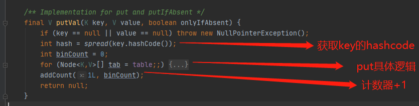

# put方法准备阶段-初始化

- 初始化具体走的逻辑
- [初始化核心逻辑-initTable](#初始化核心逻辑-initTable)



## 初始化具体走的逻辑

```java
    final V putVal(K key, V value, boolean onlyIfAbsent) {
        if (key == null || value == null) throw new NullPointerException();
      	//① 根据对象的 hashCode 取模获取在数组中的位置
        int hash = spread(key.hashCode());
        int binCount = 0;
      // ②  自旋
        for (Node<K,V>[] tab = table;;) {
            Node<K,V> f; int n, i, fh;
            if (tab == null || (n = tab.length) == 0)
              //③ 如果 列表 table 为空,则初始化列表
                tab = initTable();
            else if ((f = tabAt(tab, i = (n - 1) & hash)) == null) {
                              ...
            }
            else if ((fh = f.hash) == MOVED){
                       ...
            }
            else {
           ...
        }
    }
```

## 初始化核心逻辑-initTable

##### sizeCtl的含义

这个标志是在 Node 数组初始化或者扩容的时候的一个控制位标识，**负数代表正在进行初始化或者扩容操作**

- -1 代表正在初始化
- -N 代表有 N-1 个线程正在进行扩容操作，这里不是简单的理解成 n 个线程，sizeCtl 就是 -N
- 0 标识 Node 数组还没有被初始化
- 正数代表初始化或者下一次扩容的大小

##### 步骤

- ① 通过 CAS 判断 SIZECTL 变量是否为 0 , 0 则改为 -1
- ② 再次判断 列表 table 为空 ,如果 sc 大于 0 则使用 sc 作为初始化容量, 否则使用 16
- ③ 计算下次扩容的大小，实际就是当前容量的 0.75 倍，这里使用了右移来计算
- ④ 将下次扩容的大小赋值给 sizeCTL
- ⑤ 可能在初始化,也可能在扩容 ,则直接出让 CPU 时间片

```java
    private final Node<K,V>[] initTable() {
        Node<K,V>[] tab; int sc;
        while ((tab = table) == null || tab.length == 0) {
            if ((sc = sizeCtl) < 0)
              // ⑤ 可能在初始化,也可能在扩容 ,则直接出让 CPU 时间片
                Thread.yield(); // lost initialization race; just spin
            else if (U.compareAndSwapInt(this, SIZECTL, sc, -1)) {
              // ① 通过 CAS 判断 SIZECTL 变量是否为 0 , 0 则改为 -1
                try {
                    if ((tab = table) == null || tab.length == 0) {
                      //② 再次判断 列表 table 为空 ,如果 sc 大于 0 则使用 sc 作为初始化容量, 否则使用 16
                        int n = (sc > 0) ? sc : DEFAULT_CAPACITY;
                        @SuppressWarnings("unchecked")
                        Node<K,V>[] nt = (Node<K,V>[])new Node<?,?>[n];
                        table = tab = nt;
                      //③ 计算下次扩容的大小，实际就是当前容量的 0.75 倍，这里使用了右移来计算
                        sc = n - (n >>> 2);
                    }
                } finally {
                  //④ 将下次扩容的大小赋值给 sizeCTL , 此时的 sizeCtl 变为正数
                    sizeCtl = sc;
                }
                break;
            }
        }
        return tab;
    }
```

> 城北: 使用 CAS 从而只允许一个线程进行初始化,确保线程安全 ,其他线程

