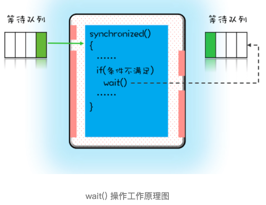
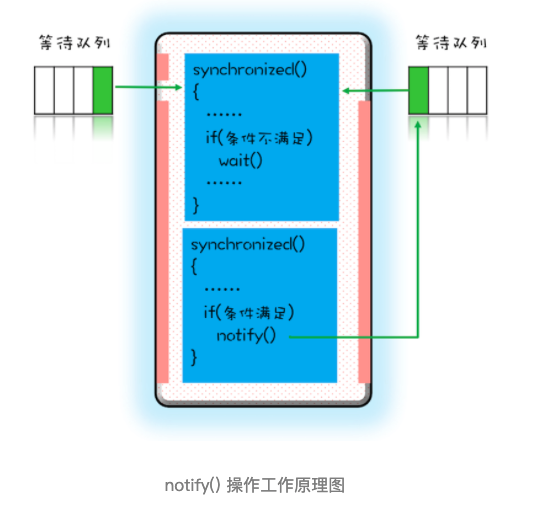

# 020-用“等待-通知”机制优化循环等待

[TOC]

## 总结

等待 - 通知机制是一种非常普遍的线程间协作的方式。工作中经常看到有同学使用轮询的方式来等待某个状态，其实很多情况下都可以用今天我们介绍的等待 - 通知机制来优化。Java 语言内置的 synchronized 配合 wait()、notify()、notifyAll() 这三个方法可以快速实现这种机制，但是它们的使用看上去还是有点复杂，所以你需要认真理解等待队列和 wait()、notify()、notifyAll() 的关系。最好用现实世界做个类比，这样有助于你的理解。

Java 语言的这种实现，背后的理论模型其实是管程，这个很重要，不过你不用担心，后面会有专门的一章来介绍管程。现在你只需要能够熟练使用就可以了。

## 简介

```java
// 一次性申请转出账户和转入账户，直到成功
while(!actr.apply(this, target))；
```

如果 apply() 操作耗时非常短，而且并发冲突量也不大时，这个方案还挺不错的，因为这种场景下，循环上几次或者几十次就能一次性获取转出账户和转入账户了。但是如果 apply() 操作耗时长，或者并发冲突量大的时候，循环等待这种方案就不适用了，因为在这种场景下，可能要循环上万次才能获取到锁，太消耗 CPU 了。

其实在这种场景下，最好的方案应该是：如果线程要求的条件（转出账本和转入账本同在文件架上）不满足，则线程阻塞自己，进入**等待**状态；当线程要求的条件（转出账本和转入账本同在文件架上）满足后，**通知**等待的线程重新执行。其中，使用线程阻塞的方式就能避免循环等待消耗 CPU 的问题。

那 Java 语言是否支持这种**等待 - 通知机制**呢？答案是：一定支持（毕竟占据排行榜第一那么久）。下面我们就来看看 Java 语言是如何支持**等待 - 通知机制**的。

## 完美的就医流程

在介绍 Java 语言如何支持等待 - 通知机制之前，我们先看一个现实世界里面的就医流程，因为它有着完善的等待 - 通知机制，所以对比就医流程，我们就能更好地理解和应用并发编程中的等待 - 通知机制。

就医流程基本上是这样：

1. 患者先去挂号，然后到就诊门口分诊，等待叫号；
2. 当叫到自己的号时，患者就可以找大夫就诊了；
3. 就诊过程中，大夫可能会让患者去做检查，同时叫下一位患者；
4. 当患者做完检查后，拿检测报告重新分诊，等待叫号；
5. 当大夫再次叫到自己的号时，患者再去找大夫就诊。

或许你已经发现了，这个有着完美等待 - 通知机制的就医流程，不仅能够保证同一时刻大夫只为一个患者服务，而且还能够保证大夫和患者的效率。与此同时你可能也会有疑问，“这个就医流程很复杂呀，我们前面描述的等待 - 通知机制相较而言是不是太简单了？”那这个复杂度是否是必须的呢？这个是必须的，我们不能忽视等待 - 通知机制中的一些细节。

下面我们来对比看一下前面都忽视了哪些细节。

1. 患者到就诊门口分诊，类似于线程要去获取互斥锁；当患者被叫到时，类似线程已经获取到锁了。
2. 大夫让患者去做检查（缺乏检测报告不能诊断病因），类似于线程要求的条件没有满足。
3. 患者去做检查，类似于线程进入等待状态；然后**大夫叫下一个患者，这个步骤我们在前面的等待 - 通知机制中忽视了，这个步骤对应到程序里，本质是线程释放持有的互斥锁**。
4. 患者做完检查，类似于线程要求的条件已经满足；**患者拿检测报告重新分诊，类似于线程需要重新获取互斥锁，这个步骤我们在前面的等待 - 通知机制中也忽视了**。

所以加上这些至关重要的细节，综合一下，就可以得出**一个完整的等待 - 通知机制：线程首先获取互斥锁，当线程要求的条件不满足时，释放互斥锁，进入等待状态；当要求的条件满足时，通知等待的线程，重新获取互斥锁**。

## 用 synchronized 实现等待 - 通知机制

在 Java 语言里，等待 - 通知机制可以有多种实现方式，比如 Java 语言内置的 synchronized 配合 wait()、notify()、notifyAll() 这三个方法就能轻松实现。

如何用 synchronized 实现互斥锁，你应该已经很熟悉了。

在下面这个图里，左边有一个等待队列，同一时刻，只允许一个线程进入 synchronized 保护的临界区（这个临界区可以看作大夫的诊室），当有一个线程进入临界区后，其他线程就只能进入图中左边的等待队列里等待（相当于患者分诊等待）。**这个等待队列和互斥锁是一对一的关系，每个互斥锁都有自己独立的等待队列。**



在并发程序中，当一个线程进入临界区后，由于某些条件不满足，需要进入等待状态，Java 对象的 wait() 方法就能够满足这种需求。如上图所示，当调用 wait() 方法后，当前线程就会被阻塞，并且进入到右边的等待队列中，**这个等待队列也是互斥锁的等待队列**。 线程在进入等待队列的同时，**会释放持有的互斥锁**，线程释放锁后，其他线程就有机会获得锁，并进入临界区了。

那线程要求的条件满足时，该怎么通知这个等待的线程呢？很简单，就是 Java 对象的 notify() 和 notifyAll() 方法。我在下面这个图里为你大致描述了这个过程，当条件满足时调用 notify()，会通知等待队列（**互斥锁的等待队列**）中的线程，告诉它**条件曾经满足过**。



为什么说是曾经满足过呢？因为**notify() 只能保证在通知时间点，条件是满足的**。而被通知线程的**执行时间点和通知的时间点**基本上不会重合，所以当线程执行的时候，很可能条件已经不满足了（保不齐有其他线程插队）。这一点你需要格外注意。

除此之外，还有一个需要注意的点，被通知的线程要想重新执行，仍然需要获取到互斥锁（因为曾经获取的锁在调用 wait() 时已经释放了）。

上面我们一直强调 wait()、notify()、notifyAll() 方法操作的等待队列是互斥锁的等待队列，所以如果 synchronized 锁定的是 this，那么对应的一定是 this.wait()、this.notify()、this.notifyAll()；如果 synchronized 锁定的是 target，那么对应的一定是 target.wait()、target.notify()、target.notifyAll() 。

而且 wait()、notify()、notifyAll() 这三个方法能够被调用的前提是已经获取了相应的互斥锁，所以我们会发现 wait()、notify()、notifyAll() 都是在 synchronized{}内部被调用的。

如果在 synchronized{}外部调用，或者锁定的 this，而用 target.wait() 调用的话，JVM 会抛出一个运行时异常：`java.lang.IllegalMonitorStateException`。

## 小试牛刀：一个更好地资源分配器

等待 - 通知机制的基本原理搞清楚后，我们就来看看它如何解决一次性申请转出账户和转入账户的问题吧。在这个等待 - 通知机制中，我们需要考虑以下四个要素。

1. 互斥锁：上一篇文章我们提到 Allocator 需要是单例的，所以我们可以用 this 作为互斥锁。
2. 线程要求的条件：转出账户和转入账户都没有被分配过。
3. 何时等待：线程要求的条件不满足就等待。
4. 何时通知：当有线程释放账户时就通知。

将上面几个问题考虑清楚，可以快速完成下面的代码。需要注意的是我们使用了：

```java
while(条件不满足) {
  wait();
}
```

利用这种范式可以解决上面提到的**条件曾经满足过**这个问题。因为当 wait() 返回时，有可能条件已经发生变化了，曾经条件满足，但是现在已经不满足了，所以要重新检验条件是否满足。范式，意味着是经典做法，所以没有特殊理由不要尝试换个写法。后面在介绍“管程”的时候，我会详细介绍这个经典做法的前世今生。

```java
class Allocator {
  private List<Object> als;
  // 一次性申请所有资源
  synchronized void apply(Object from, Object to){
    // 经典写法
    while(als.contains(from) || als.contains(to)){
      try{
        wait();
      }catch(Exception e){
      }
    }
    als.add(from);
    als.add(to);
  }
  // 归还资源
  synchronized void free(Object from, Object to){
    als.remove(from);
    als.remove(to);
    notifyAll();
  }
}
```

## 尽量使用 notifyAll()

在上面的代码中，我用的是 notifyAll() 来实现通知机制，为什么不使用 notify() 呢？

这二者是有区别的，

- **notify() 是会随机地通知等待队列中的一个线程**
- **而 notifyAll() 会通知等待队列中的所有线程**。

从感觉上来讲，应该是 notify() 更好一些，因为即便通知所有线程，也只有一个线程能够进入临界区。但那所谓的感觉往往都蕴藏着风险，实际上使用 notify() 也很有风险，它的风险在于可能导致某些线程永远不会被通知到。

假设我们有资源 A、B、C、D，线程 1 申请到了 AB，线程 2 申请到了 CD，此时线程 3 申请 AB，会进入等待队列（AB 分配给线程 1，线程 3 要求的条件不满足），线程 4 申请 CD 也会进入等待队列。

我们再假设之后线程 1 归还了资源 AB，如果使用 notify() 来通知等待队列中的线程，有可能被通知的是线程 4，但线程 4 申请的是 CD，所以此时线程 4 还是会继续等待，而真正该唤醒的线程 3 就再也没有机会被唤醒了。

所以除非经过深思熟虑，否则尽量使用 notifyAll()。

## 总结

等待 - 通知机制是一种非常普遍的线程间协作的方式。工作中经常看到有同学使用轮询的方式来等待某个状态，其实很多情况下都可以用今天我们介绍的等待 - 通知机制来优化。Java 语言内置的 synchronized 配合 wait()、notify()、notifyAll() 这三个方法可以快速实现这种机制，但是它们的使用看上去还是有点复杂，所以你需要认真理解等待队列和 wait()、notify()、notifyAll() 的关系。最好用现实世界做个类比，这样有助于你的理解。

Java 语言的这种实现，背后的理论模型其实是管程，这个很重要，不过你不用担心，后面会有专门的一章来介绍管程。现在你只需要能够熟练使用就可以了。

## 课后思考

很多面试都会问到，wait() 方法和 sleep() 方法都能让当前线程挂起一段时间，那它们的区别是什么？现在你也试着回答一下吧。

> wait与sleep区别在于：
>
> 1. wait会释放所有锁而sleep不会释放锁资源.
> 2.  wait只能在同步方法和同步块中使用，而sleep任何地方都可以.
> 3.  wait无需捕捉异常，而sleep需要.