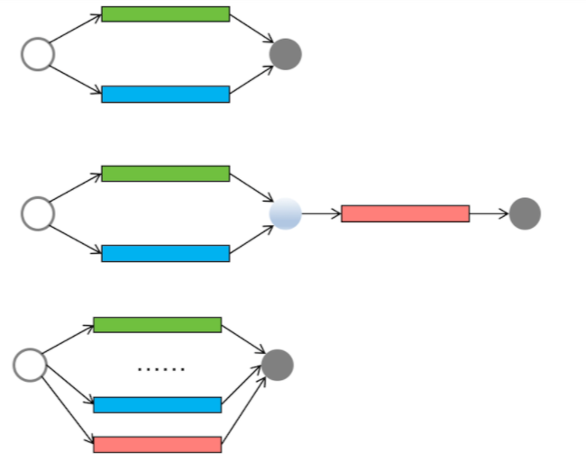
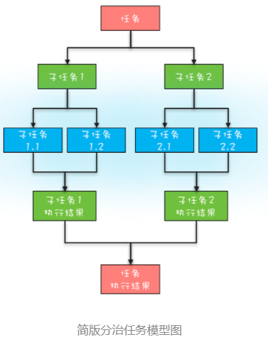
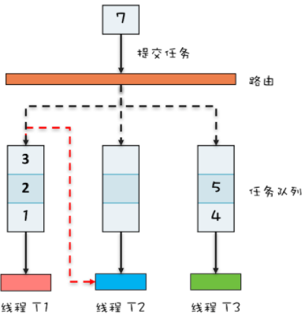

# 070-ForkJoin-单机版的MapReduce

[TOC]

前面几篇文章我们介绍了线程池、Future、CompletableFuture 和 CompletionService，仔细观察你会发现这些工具类都是在帮助我们站在任务的视角来解决并发问题，而不是让我们纠缠在线程之间如何协作的细节上（比如线程之间如何实现等待、通知等）。

- **对于简单的并行任务，你可以通过“线程池 +Future”的方案来解决；**
- **如果任务之间有聚合关系，无论是 AND 聚合还是 OR 聚合，都可以通过 CompletableFuture 来解决；**
- **而批量的并行任务，则可以通过 CompletionService 来解决。**

我们一直讲，并发编程可以分为三个层面的问题，分别是分工、协作和互斥，当你关注于任务的时候，你会发现你的视角已经从并发编程的细节中跳出来了，你应用的更多的是现实世界的思维模式，类比的往往是现实世界里的分工，所以我把线程池、Future、CompletableFuture 和 CompletionService 都列到了分工里面。

下面我用现实世界里的工作流程图描述了并发编程领域的简单并行任务、聚合任务和批量并行任务，辅以这些流程图，相信你一定能将你的思维模式转换到现实世界里来。



- 简单并行任务
- 聚合任务
- 批量并行任务

上面提到的简单并行、聚合、批量并行这三种任务模型，基本上能够覆盖日常工作中的并发场景了，但还是不够全面，因为还有一种“分治”的任务模型没有覆盖到。

- **分治**，顾名思义，即分而治之，是一种解决复杂问题的思维方法和模式；具体来讲，指的是**把一个复杂的问题分解成多个相似的子问题，然后再把子问题分解成更小的子问题，直到子问题简单到可以直接求解**。
- 理论上来讲，解决每一个问题都对应着一个任务，所以对于问题的分治，实际上就是对于任务的分治。

分治思想在很多领域都有广泛的应用，

- 例如算法领域有分治算法（归并排序、快速排序都属于分治算法，二分法查找也是一种分治算法）；
- 大数据领域知名的计算框架 MapReduce 背后的思想也是分治。

既然分治这种任务模型如此普遍，那 Java 显然也需要支持，Java 并发包里提供了一种叫做 Fork/Join 的并行计算框架，就是用来支持分治这种任务模型的。

## 分治任务模型

这里你需要先深入了解一下分治任务模型，分治任务模型可分为两个阶段：

- 一个阶段是**任务分解**，也就是将任务迭代地分解为子任务，直至子任务可以直接计算出结果；
- 另一个阶段是**结果合并**，即逐层合并子任务的执行结果，直至获得最终结果。

下图是一个简化的分治任务模型图，你可以对照着理解。



在这个分治任务模型里，任务和分解后的子任务具有相似性，这种相似性往往体现在任务和子任务的算法是相同的，但是计算的数据规模是不同的。具备这种相似性的问题，我们往往都采用递归算法。

## Fork/Join 的使用

Fork/Join 是一个并行计算的框架，主要就是用来支持分治任务模型的，这个计算框架里的**Fork 对应的是分治任务模型里的任务分解，Join 对应的是结果合并**。

Fork/Join 计算框架主要包含两部分，

- 一部分是**分治任务的线程池 ForkJoinPool**
- 另一部分是**分治任务 ForkJoinTask**。

这两部分的关系类似于 ThreadPoolExecutor 和 Runnable 的关系，都可以理解为提交任务到线程池，只不过分治任务有自己独特类型 ForkJoinTask。

ForkJoinTask 是一个抽象类，它的方法有很多，最核心的是 fork() 方法和 join() 方法，

- 其中 fork() 方法会异步地执行一个子任务，
- 而 join() 方法则会阻塞当前线程来等待子任务的执行结果。

ForkJoinTask 有两个子类——RecursiveAction 和 RecursiveTask，通过名字你就应该能知道，它们都是用递归的方式来处理分治任务的。

这两个子类都定义了抽象方法 compute()，不过区别是 RecursiveAction 定义的 compute() 没有返回值，而 RecursiveTask 定义的 compute() 方法是有返回值的。

这两个子类也是抽象类，在使用的时候，需要你定义子类去扩展。

接下来我们就来实现一下，看看如何用 Fork/Join 这个并行计算框架计算斐波那契数列（下面的代码源自 Java 官方示例）。

首先我们需要创建一个分治任务线程池以及计算斐波那契数列的分治任务，之后通过调用分治任务线程池的 invoke() 方法来启动分治任务。

由于计算斐波那契数列需要有返回值，所以 Fibonacci 继承自 RecursiveTask。分治任务 Fibonacci 需要实现 compute() 方法，这个方法里面的逻辑和普通计算斐波那契数列非常类似，区别之处在于计算 `Fibonacci(n - 1)` 使用了异步子任务，这是通过 `f1.fork()` 这条语句实现的。

```java
static void main(String[] args){
  // 创建分治任务线程池  
  ForkJoinPool fjp = new ForkJoinPool(4);
  // 创建分治任务
  Fibonacci fib = new Fibonacci(30);   
  // 启动分治任务  
  Integer result = 
    fjp.invoke(fib);
  // 输出结果  
  System.out.println(result);
}
// 递归任务
static class Fibonacci extends RecursiveTask<Integer>{
  final int n;
  Fibonacci(int n){this.n = n;}
  protected Integer compute(){
    if (n <= 1)
      return n;
    Fibonacci f1 =  new Fibonacci(n - 1);
    // 创建子任务  
    f1.fork();
    Fibonacci f2 = 
      new Fibonacci(n - 2);
    // 等待子任务结果，并合并结果  
    return f2.compute() + f1.join();
  }
}
```

## ForkJoinPool 工作原理

Fork/Join 并行计算的核心组件是 ForkJoinPool，所以下面我们就来简单介绍一下 ForkJoinPool 的工作原理。

通过专栏前面文章的学习，你应该已经知道 ThreadPoolExecutor 本质上是一个生产者 - 消费者模式的实现，内部有一个任务队列，这个任务队列是生产者和消费者通信的媒介；

ThreadPoolExecutor 可以有多个工作线程，但是这些工作线程都共享一个任务队列。

ForkJoinPool 本质上也是一个生产者 - 消费者的实现，但是更加智能，你可以参考下面的 ForkJoinPool 工作原理图来理解其原理。

ThreadPoolExecutor 内部只有一个任务队列，而 ForkJoinPool 内部有多个任务队列，当我们通过 ForkJoinPool 的 invoke() 或者 submit() 方法提交任务时，ForkJoinPool 根据一定的路由规则把任务提交到一个任务队列中，如果任务在执行过程中会创建出子任务，那么子任务会提交到工作线程对应的任务队列中。

如果工作线程对应的任务队列空了，是不是就没活儿干了呢？

不是的，ForkJoinPool 支持一种叫做“**任务窃取**”的机制，如果工作线程空闲了，那它可以“窃取”其他工作任务队列里的任务，例如下图中，线程 T2 对应的任务队列已经空了，它可以“窃取”线程 T1 对应的任务队列的任务。如此一来，所有的工作线程都不会闲下来了。

ForkJoinPool 中的任务队列采用的是双端队列，工作线程正常获取任务和“窃取任务”分别是从任务队列不同的端消费，这样能避免很多不必要的数据竞争。

我们这里介绍的仅仅是简化后的原理，ForkJoinPool 的实现远比我们这里介绍的复杂，如果你感兴趣，建议去看它的源码。



## 总结

Fork/Join 并行计算框架主要解决的是分治任务。分治的核心思想是“分而治之”：将一个大的任务拆分成小的子任务去解决，然后再把子任务的结果聚合起来从而得到最终结果。这个过程非常类似于大数据处理中的 MapReduce，所以你可以把 Fork/Join 看作单机版的 MapReduce。

Fork/Join 并行计算框架的核心组件是 ForkJoinPool。

ForkJoinPool 支持任务窃取机制，能够让所有线程的工作量基本均衡，不会出现有的线程很忙，而有的线程很闲的状况，所以性能很好。

Java 1.8 提供的 Stream API 里面并行流也是以 ForkJoinPool 为基础的。不过需要你注意的是，默认情况下所有的并行流计算都共享一个 ForkJoinPool，这个共享的 ForkJoinPool 默认的线程数是 CPU 的核数；如果所有的并行流计算都是 CPU 密集型计算的话，完全没有问题，但是如果存在 I/O 密集型的并行流计算，那么很可能会因为一个很慢的 I/O 计算而拖慢整个系统的性能。所以**建议用不同的 ForkJoinPool 执行不同类型的计算任务**。

如果你对 ForkJoinPool 详细的实现细节感兴趣，也可以参考[Doug Lea 的论文](http://gee.cs.oswego.edu/dl/papers/fj.pdf)。

## 课后思考

对于一个 CPU 密集型计算程序，在单核 CPU 上，使用 Fork/Join 并行计算框架是否能够提高性能呢？