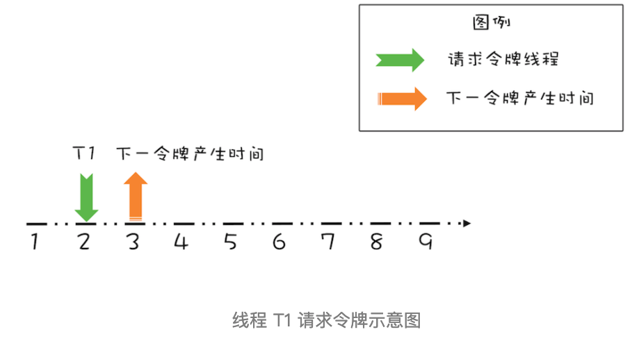
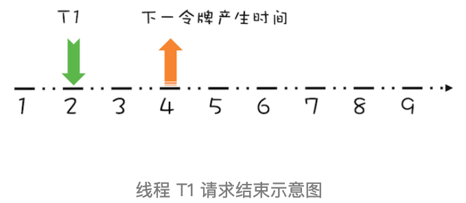
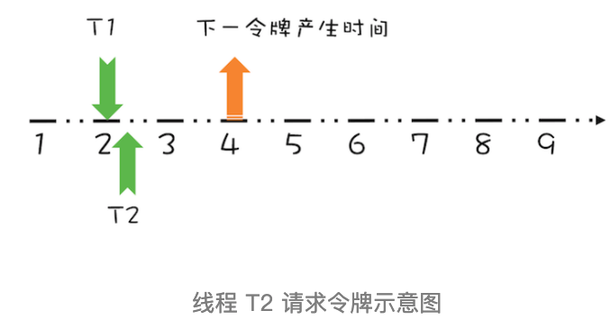
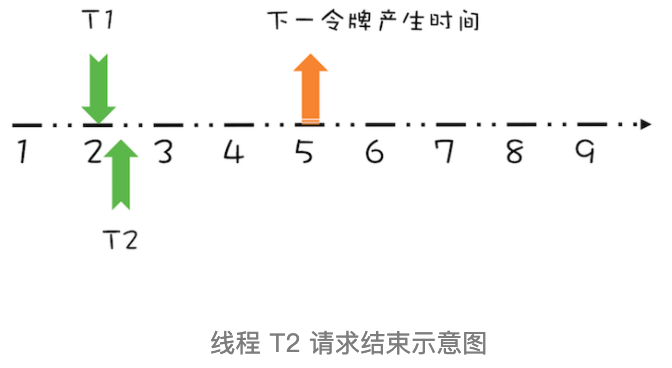
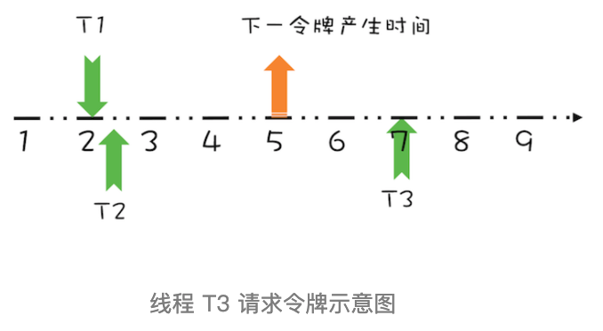
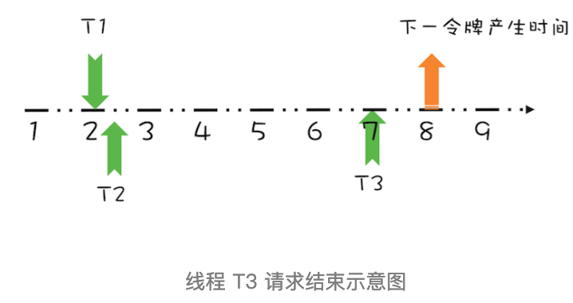

# 010-高性能限流器Guava 丨RateLimiter

[TOC]

**Guava RateLimiter 是如何解决高并发场景下的限流问题的**。

Guava 是 Google 开源的 Java 类库，提供了一个工具类 RateLimiter。我们先来看看 RateLimiter 的使用，让你对限流有个感官的印象。假设我们有一个线程池，它每秒只能处理两个任务，如果提交的任务过快，可能导致系统不稳定，这个时候就需要用到限流。

在下面的示例代码中，我们创建了一个流速为 2 个请求 / 秒的限流器，这里的流速该怎么理解呢？直观地看，2 个请求 / 秒指的是每秒最多允许 2 个请求通过限流器，其实在 Guava 中，流速还有更深一层的意思：是一种匀速的概念，2 个请求 / 秒等价于 1 个请求 /500 毫秒。

在向线程池提交任务之前，调用 `acquire()` 方法就能起到限流的作用。

通过示例代码的执行结果，任务提交到线程池的时间间隔基本上稳定在 500 毫秒。

```java
// 限流器流速：2 个请求 / 秒
RateLimiter limiter = RateLimiter.create(2.0);
// 执行任务的线程池
ExecutorService es = Executors.newFixedThreadPool(1);
// 记录上一次执行时间
prev = System.nanoTime();
// 测试执行 20 次
for (int i=0; i<20; i++){
  // 限流器限流
  limiter.acquire();
  // 提交任务异步执行
  es.execute(()->{
    long cur=System.nanoTime();
    // 打印时间间隔：毫秒
    System.out.println((cur-prev)/1000_000);
    prev = cur;
  });
}
 
输出结果：
...
500
499
499
500
499
```

## 经典限流算法：令牌桶算法

 [04-令牌桶算法.md](../../../../09-micro-services/01-限流/04-令牌桶算法.md) 

Guava 的限流器使用上还是很简单的，那它是如何实现的呢？Guava 采用的是**令牌桶算法**，其**核心是要想通过限流器，必须拿到令牌**。也就是说，只要我们能够限制发放令牌的速率，那么就能控制流速了。令牌桶算法的详细描述如下：

1. 令牌以固定的速率添加到令牌桶中，假设限流的速率是 r/ 秒，则令牌每 1/r 秒会添加一个；
2. 假设令牌桶的容量是 b ，如果令牌桶已满，则新的令牌会被丢弃；
3. 请求能够通过限流器的前提是令牌桶中有令牌。

这个算法中，限流的速率 r 还是比较容易理解的，但令牌桶的容量 b 该怎么理解呢？

b 其实是 burst 的简写，意义是**限流器允许的最大突发流量**。比如 b=10，而且令牌桶中的令牌已满，此时限流器允许 10 个请求同时通过限流器，当然只是突发流量而已，这 10 个请求会带走 10 个令牌，所以后续的流量只能按照速率 r 通过限流器。

令牌桶这个算法，如何用 Java 实现呢？很可能你的直觉会告诉你生产者 - 消费者模式：一个生产者线程定时向阻塞队列中添加令牌，而试图通过限流器的线程则作为消费者线程，只有从阻塞队列中获取到令牌，才允许通过限流器。

这个算法看上去非常完美，而且实现起来非常简单，如果并发量不大，这个实现并没有什么问题。可实际情况却是使用限流的场景大部分都是高并发场景，而且系统压力已经临近极限了，此时这个实现就有问题了。

问题就出在定时器上，在高并发场景下，当系统压力已经临近极限的时候，定时器的精度误差会非常大，同时定时器本身会创建调度线程，也会对系统的性能产生影响。

那还有什么好的实现方式呢？当然有，Guava 的实现就没有使用定时器，下面我们就来看看它是如何实现的。

## Guava如何实现令牌桶算法

Guava 实现令牌桶算法，用了一个很简单的办法，其关键是**记录并动态计算下一令牌发放的时间**。

下面我们以一个最简单的场景来介绍该算法的执行过程。

- 假设令牌桶的容量为 b=1，限流速率 r = 1 个请求 / 秒，如下图所示，如果当前令牌桶中没有令牌，下一个令牌的发放时间是在第 3 秒，而在第 2 秒的时候有一个线程 T1 请求令牌，此时该如何处理呢？



对于这个请求令牌的线程而言，很显然需要等待 1 秒，因为 1 秒以后（第 3 秒）它就能拿到令牌了。

此时需要注意的是，下一个令牌发放的时间也要增加 1 秒，为什么呢？因为第 3 秒发放的令牌已经被线程 T1 预占了。处理之后如下图所示。



假设 T1 在预占了第 3 秒的令牌之后，马上又有一个线程 T2 请求令牌，如下图所示。



很显然，由于下一个令牌产生的时间是第 4 秒，所以线程 T2 要等待两秒的时间，才能获取到令牌，同时由于 T2 预占了第 4 秒的令牌，所以下一令牌产生时间还要增加 1 秒，完全处理之后，如下图所示。



上面线程 T1、T2 都是在**下一令牌产生时间之前**请求令牌，如果线程在**下一令牌产生时间之后**请求令牌会如何呢？假设在线程 T1 请求令牌之后的 5 秒，也就是第 7 秒，线程 T3 请求令牌，如下图所示。



由于在第 5 秒已经产生了一个令牌，所以此时线程 T3 可以直接拿到令牌，而无需等待。

在第 7 秒，实际上限流器能够产生 3 个令牌，第 5、6、7 秒各产生一个令牌。由于我们假设令牌桶的容量是 1，所以第 6、7 秒产生的令牌就丢弃了，其实等价地你也可以认为是保留的第 7 秒的令牌，丢弃的第 5、6 秒的令牌，也就是说第 7 秒的令牌被线程 T3 占有了，于是下一令牌的的产生时间应该是第 8 秒，如下图所示。



通过上面简要地分析，你会发现，我们**只需要记录一个下一令牌产生的时间，并动态更新它，就能够轻松完成限流功能**。

我们可以将上面的这个算法代码化，示例代码如下所示，依然假设令牌桶的容量是 1。

关键是**reserve() 方法**，这个方法会为请求令牌的线程预分配令牌，同时返回该线程能够获取令牌的时间。其实现逻辑就是上面提到的:

- 如果线程请求令牌的时间在下一令牌产生时间之后，那么该线程立刻就能够获取令牌；
- 反之，如果请求时间在下一令牌产生时间之前，那么该线程是在下一令牌产生的时间获取令牌。由于此时下一令牌已经被该线程预占，所以下一令牌产生的时间需要加上 1 秒。

```java
class SimpleLimiter {
  // 下一令牌产生时间
  long next = System.nanoTime();
  // 发放令牌间隔：纳秒
  long interval = 1000_000_000;
  // 预占令牌，返回能够获取令牌的时间
  synchronized long reserve(long now){
    // 请求时间在下一令牌产生时间之后
    // 重新计算下一令牌产生时间
    if (now > next){
      // 将下一令牌产生时间重置为当前时间
      next = now;
    }
    // 能够获取令牌的时间
    long at=next;
    // 设置下一令牌产生时间
    next += interval;
    // 返回线程需要等待的时间
    return Math.max(at, 0L);
  }
  // 申请令牌
  void acquire() {
    // 申请令牌时的时间
    long now = System.nanoTime();
    // 预占令牌
    long at=reserve(now);
    long waitTime=max(at-now, 0);
    // 按照条件等待
    if(waitTime > 0) {
      try {
        TimeUnit.NANOSECONDS.sleep(waitTime);
      }catch(InterruptedException e){
        e.printStackTrace();
      }
    }
  }
}
```

如果令牌桶的容量大于 1，又该如何处理呢？按照令牌桶算法，令牌要首先从令牌桶中出，所以我们需要按需计算令牌桶中的数量，当有线程请求令牌时，先从令牌桶中出。

具体的代码实现如下所示。我们增加了一个**resync() 方法**，在这个方法中，如果线程请求令牌的时间在下一令牌产生时间之后，会重新计算令牌桶中的令牌数，**新产生的令牌的计算公式是：(now-next)/interval**，你可对照上面的示意图来理解。

reserve() 方法中，则增加了先从令牌桶中出令牌的逻辑，不过需要注意的是，如果令牌是从令牌桶中出的，那么 next 就无需增加一个 interval 了。

```java
class SimpleLimiter {
  // 当前令牌桶中的令牌数量
  long storedPermits = 0;
  // 令牌桶的容量
  long maxPermits = 3;
  // 下一令牌产生时间
  long next = System.nanoTime();
  // 发放令牌间隔：纳秒
  long interval = 1000_000_000;
  
  // 请求时间在下一令牌产生时间之后, 则
  // 1. 重新计算令牌桶中的令牌数
  // 2. 将下一个令牌发放时间重置为当前时间
  void resync(long now) {
    if (now > next) {
      // 新产生的令牌数
      long newPermits=(now-next)/interval;
      // 新令牌增加到令牌桶
      storedPermits=min(maxPermits, storedPermits + newPermits);
      // 将下一个令牌发放时间重置为当前时间
      next = now;
    }
  }
  // 预占令牌，返回能够获取令牌的时间
  synchronized long reserve(long now){
    resync(now);
    // 能够获取令牌的时间
    long at = next;
    // 令牌桶中能提供的令牌
    long fb=min(1, storedPermits);
    // 令牌净需求：首先减掉令牌桶中的令牌
    long nr = 1 - fb;
    // 重新计算下一令牌产生时间
    next = next + nr*interval;
    // 重新计算令牌桶中的令牌
    this.storedPermits -= fb;
    return at;
  }
  // 申请令牌
  void acquire() {
    // 申请令牌时的时间
    long now = System.nanoTime();
    // 预占令牌
    long at=reserve(now);
    long waitTime=max(at-now, 0);
    // 按照条件等待
    if(waitTime > 0) {
      try {
        TimeUnit.NANOSECONDS
          .sleep(waitTime);
      }catch(InterruptedException e){
        e.printStackTrace();
      }
    }
  }
}
```

## 总结

经典的限流算法有两个，一个是**令牌桶算法（Token Bucket）**，另一个是**漏桶算法（Leaky Bucket）**。

- 令牌桶算法是定时向令牌桶发送令牌，请求能够从令牌桶中拿到令牌，然后才能通过限流器；

- 而漏桶算法里，请求就像水一样注入漏桶，漏桶会按照一定的速率自动将水漏掉，只有漏桶里还能注入水的时候，请求才能通过限流器。

令牌桶算法和漏桶算法很像一个硬币的正反面，所以你可以参考令牌桶算法的实现来实现漏桶算法。

上面我们介绍了 Guava 是如何实现令牌桶算法的，我们的示例代码是对 Guava RateLimiter 的简化，Guava RateLimiter 扩展了标准的令牌桶算法，比如还能支持预热功能。

对于按需加载的缓存来说，预热后缓存能支持 5 万 TPS 的并发，但是在预热前 5 万 TPS 的并发直接就把缓存击垮了，所以如果需要给该缓存限流，限流器也需要支持预热功能，在初始阶段，限制的流速 r 很小，但是动态增长的。

预热功能的实现非常复杂，Guava 构建了一个积分函数来解决这个问题，如果你感兴趣，可以继续深入研究。

