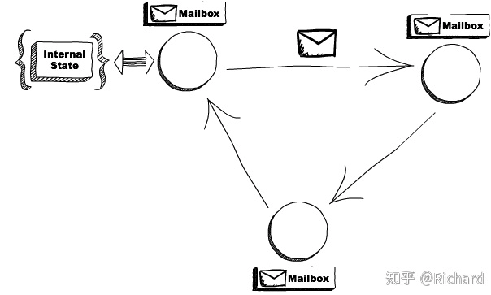

# 010-Actor模型：面向对象原生的并发模型

[TOC]

## 简介

上学的时候，有门计算机专业课叫做面向对象编程，学这门课的时候有个问题困扰了我很久，按照面向对象编程的理论，对象之间通信需要依靠**消息**，而实际上，像 C++、Java 这些面向对象的语言，对象之间通信，依靠的是**对象方法**。对象方法和过程语言里的函数本质上没有区别，有入参、有出参，思维方式很相似，使用起来都很简单。

那面向对象理论里的消息是否就等价于面向对象语言里的对象方法呢？很长一段时间里，我都以为对象方法是面向对象理论中消息的一种实现，直到接触到 Actor 模型，才明白消息压根不是这个实现法。

## Hello Actor 模型

Actor 模型本质上是一种计算模型，基本的计算单元称为 Actor，换言之，**在 Actor 模型中，所有的计算都是在 Actor 中执行的**。在面向对象编程里面，一切都是对象；

**在 Actor 模型里，一切都是 Actor，并且 Actor 之间是完全隔离的，不会共享任何变量。**

当看到“不共享任何变量”的时候，相信你一定会眼前一亮，并发问题的根源就在于共享变量，而 Actor 模型中 Actor 之间不共享变量，那用 Actor 模型解决并发问题，一定是相当顺手。的确是这样，所以很多人就把 Actor 模型定义为一种**并发计算模型**。其实 Actor 模型早在 1973 年就被提出来了，只是直到最近几年才被广泛关注，一个主要原因就在于它是解决并发问题的利器，而最近几年随着多核处理器的发展，并发问题被推到了风口浪尖上。

但是 Java 语言本身并不支持 Actor 模型，所以如果你想在 Java 语言里使用 Actor 模型，就需要借助第三方类库，目前能完备地支持 Actor 模型而且比较成熟的类库就是**Akka**了。在详细介绍 Actor 模型之前，我们就先基于 Akka 写一个 Hello World 程序，让你对 Actor 模型先有个感官的印象。

在下面的示例代码中，我们首先创建了一个 ActorSystem（Actor 不能脱离 ActorSystem 存在）；之后创建了一个 HelloActor，Akka 中创建 Actor 并不是 new 一个对象出来，而是通过调用 system.actorOf() 方法创建的，该方法返回的是 ActorRef，而不是 HelloActor；最后通过调用 ActorRef 的 tell() 方法给 HelloActor 发送了一条消息 “Actor” 。

```java
// 该 Actor 当收到消息 message 后，
// 会打印 Hello message
static class HelloActor extends UntypedActor {
  @Override
  public void onReceive(Object message) {
    System.out.println("Hello " + message);
  }
}
 
public static void main(String[] args) {
  // 创建 Actor 系统
  ActorSystem system = ActorSystem.create("HelloSystem");
  // 创建 HelloActor
  ActorRef helloActor = system.actorOf(Props.create(HelloActor.class));
  // 发送消息给 HelloActor
  helloActor.tell("Actor", ActorRef.noSender());
}
```

通过这个例子，你会发现 Actor 模型和面向对象编程契合度非常高，完全可以用 Actor 类比面向对象编程里面的对象，而且 Actor 之间的通信方式完美地遵守了消息机制，而不是通过对象方法来实现对象之间的通信。那 Actor 中的消息机制和面向对象语言里的对象方法有什么区别呢？

## 消息和对象方法的区别

在没有计算机的时代，异地的朋友往往是通过写信来交流感情的，但信件发出去之后，也许会在寄送过程中弄丢了，也有可能寄到后，对方一直没有时间写回信……这个时候都可以让邮局“背个锅”，不过无论如何，也不过是重写一封，生活继续。

Actor 中的消息机制，就可以类比这现实世界里的写信。

**Actor 内部有一个邮箱（Mailbox）**，接收到的消息都是先放到邮箱里，如果邮箱里有积压的消息，那么新收到的消息就不会马上得到处理，也正是因为 Actor 使用单线程处理消息，所以不会出现并发问题。你可以把 Actor 内部的工作模式想象成只有一个消费者线程的生产者 - 消费者模式。

所以，在 Actor 模型里，发送消息仅仅是把消息发出去而已，接收消息的 Actor 在接收到消息后，也不一定会立即处理，也就是说**Actor 中的消息机制完全是异步的**。而**调用对象方法**，实际上是**同步**的，对象方法 return 之前，调用方会一直等待。

除此之外，**调用对象方法**，需要持有对象的引用，**所有的对象必须在同一个进程中**。而在 Actor 中发送消息，类似于现实中的写信，只需要知道对方的地址就可以，**发送消息和接收消息的 Actor 可以不在一个进程中，也可以不在同一台机器上**。因此，Actor 模型不但适用于并发计算，还适用于分布式计算。

## Actor 的规范化定义

通过上面的介绍，相信你应该已经对 Actor 有一个感官印象了，下面我们再来看看 Actor 规范化的定义是什么样的。Actor 是一种基础的计算单元，具体来讲包括三部分能力，分别是：

1. 处理能力，处理接收到的消息。
2. 存储能力，Actor 可以存储自己的内部状态，并且内部状态在不同 Actor 之间是绝对隔离的。
3. 通信能力，Actor 可以和其他 Actor 之间通信。

当一个 Actor 接收的一条消息之后，这个 Actor 可以做以下三件事：

1. 创建更多的 Actor；
2. 发消息给其他 Actor；
3. 确定如何处理下一条消息。

其中前两条还是很好理解的，就是最后一条，该如何去理解呢？前面我们说过 Actor 具备存储能力，它有自己的内部状态，所以你也可以把 Actor 看作一个状态机，把 Actor 处理消息看作是触发状态机的状态变化；而状态机的变化往往要基于上一个状态，触发状态机发生变化的时刻，上一个状态必须是确定的，所以确定如何处理下一条消息，本质上不过是改变内部状态。

在多线程里面，由于可能存在竞态条件，所以根据当前状态确定如何处理下一条消息还是有难度的，需要使用各种同步工具，但在 Actor 模型里，由于是单线程处理，所以就不存在竞态条件问题了。

## 用 Actor 实现累加器

支持并发的累加器可能是最简单并且有代表性的并发问题了，可以基于互斥锁方案实现，也可以基于原子类实现，但今天我们要尝试用 Actor 来实现。

在下面的示例代码中，CounterActor 内部持有累计值 counter，当 CounterActor 接收到一个数值型的消息 message 时，就将累计值 counter += message；但如果是其他类型的消息，则打印当前累计值 counter。在 main() 方法中，我们启动了 4 个线程来执行累加操作。整个程序没有锁，也没有 CAS，但是程序是线程安全的。

```java
// 累加器
static class CounterActor extends UntypedActor {
  private int counter = 0;
  @Override
  public void onReceive(Object message){
    // 如果接收到的消息是数字类型，执行累加操作，
    // 否则打印 counter 的值
    if (message instanceof Number) {
      counter += ((Number) message).intValue();
    } else {
      System.out.println(counter);
    }
  }
}
public static void main(String[] args) throws InterruptedException {
  // 创建 Actor 系统
  ActorSystem system = ActorSystem.create("HelloSystem");
  //4 个线程生产消息
  ExecutorService es = Executors.newFixedThreadPool(4);
  // 创建 CounterActor 
  ActorRef counterActor = 
    system.actorOf(Props.create(CounterActor.class));
  // 生产 4*100000 个消息 
  for (int i=0; i<4; i++) {
    es.execute(()->{
      for (int j=0; j<100000; j++) {
        counterActor.tell(1, ActorRef.noSender());
      }
    });
  }
  // 关闭线程池
  es.shutdown();
  // 等待 CounterActor 处理完所有消息
  Thread.sleep(1000);
  // 打印结果
  counterActor.tell("", ActorRef.noSender());
  // 关闭 Actor 系统
  system.shutdown();
}
```

## Actor模型中的角色

### Model

Actor并发模型是一种处理并发计算的基本模型，它通过定义一些通用的规则来决定系统的各个components如何交互。使用Actor模型最著名的当然是erlang，我们将会聚焦模型的本身而不是各种实现Actor模型的语言或库。

### Actors

**一个actor是一个基本的计算单元**，通常actor会接收消息，然后基于消息来做某些计算。

这种概念跟面向对象(OOP)编程语言非常类似：一个object接收消息(对应为OOP中的方法调用)，然后基于该消息来做一些事情。但是，Actor并发模型的不同之处在于：每个actor是完全隔离的，他们不会共享内存；同时，actor也会维护自身的私有状态，并且不会直接被其他的actor修改。

在Actor并发模型中，一切事物都是actor，为了发送消息给actor，我们需要知道某个actor的地址。

### Mailboxs

有一个非常重要的概念需要理解：尽管可以一次运行多个actor，但actor会顺序的处理收到的消息。这意味着，如果你同时发送三个消息给同一个actor，它将会一次处理一个。为了让这三个消息被并行的处理，需要创建三个actor，并将这个消息发送给他们。

消息是被异步地发送给actor，如果一个actor正在处理某个消息，这个时候给它发送了其他消息，需要将这些消息存储到某个地方。**邮箱(mailbox)**正是存储消息的地方，注意，这里的**mailbox是具名的**，可以理解为mailbox绑定到actor上的，跟CSP中的channel是匿名的不同。



## Actor能做什么

当一个actor接收到消息后，它可能做三件事：

- 创建更多的actor
- 发送消息给其他的actor
- 决定收到下一条消息应该做什么

前两个点非常好理解，我们来说说第三条。前面也提到过，actor会维护私有的状态，第三条意味着：接收到下一条消息后，私有状态应该是怎样的(这就跟状态机的概念非常类似了)，或者更简单点，应该如何修改状态。

我们来想象一下，如果一个actor的行为类似于计算器，它的初始状态为0. 当它接收到"add(1)"的消息后，它将会在下次接收到消息后，将状态设为1；而不是在本次接收到消息后修改状态。

#### 容错

Erlang里面有一个非常有名的哲学"**let it crash**". 指的是你不应该进行防守式编程，尝试预测到所有可能的问题，然后找到一种方法来处理他们，因为你不可能考虑到所有的错误点。

Erlang只是简单的让程序crash掉，但是要让这段关键的代码由某个模块负责监控，它的唯一职责是知道当crash发生时该怎么做(比如说重启这段应用来回到一个稳定的状态)，这就是Actor模型负责干的事。

每段代码都运行在进程(**process**，也就是actor概念)中，进程是完全隔离的，这意味着一个进程中的状态不会影响到其他的进程。同时，上面也提到了，需要有负责监控的模块，这就是另外一个进程(一切都是actor，包括进程)。当被监控的进程crash掉了，将会通知这个负责监控的进程，然后处理剩下的任务。

通过上面的这种方式，我们就能构建一个可以自愈(self heal)的系统，当一个actor进入到异常状态，发生了crash，监控的actor能够去负责处理，然后回到一个一致的状态(例如重置为最初的状态)。

## 分布式

Actor模型中另外一个非常重要的概念是：如果我们要发送一个消息跟actor，并不需要关心这个actor是本地的还是其他节点上的。

想象一下，如果actor只是一个带有mailbox和内部状态的代码单元，它值负责响应消息，那谁会关心这段代码运行在哪台机器上了呢？只要我们能让消息到达指定的actor就OK了。这种特性让我们能够构建出一个规模非常庞大的系统，帮助我们很好的处理错误的情况。

上面就是Actor并发模型的基本内容，下一篇文章，将会介绍CSP并发模型，敬请期待。

## 总结

Actor 模型是一种非常简单的计算模型，其中 Actor 是最基本的计算单元，Actor 之间是通过消息进行通信。Actor 与面向对象编程（OOP）中的对象匹配度非常高，在面向对象编程里，系统由类似于生物细胞那样的对象构成，对象之间也是通过消息进行通信，所以在面向对象语言里使用 Actor 模型基本上不会有违和感。

在 Java 领域，除了可以使用 Akka 来支持 Actor 模型外，还可以使用 Vert.x，不过相对来说 Vert.x 更像是 Actor 模型的隐式实现，对应关系不像 Akka 那样明显，不过本质上也是一种 Actor 模型。

Actor 可以创建新的 Actor，这些 Actor 最终会呈现出一个树状结构，非常像现实世界里的组织结构，所以利用 Actor 模型来对程序进行建模，和现实世界的匹配度非常高。Actor 模型和现实世界一样都是异步模型，理论上不保证消息百分百送达，也不保证消息送达的顺序和发送的顺序是一致的，甚至无法保证消息会被百分百处理。虽然实现 Actor 模型的厂商都在试图解决这些问题，但遗憾的是解决得并不完美，所以使用 Actor 模型也是有成本的。