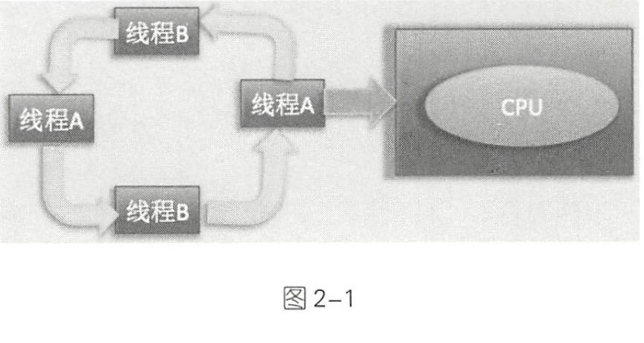
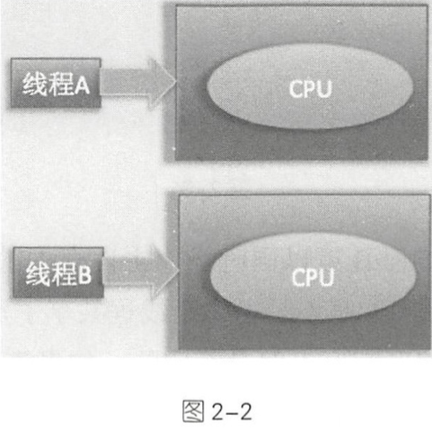

# 并行和并发的区别

[TOC]

## 并发

并发是指同一个时间段内多个任务同时都在执行,并且都没有执行结束

并发任务强调在一个时间段内同时执行,而一个时间段由多个单位时间累积而成,所以说并发的多个任务在单位时间段不一定同时执行

> 单核 CPU 时代多个任务都是并发执行的,这是因为 单个 CPU 同时只能执行一个任务
>
> 在单 CPU 时代多任务是共享一个 CPU 的
>
> - 当一个任务占用 CPU 运行时,其他任务就会被挂起
>
> - 当占用 CPU 的任务时间片用完后,会把 CPU 让给其他任务来使用
>
>   所以单CPU 时代多线程编程是没有多大意义的,并且线程之间频繁上下文切换还会导致额外开销

> 单个 CPU 上运行两个线程，线程 A 和线程 B 是轮流使用 CPU 进行任 务处理的，也就是在某个时间内单个 CPU 只执行 一个线程上面的任务 。 当线程 A 的时间片用完后会进行线程上下文切换，也就是保存当前线程 A 的执行上下文，然后切换到线程 B 来占用CPU 运行任务 。

## 并行

并行是指单位时间内多个任务在同时执行

> 图 2-2 所示为双 CPU 配置，线程 A 和线程 B 各自在自己的 CPU 上执行任务，实现了真正的并行运行 。

而在多线程编程实践中，线程的个数往往多于 CPU 的个数，所 以一般都称多线程并发编程而不是多线程并行编程。

## 灵魂拷问: 问什么要多线程并发编程

**榨取CPU 的每一份价值**

多核CPU 时代的到来打破了单核 CPU对多线程能效的限制

多个 CPU 意味着每个线程可以使用自己的 CPU 运行,减少了线程的上下文消耗, 但是随着对应用系统性能和吞吐量要求的提高,出现海量数据和请求的要求,这些都对高并发编程有着迫切的需求

