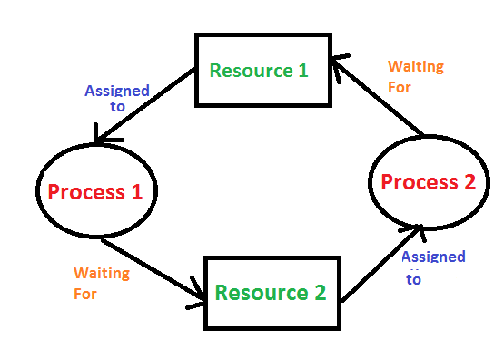

# 死锁

## 操作系统与资源
一个操作系统的进程使用以下方式使用不同的资源：
1. 请求一个资源
1. 使用该资源
1. 释放该资源

## 死锁
死锁是一种状态，该状态诱发的原因是一组线程因为互相持有资源并等待其他线程的释放。

## 图示

如图中所示， 进程1正在持有一个资源的同时，等待进程2释放资源，进程2持有的资源是进程1后续运行必须的，同理，进程2在持有资源的同时，等在进程1释放手中的资源。形成了僵持。

## 形成死锁的四要素
1. **互斥条件**：资源是独占的且排他使用，进程互斥使用资源，即任意时刻一个资源只能给一个进程使用，其他进程若申请一个资源，而该资源被另一进程占有时，则申请者等待直到资源被占有者释放。
1. **不可剥夺条件**：进程所获得的资源在未使用完毕之前，不被其他进程强行剥夺，而只能由获得该资源的进程资源释放。
1. **请求和保持条件**：进程每次申请它所需要的一部分资源，在申请新的资源的同时，继续占用已分配到的资源。
1. **循环等待条件**：在发生死锁时必然存在一个进程等待队列{P1,P2,…,Pn},其中P1等待P2占有的资源，P2等待P3占有的资源，…，Pn等待P1占有的资源，形成一个进程等待环路，环路中每一个进程所占有的资源同时被另一个申请，也就是前一个进程占有后一个进程所申请地资源。 

## 避免死锁的办法

破坏任意一个四要素就可以,但是学过操作系统的人都知道,只能皮怀 **请求保持 和循环等待**可以破坏

- 避免一个线程同时获取多个锁 
- 避免一个线程在所锁同时占用多个资源，尽量保证每个锁只占用一个资源。
- 尝试使用定时锁，使用`lock.tryLock(timeout)`来替代使用内部锁机制
- 对于数据库锁，加锁和解锁必须在一个数据库连接里，否则会出现解锁失败的情况。

