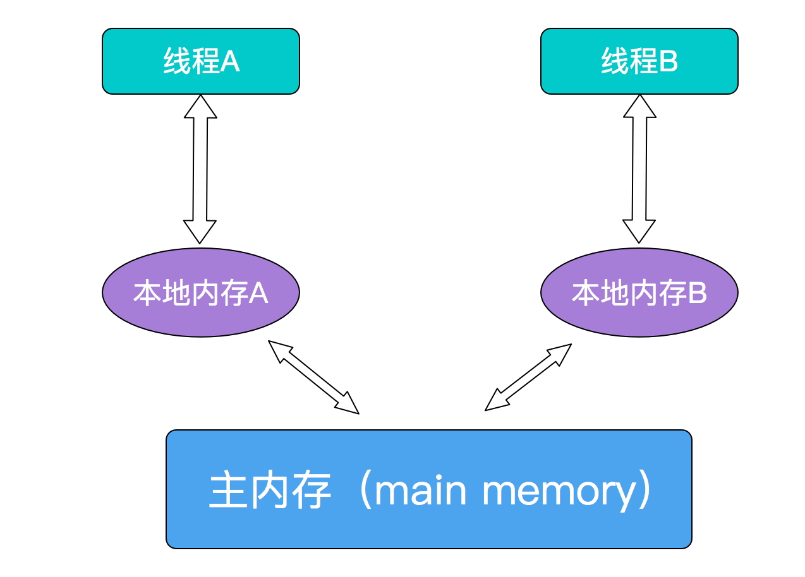

# volatile的定义

---

[TOC]

## 原理

 [04-volatile内存语义.md](../05-Java内存模型/04-volatile内存语义.md) 

关键字volatile可以用来修饰字段（成员变量），就是告知程序任何对该变量的访问均需要从**共享内存**中获取，而对它的改变必须同步刷新回共享内存，它能保证所有线程对变量访问的可见性。

volatile 在多处理器开发中保证了共享变量的可见性,这意味着当一个线程在修改一个共享变量的时候,另外一个线程能够读到这个修改的值

| 术语       | 英文单词               | 描述                                                         |
| ---------- | ---------------------- | ------------------------------------------------------------ |
| 共享变量   |                        | 在多个线程之间能够被共享的变量被称为共享变量。共享变量包括所有的实例变量，静态变量和数组元素。他们都被存放在堆内存中，Volatile只作用于共享变量。 |
| 内存屏障   | Memory Barriers        | 是一组处理器指令，用于实现对内存操作的顺序限制。             |
| 缓冲行     | Cache line             | 缓存中可以分配的最小存储单位。处理器填写缓存线时会加载整个缓存线，需要使用多个主内存读周期。 |
| 原子操作   | Atomic operations      | 不可中断的一个或一系列操作。                                 |
| 缓存行填充 | cache line fill        | 当处理器识别到从内存中读取操作数是可缓存的，处理器读取整个缓存行到适当的缓存（L1，L2，L3的或所有） |
| 缓存命中   | cache hit              | 如果进行高速缓存行填充操作的内存位置仍然是下次处理器访问的地址时，处理器从缓存中读取操作数，而不是从内存。 |
| 写命中     | write hit              | 当处理器将操作数写回到一个内存缓存的区域时，它首先会检查这个缓存的内存地址是否在缓存行中，如果存在一个有效的缓存行，则处理器将这个操作数写回到缓存，而不是写回到内存，这个操作被称为写命中。 |
| 写缺失     | write misses the cache | 一个有效的缓存行被写入到不存在的内存区域。                   |

## 可见性问题的本质

 [021-内存可见性.md](../05-Java内存模型/021-内存可见性.md) 

## Volatile 如何保证可见性?

准编程汇编后实际上会对变量添加 lock 执行

实际操作:

- 将当前处理器缓存的行的数据写回到系统内存
- 这个回写 的操做会使在其他 CPU 里的缓存了该内存地址的数据无效

## volatile关键字的作用

[好文章参考](https://www.cnblogs.com/chengxiao/p/6528109.html)

Java提供了一种轻量级同步机制：volatile变量。

1. volatile变量确保变量的更新以一种可预见的方式告知其他线程
2. 当一个域被声明为volatile类型后，编译器在运行时会监视这个变量：它是共享的。
3. volatile变量不会和其他内存操作一起被重排序。
4. volatile变量不会缓存在寄存器或者缓存在对其他处理器隐藏的地方。

所以，读取一个volatile变量,总会返回某一个线程所写入的最新值。

## 特性
Java虚拟机有自己的内存模型（Java Memory Model，JMM），JMM可以屏蔽掉各种硬件和操作系统的内存访问差异，以实现让java程序在各种平台下都能达到一致的内存访问效果。

　　JMM决定一个线程对共享变量的写入何时对另一个线程可见，JMM定义了线程和主内存之间的抽象关系：共享变量存储在主内存(Main Memory)中，每个线程都有一个私有的本地内存（Local Memory），本地内存保存了被该线程使用到的主内存的副本拷贝，线程对变量的所有操作都必须在工作内存中进行，而不能直接读写主内存中的变量。

  

volatile具备两种特性，第一就是保证共享变量对所有线程的可见性。将一个共享变量声明为volatile后，会有以下效应：

1. 当写一个volatile变量时，JMM会把该线程对应的本地内存中的变量强制刷新到主内存中去；
1. 这个写会操作会导致其他线程中的缓存无效。

## 为什么叫它轻量级的同步机制呢

1. 访问volatile变量的操作不会加锁
2. 不会引起执行线程的阻塞

## 什么时候使用它

只有当volatile变量能够简化实现和同步策略的验证时，才使用它们。

当验证正确性必须推断可见性问题时，应该避免使用volatile变量。

正确使用volatile变量的方式包括：

1. 用于确保它们所引用的对象状态的可见性。
2. 用于标识重要的生命周期事件（比如初始化或者关闭）的发生。

场景：

1. 写入变量时并不依赖变量的当前值，或者能够确保只有单一的线程修改变量的值。
2. 变量不需要与其他的状态变量共同参与不变约束
3. 访问变量时，没有其他原因，需要加锁

## 总结

volatile变量对可见性的影响所产生的价值，远远超过变量本身：线程A像volatile变量写入值，随后线程B读取该变量，所有A执行写操作前可见的变量的值，在B读取了volatile变量后，成为对B的可见的。

从内存可见性的角度看：

- **读取volatile变量就像是进入同步块**, 读取主内存最新的值覆盖本地的值

- **写入volatile变量就像是退出同步块**, 将本地内存的值刷新到工作内存

但是依赖volatile变量来控制状态可见性的代码，比使用锁的代码更脆弱，更难以理解。

**加锁可以保证可见性和原子性，volatile只能保证可见性。**