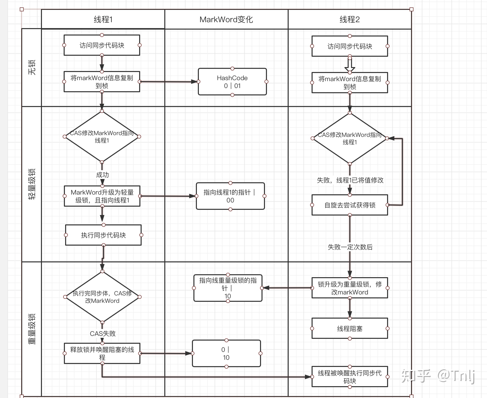

# 02-synchronized锁升级过程

[TOC]

## 为什么要有锁升级

Java SE 1.6 为了减少获得锁和释放锁的性能消耗,引入了"偏向锁"和"轻量级锁"

## 锁的四种状态

级别从高到低依次是:

- 无锁状态
- 偏向锁状态
- 轻量级锁状态
- 重量级锁状态

**这几个状态可以随着竞争情况主键升级,但是不能降级例** ,如偏向锁升级成轻量级锁后不能再降级到偏向锁

## 1. 偏向锁

在大多数情况下，锁不存在多线程竞争，且总是由同一个线程多次获得，为了让线程获得锁的代价更低而引入了**偏向锁**。

那么只需要在锁第一次被拥有的时候，记录下偏向线程ID。

#### 偏向锁初始化的流程

这样偏向线程就一直持有着锁，直到竞争发生才释放锁。

以后每次同步，检查锁的偏向线程ID与当前线程ID是否一致，如果一致直接进入同步，退出同步也无需每次加锁解锁都去CAS更新对象头，如果不一致意味着发生了竞争，锁已经不是总是偏向于同一个线程了，这时候需要锁膨胀为轻量级锁，才能保证线程间公平竞争锁。

#### 偏向锁的撤销

**偏向锁使用了一种等到竞争出现才释放锁的机制，所以当其他线程尝试竞争偏向锁时，持有偏向锁的线程才会释放锁。**

偏向锁的撤销，需要等待全局安全点（在这个时间点上没有字节码正在执行），

- 它会首先暂停拥有偏向锁的线程，然后检查持有偏向锁的线程是否活着，
  - 如果线程不处于活动状态，则将对象头设置成无锁状态，
  - 如果线程仍然活着，拥有偏向锁的栈会被执行，遍历偏向对象的锁记录，栈中的锁记录和对象头的Mark Word要么重新偏向于其他线程，要么恢复到无锁或者标记对象不适合作为偏向锁，最后唤醒暂停的线程。

#### 关闭偏向锁

- 默认是开启的, Java6, java7
- 但是在程序启动几秒后才激活,如有必要刻意使用 JVM参数来关闭延迟

```
-XX：BiasedLockingStartupDelay = 0
```

- 如果你确定自己应用程序里所有的锁通常情况下处于竞争状态，可以通过JVM参数关闭偏向锁，那么默认会进入轻量级锁状态。

```
-XX:-UseBiasedLocking=false
```

## 2. 轻量级锁

#### **轻量级锁加锁**

线程在执行同步块之前，JVM会先在当前线程的栈桢中创建用于存储锁记录的空间，并将对象头中的Mark Word复制到锁记录中，官方称为`Displaced Mark Word`。然后线程尝试使用CAS将对象头中的Mark Word替换为指向锁记录的指针。如果成功，当前线程获得锁，如果失败，表示其他线程竞争锁，当前线程便尝试使用自旋来获取锁。

#### **轻量级锁解锁**

轻量级解锁时，会使用原子的CAS操作来将Displaced Mark Word替换回到对象头，如果成功，则表示没有竞争发生。如果失败，表示当前锁存在竞争，锁就会膨胀成重量级锁。下图是两个线程同时争夺锁，导致锁膨胀的流程图。


因为自旋会消耗CPU，为了避免无用的自旋（比如获得锁的线程被阻塞住了），一旦锁升级成重量级锁，就不会再恢复到轻量级锁状态。当锁处于这个状态下，其他线程试图获取锁时，都会被阻塞住，当持有锁的线程释放锁之后会唤醒这些线程，被唤醒的线程就会进行新一轮的夺锁之争。

 轻量锁与偏向锁不同的是：

1. **轻量级锁每次退出同步块都需要释放锁，而偏向锁是在竞争发生时才释放锁** 
1. **轻量级锁每次进入退出同步块都需要CAS更新对象头。**
1. **争夺轻量级锁失败时，自旋尝试抢占锁。**

 可以看到轻量锁适合在竞争情况下使用，其自旋锁可以保证响应速度快，但自旋操作会占用CPU，所以一些计算时间长的操作不适合使用轻量级锁。

##  锁的优缺点对比

| 锁       | 优点                                                         | 缺点                                             | 适用场景                             |
| -------- | ------------------------------------------------------------ | ------------------------------------------------ | ------------------------------------ |
| 偏向锁   | 加锁和解锁不需要额外的消耗，和执行非同步方法比仅存在纳秒级的差距。 | 如果线程间存在锁竞争，会带来额外的锁撤销的消耗。 | 适用于只有一个线程访问同步块场景。   |
| 轻量级锁 | 竞争的线程不会阻塞，提高了程序的响应速度。                   | 如果始终得不到锁竞争的线程使用自旋会消耗CPU。    | 追求响应时间。同步块执行速度非常快。 |
| 重量级锁 | 线程竞争不使用自旋，不会消耗CPU。                            | 线程阻塞，响应时间缓慢。                         | 追求吞吐量。同步块执行速度较长。     |

# 轻量级锁加解锁过程详解

> https://zhuanlan.zhihu.com/p/141554048

从Java SE 1.6开始，为了减少获得锁和释放锁带来的性能消耗，就引入了轻量级锁。轻量级锁在对象内存布局中 MarkWord 锁标志位为 00，它可以由偏向锁对象因存在多个线程访问而升级成轻量级锁，当然，轻量级锁也可能因多个线程同时访问同步代码块升级成重量级锁。

## **一、加锁过程**

加锁过程主要分为3步：

1、在线程执行同步代码块之前，JVM会现在当前线程的栈桢中创建用于存储锁记录的空间，并将锁对象头中的 markWord 信息复制到锁记录中，这个官方称为 Displaced Mard Word。然后线程尝试使用 CAS 将对象头中的 MarkWord 替换为指向锁记录的指针。


2、将锁对象头中的 markWord 信息复制到锁记录中，这个官方称为 Displaced Mard Word。然后线程尝试使用 CAS 将对象头中的 MarkWord 替换为指向锁记录的指针。如果替换成功，则进入步骤3，失败则进入步骤4。

3、CAS 替换成功说明当前线程已获得该锁，此时在栈桢中锁标志位信息也更新为轻量级锁状态：00。此时的栈桢与锁对象头的状态如图二所示。


4、如果CAS 替换失败则说明当前时间锁对象已被某个线程占有，那么此时当前线程只有通过自旋的方式去获取锁。如果在自旋一定次数后仍为获得锁，那么轻量级锁将会升级成重量级锁。

**升级成重量级锁带来的变化就是对象头中锁标志位将变为 10（重量级锁），MarkWord 中存储的也就是指向互斥量（重量级锁）的指针。（注意！！！此时，锁对象头的 MarkWord 已经发生了改变）。**

轻量级锁升级过程大概流程图如下：




## 2、解锁过程

轻量级锁解锁时，会使用CAS将之前复制在栈桢中的 Displaced Mard Word 替换回 Mark Word 中。如果替换成功，则说明整个过程都成功执行，期间没有其他线程访问同步代码块。

但如果替换失败了，表示当前线程在执行同步代码块期间，有其他线程也在访问，当前锁资源是存在竞争的，那么锁将会膨胀成重量级锁。图三中重量级锁部分也就演示了锁膨胀的过程。

## 3、轻量级锁的优缺点

轻量级锁涉及到一个自旋的问题，而自旋操作是会消耗CPU资源的。为了避免无用的自旋，当锁资源存在线程竞争时，偏向锁就会升级为重量级锁来避免其他线程无用的自旋操作。所以这就引出了偏向锁的一个缺点：如果始终无法获得锁资源，线程就会自旋消耗CPU资源。

但是偏向锁相对于重量级锁的一个优点就是：因为线程在竞争资源时采用的是自旋，而不是阻塞，也就避免了线程的切换带来的时间消耗，提高了程序的响应速度。

